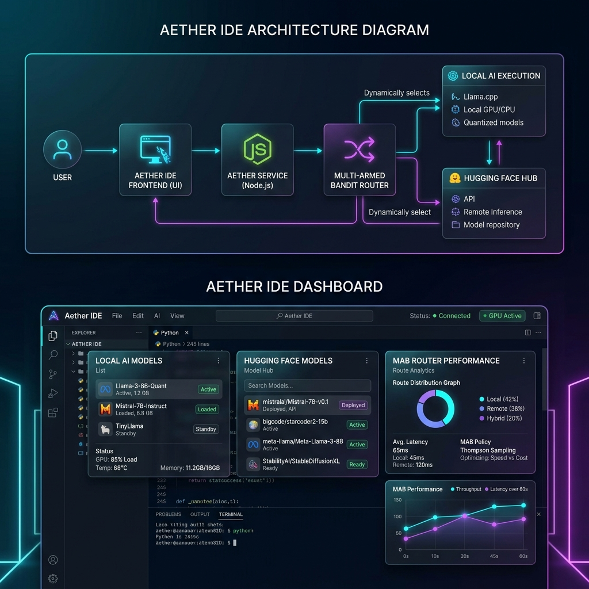
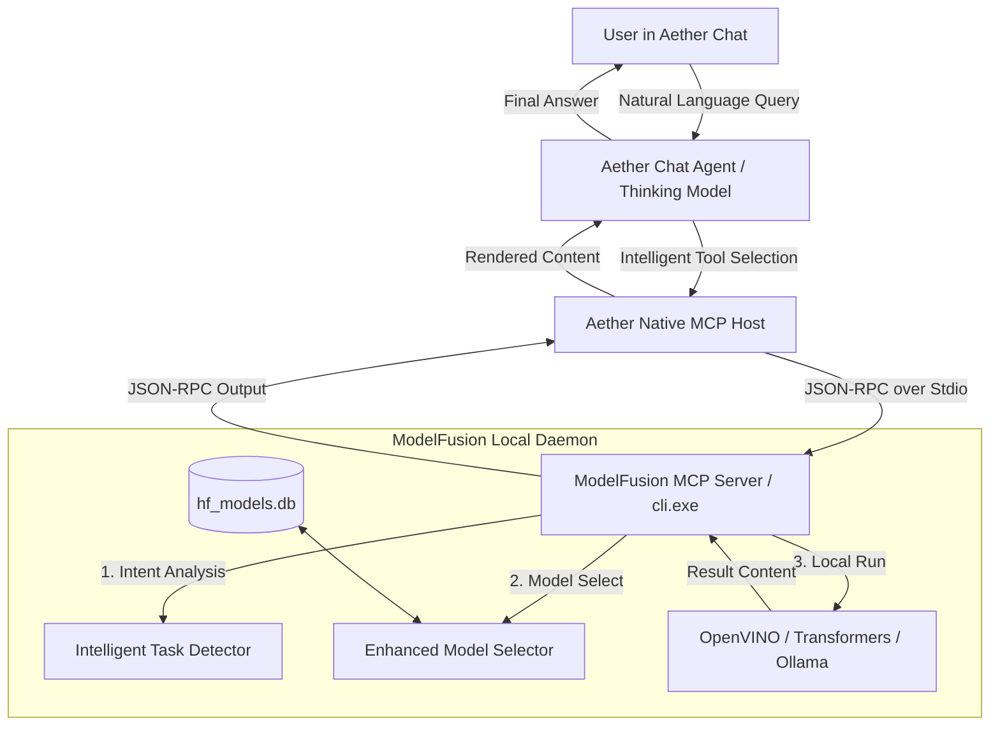

# Aether IDE — Custom AI-Powered Code-OSS Fork

Aether is an advanced, open-weights compound intelligence IDE built upon the open-source core of VS Code (Code - OSS). 

Unlike standard editors that rely on proprietary cloud APIs, Aether is built from the ground up for native local orchestration, running ModelFusion as a built-in, un-uninstallable Model Context Protocol (MCP) server.

---

## 🏗️ Architecture & Integration

Aether disables and strips out all proprietary and paid model registries (such as OpenAI, Anthropic, and Gemini) and strictly restricts the MCP registry to **only allow the ModelFusion local MCP server**. All other MCP server registrations are dynamically filtered out at the core workbench registry layer.

### Integration Flow

---

## 🤖 Exposing Over 2 Million Hugging Face Models

ModelFusion enables Aether to tap directly into the **Hugging Face Hub ecosystem**, which hosts **over 2,000,000+ open-weights models** spanning multiple modalities:

| Modality | Task Types Supported | Popular Local Architectures |
| :--- | :--- | :--- |
| **Text** | Causal Language Modeling, Summarization, NER, Text Classification | Llama-3, Qwen-2.5, Phi-3, Mistral, DeepSeek-R1-Distill |
| **Code** | Code Summary, Clone Detection, Vulnerability Auditing | StarCoder-2, DeepSeek-Coder, Codellama |
| **Security** | PE File Header Analysis, Malware Text Detection, PII Auditing | Custom Fine-tuned RoBERTa, Malware-BERT |
| **Multimodal** | Image Classification, Document QA, Feature Extraction | ResNet, ViT, layoutlm |

### How Local Orchestration Works
1. **Intelligent Model Selection**: When a tool is triggered, ModelFusion queries the local database `hf_models.db` containing index data for small, highly-capable models. It utilizes multi-objective optimization to select the best model based on your task type, local hardware constraints, and processing speed.
2. **Local Caching & Execution**: 
   - **OpenVINO**: Pre-quantized `INT4` models are downloaded from the OpenVINO Hub and cached in `ov_models/`, running on local CPUs/GPUs with hardware acceleration.
   - **Transformers / Ollama**: Runs fallbacks or local LLM instances.

---

## ⚖️ Multi-Armed Bandit (MAB) Contextual Router

Aether incorporates a contextual Multi-Armed Bandit model selection algorithm to optimize the balance between single model execution (fast, low resource) and model fusion (highly accurate, panel of models).

### Mathematical Model
The routing layer models the decision as a reinforcement learning problem:
- **Context $C$**: 
  - $C_0$: Simple queries (general text conversation).
  - $C_1$: Coding/Complicated queries (contains syntax symbols, programming keywords, or length > 150).
- **Arms $A$**:
  - $A_0$: Single local model execution.
  - $A_1$: Model Fusion panel execution.
- **Epsilon-Greedy Exploration ($\epsilon = 0.15$)**:
  - With probability $1 - \epsilon$, the router selects the best performing arm based on running average rewards: $A^* = \operatorname{argmax}_a Q(C, a)$.
  - With probability $\epsilon$, it randomly explores one of the two arms.
- **Online Updates**:
  - Counts and average rewards are loaded and updated in `db/bandit_state.json`.
  - Rewards are automatically calculated based on compilation or execution success (1.0 for success, 0.0 for errors).

---

## 🛠️ ModelFusion MCP Stdio Server Tools

The ModelFusion MCP server runs via `cli.exe --mcp` and communicates with Aether over standard I/O streams (`stdin`/`stdout`). This removes any HTTP port conflicts, firewall blocks, or network configuration overhead.

The server registers the following native tools, which the editor's thinking model calls automatically:

### 1. `orchestrate`
- **Description**: Runs local model selection and orchestration for general text-based queries.
- **Parameters**: `prompt` (string, required), `budget` (number), `selection_strategy` (string), `fusion_mode` (string), `task_override` (string), `gpu` (boolean), `cpu` (boolean).

### 2. `analyze_file`
- **Description**: Evaluates and refines code or logs for a specific file path, feeding the file's content as context into the local LLM.
- **Parameters**: `file` (string, required), `prompt` (string, required), `budget` (number), `gpu` (boolean), `cpu` (boolean).

### 3. `analyze_folder`
- **Description**: Scans a folder to list files and analyze directory context for architectural review.
- **Parameters**: `folder` (string, required), `prompt` (string, required), `budget` (number).

### 4. `pe_header_extraction`
- **Description**: Extract PE structures, sections, imports, and detect malware signatures in Windows executables.
- **Parameters**: `file` (string, required), `prompt` (string).

### 5. `get_database_stats`
- **Description**: Inspects `hf_models.db` to show the number of cached, categorized, and indexed models.
- **Parameters**: None.

### 6. `list_tasks`
- **Description**: Returns all supported Hugging Face model tasks categorized by modality.
- **Parameters**: `category` (string).

### 7. `update_database`
- **Description**: Updates the local SQLite models database with the latest open-weights metadata.
- **Parameters**: None.

### 8. `clear_cache`
- **Description**: Empties the local download cache to free disk space.
- **Parameters**: None.

### 9. `get_decision_stats`
- **Description**: Retrieves history logs detailing which models were chosen for past prompts.
- **Parameters**: None.

### 10. `report_bandit_feedback`
- **Description**: Submits thumbs-up/down or numeric feedback to train the Multi-Armed Bandit context router.
- **Parameters**: `context` (integer, required), `arm` (integer, required), `reward` (number, required).

---

## 🚀 Running and Packaging

Aether bundles the ModelFusion CLI directly.
- **Run Locally (Development)**:
  Make sure you compile the CLI (`cargo build`) and register the local server in your workspace's `.mcp.json` file.
- **Production MSI Installer**:
  Execute `powershell -ExecutionPolicy Bypass -File IDE/build_msi.ps1` to compile, code-sign, and build the native Windows installer `Aether.msi`.
