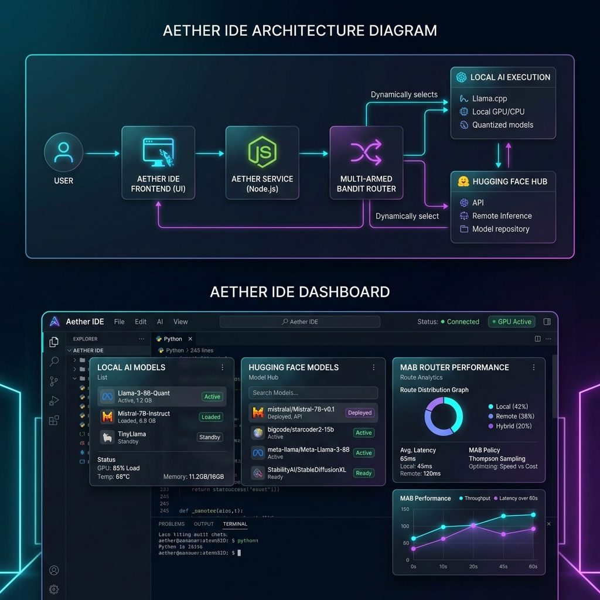
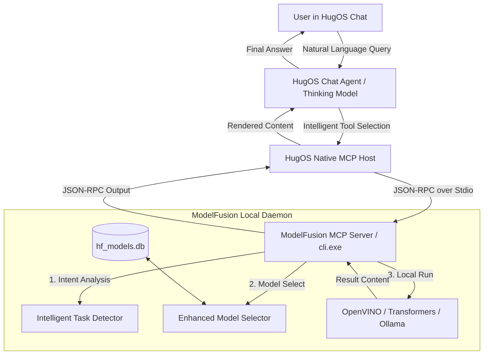

# HugOS IDE — Custom AI-Powered Code-OSS Fork

HugOS is an advanced, open-weights compound intelligence IDE built upon the open-source core of VS Code (Code - OSS). 

Unlike standard editors that rely on proprietary cloud APIs, HugOS is built from the ground up for native local orchestration, running ModelFusion as a built-in, un-uninstallable Model Context Protocol (MCP) server.



---

## 🏗️ Architecture & Integration

HugOS defaults to 100% private local execution powered by native runtimes (Ollama, OpenVINO, ONNX) and restricts the MCP registry to **only allow the ModelFusion local MCP server**. All third-party MCP server registrations are dynamically filtered out at the core workbench registry layer. For developers who require hybrid cloud capabilities, HugOS optionally supports user-provided API keys (`openaiApiKey`, `anthropicApiKey`, `geminiApiKey`, `huggingfaceApiKey`) configured securely in VS Code Settings (`Ctrl+,`), keeping all credentials local to your machine.

### Integration Flow

```mermaid
graph TD
    User[User in HugOS Chat] -->|Natural Language Query| Agent[HugOS Chat Agent / Thinking Model]
    Agent -->|Intelligent Tool Selection| Host[HugOS Native MCP Host]
    Host -->|JSON-RPC over Stdio| Server[ModelFusion MCP Server / cli.exe]
    
    subgraph ModelFusion Local Daemon
        Server -->|1. Intent Analysis| Detector[Intelligent Task Detector]
        Server -->|2. Model Select| Selector[Enhanced Model Selector]
        Server -->|3. Local Run| Exec[OpenVINO / Transformers / Ollama]
        DB[(hf_models.db)] <--> Selector
    end

    Exec -->|Result Content| Server
    Server -->|JSON-RPC Output| Host
    Host -->|Rendered Content| Agent
    Agent -->|Final Answer| User
```

---

## 🛠️ Setup & Installation Instructions

### 1. System & Hardware Requirements
* **Operating System:** Windows 10 or Windows 11 (64-bit).
* **Memory (RAM):** 
  * *Minimum:* 8 GB RAM (runs models up to 3B parameters).
  * *Recommended:* 16 GB or higher (required for models > 8B parameters and multi-model Fusion).
* **Graphics (GPU):** NVIDIA RTX/GTX GPU, AMD Radeon, or Intel Arc. Integrates automatically to accelerate local inference via OpenVINO or local Transformers.

### 2. Environment Variables & `.env` Configuration
To run Hugging Face models using the serverless Inference API (the default fallback when running models that aren't cached locally), you **must provide a Hugging Face API Token (`HF_TOKEN`)**:
1. Create a file named `.env` in the root of your opened workspace directory.
2. Add your token inside the `.env` file like this:
   ```env
   HF_TOKEN=your_hugging_face_token_here
   ```
3. When HugOS launches, the IDE automatically detects the `.env` file in your workspace, parses it, and safely injects the token into the ModelFusion server process's environment. **No tokens are ever stored inside the global IDE configuration, keeping them 100% private to your workspace.**

### 3. Production Installation via MSI
`HugOS.msi` is a **100% self-contained Windows Installer** packaging all 51,000+ files, including the VS Code core runtime (`HugOS.exe`), ModelFusion backend (`cli.exe`, `mcp-cli.exe`), Copilot chat extension, and all 127 signed native dependencies. It requires zero external folders or internet access to install.

#### Option A: Clone the Repository via Git LFS
To clone the complete repository on any computer with the installer included:
```powershell
# 1. Initialize Git LFS
git lfs install

# 2. Clone the repository
git clone https://github.com/oyesanyf/ModelFusion.git
cd ModelFusion

# 3. Verify the full installer was downloaded (~1.77 GB)
(Get-Item IDE\HugOS.msi).Length

# 4. Install HugOS IDE
Start-Process -FilePath "msiexec.exe" -ArgumentList "/i", "IDE\HugOS.msi" -Wait
```
*(If `(Get-Item IDE\HugOS.msi).Length` shows ~130 bytes, Git LFS was not active during clone. Run `git lfs pull` to download the installer).*

#### Option B: Direct Single-Click Download
* **Latest Release:** Download `HugOS.msi` directly from [GitHub Releases](https://github.com/oyesanyf/ModelFusion/releases).
* **Install Command:** Double-click `HugOS.msi`, or run in PowerShell:
  ```powershell
  msiexec /i "HugOS.msi" /qb
  ```
* **Auto-Upgrades:** The installer automatically detects, cleanly uninstalls, and upgrades older versions when running new MSI builds.

### 4. Automatic Spec Auto-Configuration
Upon launch, the IDE scans your system's hardware (logical CPU threads, physical RAM, free memory, and GPU description using Windows Registry query `reg.exe` for sub-10ms latency). 
* The system's specifications are passed to a local "thinking" resource manager or rule-based heuristic.
* It automatically configures the local backend (defaults to `ollama` with `qwen2.5:7b` / `14b` dynamic provisioning, or `openvino` for Intel-accelerated IR models), GPU/CPU device routing, parameter size budget, and multi-model `fusion` (enabled by default with `fusionModels: 0` for dynamic available RAM/VRAM scaling).

### 5. GitHub Account Login Setup
To enable cloning, pushing, pulling, and querying private repositories on GitHub:
1. Click the **Accounts** icon (the profile silhouette in the bottom-left corner of the status bar).
2. Click **Sign in to GitHub** and follow the browser authorization prompts.

---

## 💾 System & Hardware Requirements

HugOS features a pure-Rust hardware detection system powered by the `sysinfo` crate and `nvidia-smi` to prevent Out-Of-Memory (OOM) crashes and select models optimal for your device.

### 1. Detected Hardware Metrics
* **System RAM:** Captured using pure-Rust `sysinfo::System`.
* **CPU Physical Cores:** Captured using pure-Rust physical core count.
* **GPU VRAM:** Queries free/total memory using `nvidia-smi`.

### 2. Minimum vs. Adequate Hardware Specs
The routing layer calculates hardware suitability boundaries based on parameter count ($P$ in billions) and active backend runtime (Transformers, Ollama, OpenVINO):

| Model Size | Backend | Minimum Specs (Required) | Adequate Specs (Recommended) |
| :--- | :--- | :--- | :--- |
| **$P \le 3\text{B}$** | OpenVINO / Ollama | 4 GB RAM, 2 CPU Cores | 6 GB RAM, 4 CPU Cores, GPU preferred |
| **$3\text{B} < P \le 8\text{B}$** | OpenVINO / Ollama | 8 GB RAM, 4 CPU Cores | 12 GB RAM, 6 CPU Cores, GPU preferred |
| **$P > 8\text{B}$** | OpenVINO / Ollama | 16 GB RAM, 6 CPU Cores | 24 GB RAM, 8 CPU Cores, GPU preferred |
| **Any Size** | Transformers (FP16) | $VRAM \ge P \times 2.4\text{ GB}$ | $VRAM \ge P \times 3.0\text{ GB}$ |

### 3. Budget & Scoring Modifiers
* **Safety Factor:** The system applies a 70% safety margin buffer on available resources when computing CPU and GPU budgets.
* **Suitability Modifiers:**
  * **Inadequate:** If the system does not meet the minimum RAM or Core counts required, the candidate model is **completely filtered out** (failsafe).
  * **Adequate:** If the system meets the adequate recommendation, the candidate receives a **`+0.15` score boost** (promoting faster performance).
  * **Minimum:** If the system only meets the minimum specifications but not adequate, the candidate receives a **`-0.20` score penalty**.

---

## 🎛️ Local Inference Backends (OpenVINO, vLLM, Ollama)

ModelFusion supports multiple high-performance execution backends depending on your hardware:

* **OpenVINO (Optimized CPU/iGPU/GPU):** 
  * Designed for cross-platform hardware acceleration on Intel/AMD CPUs, integrated GPUs (iGPUs), and discrete graphics.
  * Active when the `--openvino` flag or `MODELFUSION_USE_OPENVINO` environment variable is set.
  * *Conversion Flow:* It looks for cached models in `ov_models/`. If not found, it downloads pre-converted INT4 models from the OpenVINO HuggingFace registry. If a custom model is requested, it attempts manual conversion via `optimum-intel` or direct `ov.convert_model()`.
* **vLLM (Linux-only High-Throughput GPU):**
  * High-performance LLM execution framework optimized for NVIDIA GPUs using PagedAttention.
  * Only supported on **Linux** environments; falls back to Ollama or OpenVINO on Windows.
  * Active when the `MODELFUSION_USE_VLLM` environment variable is set.
* **Ollama (Local LLM Daemon):**
  * Seamless fallback or primary local runner that connects to a running Ollama server instance (default: `http://localhost:11434`).
  * Maps HuggingFace model IDs to Ollama-specific library equivalents (e.g. `Qwen2.5-Coder` -> `qwen2.5-coder`).

---

## 📸 Multimodal Task Processing (Images, Voice & PDFs)

HugOS categorizes task queries by modality: `text`, `security`, `legal`, `domain`, `image`, and `audio`. The IDE features **native local multimodal processing** directly through its Python execution pipeline, completely bypassing the need for any external container manager or Ollama installation.

### How it Works:
* **IDE Capture:** The editor's chat UI allows dragging and dropping images, voice notes, or documents. Binary parts are serialized to base64 and wrapped in custom tags (e.g. `[IMAGE:base64_data]` or `[AUDIO:base64_data]`) inside the text prompt.
* **Extraction:** The Python execution scripts (`run_model_transformers.py`) parse these tags, strip them from the prompt, and decode the base64 strings back into their raw media representations.

### Modality Breakdown:
1. **Images (PNG, JPEG, WebP):** 
   * Local models (e.g. `Qwen2-VL` or `Phi-3-vision`) are loaded via HuggingFace's `AutoProcessor` and `AutoModelForVision2Seq` to perform image classification, visual question answering, or layout analysis.
2. **Voice & Audio (WAV, MP3, M4A):** 
   * Local audio processing is handled via HuggingFace's automatic speech recognition pipelines (e.g. executing Whisper models) to natively transcribe and analyze audio clips.
3. **PDFs & Documents (Text & Layout):** 
   * For standard text PDFs, the text layer is extracted and routed as context. For scanned or visual PDFs (containing diagrams/tables), pages are converted to images in Python to perform visual reasoning.

### Required Setup & Dependencies:
To enable native local multimodal execution on your machine, install the required Python packages:
```bash
pip install torch transformers accelerate pillow soundfile librosa pypdf
```
*(If a HuggingFace API token is supplied in settings, multimodal requests will optionally route to Hugging Face's serverless endpoints in the cloud; otherwise, the local Python scripts run the execution locally).*

---

## 🤖 Intent Classification & Decision Routing

HugOS features a hybrid task detector in [detector.rs](file:///d:/harfile/ModelFusion/crates/task_detection/src/detector.rs) combining exact regex keyword patterns and a Term-Frequency Vector Space Model (VSM).

### 1. Prompt Embedding and VSM Classification
1. **Tokenizer & Stop-Word Filter:** The prompt text is cleaned, lower-cased, and stripped of non-alphanumeric noise. Common English stop-words (e.g. `the`, `is`, `a`) are removed.
2. **TF Vector Space Embedding:** The remaining tokens are parsed into a normalized term frequency vector (`TermVector`).
3. **Cosine Similarity Matching:** The prompt vector is compared against mutable category centroids representing standard tasks (e.g. `translation`, `code-analysis`, `summarization`).
4. **Hybrid Scoring:** The final score combines keyword matches ($40\%$) and VSM similarity ($60\%$).

### 2. Online Feedback & Drift Prevention
To adapt to the developer's vocabulary, the IDE supports feedback corrections via `register_feedback(prompt, corrected_task)`:
* **Centroid Shift:** Shifty task centroids are updated using an Exponential Moving Average (EMA) with a learning rate ($\alpha = 0.15$).
* **L2 Unit Normalization:** After each update, the centroid vector is re-normalized to a unit length of `1.0`.
* **Pruning Threshold:** Any term weight falling below `0.01` is pruned.
* *This mathematical cleanup prevents feature inflation and guarantees category definitions do not drift over time.*

---

## 💻 CLI Command Line Interface Flags (`cli.exe`)

The ModelFusion binary `cli.exe` (located in the IDE `bin` directory) supports command-line flags. **Please note the differences between flags that are active inside the IDE and those that are only for standalone CLI use:**

### Supported CLI Flags in the IDE
* **`--server`**: Starts the persistent HTTP API server that the IDE connects to.
* **`--port <port>`**: Configures the HTTP port for the server (the IDE extension expects this to be `5000`).
* **`--db-path <path>`**: Sets the SQLite database path (resolved relative to the IDE installation directory).
* **`--mcp`**: Runs ModelFusion as an MCP stdio server.
* **`--update`**: Runs the background Hugging Face Hub sync process.
* **`--orchestrate "<prompt>"`**: Command-line fallback used by the IDE to fetch routing decisions and run models if the API server is unreachable.
* **`--openvino`**: Forces local inference to run using OpenVINO.
* **`--gpu`**: Requests CUDA/GPU execution for local transformers.
* **`--cpu`**: Forces CPU fallback for local transformers.

### Upstream Rebase & Compilation Flags (`--patch-ide`)
* **`--patch-ide`**: Clones upstream Microsoft VS Code from GitHub, applies HugOS branding and proposal whitelists, applies 8+ TypeScript source patches (routing Copilot to ModelFusion), copies extensions and icons, compiles from source via `yarn` and `gulp vscode-win32-x64`, brands the PE executable with `rcedit.exe`, and verifies ICU runtime directory integrity.
* **`--ide-src-dir <path>`**: Target destination directory for the cloned and patched VS Code source tree (default: `IDE/src`).
* **`--shallow`**: Performs a shallow git clone (`--depth 1`) of upstream VS Code to save bandwidth and disk space.
* **`--vscode-tag <tag>`**: Specific upstream VS Code git release tag to clone and rebase onto (e.g. `1.126.0`).

### Deactivated or Unsupported CLI Flags in HugOS IDE
* **`--use-openai`**: Configured via user settings (`hugos.modelfusion.openaiApiKey`) rather than CLI flags. HugOS guarantees 100% private local execution by default while optionally enabling hybrid cloud routing when API keys are configured.
* **`--vllm`**: **Linux-only.** Cannot be used on Windows IDE installations.
* **`--config` / `--api-keys`**: Managed automatically by the HugOS extension and user settings; manually overriding these via CLI flags is unsupported inside the IDE environment.
* **`--save-model` / `--load-model` / `--ml-retrain`**: CLI-only tools for developer experimentation; these will not work inside the IDE's read-only production environment.

---

## 🛠️ Developer Build Workflows: Upstream VS Code Rebase vs. Daily Packaging

HugOS IDE distinguishes clearly between upstream source rebase compilation and day-to-day installer packaging:

### 1. Daily Packaging & MSI Generation (`build_msi.ps1`)
For everyday bug fixes, extension updates, or ModelFusion CLI enhancements, developers run:
```powershell
powershell -ExecutionPolicy Bypass -File .\IDE\build_msi.ps1
```
* **Scope**: Operates directly on the pre-compiled `IDE/VSCode-win32-x64` tree.
* **Execution**: Re-synchronizes `cli.exe` across 4 distribution locations, auto-increments the build number in `IDE/build_number.txt` and `IDE/HugOS.wxs`, digitally signs all binaries and DLLs with `hugos-signing-cert.pfx` via DigiCert timestamping, and packages the complete self-contained installer (`IDE/HugOS.msi`).
* **Duration**: ~2–3 minutes.

### 2. Upstream Rebase & Compilation Pipeline (`cli.exe --patch-ide`)
Used **strictly when rebasing HugOS onto a newer upstream Microsoft VS Code release** (e.g., upgrading from `1.96.0` to `1.126.0`):
```bash
cli.exe --patch-ide --shallow --vscode-tag 1.126.0
```
* **Toolchain Requirements**: Requires full C++/Node build chains: Node.js (v20+), `yarn`, `gulp`, `node-gyp`, Visual Studio C++ Build Tools, and Python.
* **Duration**: ~10–15 minutes on first run.
* **The 10-Step Automated Workflow**:
  1. **Clone VSCode**: Clones `https://github.com/microsoft/vscode.git` (supports `--shallow` and `--vscode-tag <tag>`; skips clone if target directory exists).
  2. **Product Branding**: Replaces `product.json` with HugOS branding (`"applicationName": "hugos"`) and ModelFusion proposal whitelists.
  3. **Package Metadata**: Updates `package.json` (`name: "hugos"`, `displayName: "HugOS"`, description, and author).
  4. **Source Code Patches**: Systematically decouples Copilot across 8+ TypeScript files (`src/main.ts`, `product.ts`, `forwardingTelemetryService.ts`, `mcpListWidget.ts`, `chatSetupProviders.ts`, `editSourceTrackingFeature.ts`, `editSourceTrackingImpl.ts`, `terminalMenus.ts`, `settingsLayout.ts`, `mcpRegistry.ts`, `languageModels.ts`).
  5. **Copy Extension**: Copies `IDE/vscode/extensions/modelfusion` into `extensions/modelfusion/`.
  6. **Copy Artwork**: Injects HugOS icons across Windows (`code.ico`), macOS (`code.icns`), and Linux (`code.png`).
  7. **Dev Configuration**: Updates `.vscode/launch.json` (`modelfusion` outFiles) and `.vscode/tasks.json`.
  8. **Build from Source**: Executes `yarn install --frozen-lockfile` followed by `gulp vscode-win32-x64` to build `IDE/VSCode-win32-x64/`.
  9. **PE Binary Branding**: Uses `rcedit.exe` to brand `HugOS.exe` PE resource tables (ProductName, FileDescription, CompanyName, icon, and version `1.126.0`).
  10. **Runtime Integrity Check**: Validates the versioned Electron ICU runtime directory (e.g. `7e7950df89/`) to prevent ICU descriptor crashes (`IDE/INCIDENT_SIGNING_2026-07-16.md`) and verifies Authenticode signatures.

Once `--patch-ide` completes successfully, the compiled output in `IDE/VSCode-win32-x64` is ready for standard daily packaging via `build_msi.ps1`.

---

---

## ⚡ Quick Reference: Chat Slash Commands & @agent Directives

HugOS Chat supports over 71 interactive commands with complete **1:1 parity** between slash commands (`/<command>`) and agent directives (`@agent <command>`). Type `/` or `@agent ` in the chat panel to trigger interactive autocomplete.

| Category | Slash Command | @agent Directive | Description & Real-World Example |
|:---|:---|:---|:---|
| **Code Evolution** | `/evolve -n 5` | `@agent evolve -n 5` | Multi-pass code evolution with inline diff (`Ctrl+Shift+Y` / `Ctrl+Shift+N`).<br>`/evolve -n 5 Eliminate allocations in hot parsing loop` |
| **Refactoring** | `/refactor` | `@agent refactor` | Clean architecture, modularity, and SOLID design.<br>`/refactor Decouple this handler with dependency injection` |
| **Security Audit** | `/security --deep` | `@agent security --deep` | ATLAS static vulnerability and OWASP Top 10 taint analysis.<br>`/security Audit auth router for SQLi and timing attacks` |
| **Consensus Deliberation** | `/fusion` | `@agent fusion` | Multi-model deliberation with consensus answer synthesis.<br>`/fusion Compare Kafka vs Debezium CDC for financial ledgers` |
| **Consensus Panel Size** | `/fusion-models 0` | `@agent fusion-models 0` | Dynamic hardware sizing (`0` = auto-scales to free RAM/VRAM).<br>`/fusion-models 0 Deliberate on distributed cache invalidation` |
| **Execution Planning** | `/plan` | `@agent plan` | Emits structured sequential execution plan before modifying files.<br>`/plan Plan migration from CommonJS to ESM modules` |
| **Chain-of-Thought** | `/cot` | `@agent cot` | Enables step-by-step deduction scratchpad before emitting code.<br>`/cot Solve this concurrent deadlock in tokio worker pool` |
| **Local Runtime** | `/ollama` / `/openvino` | `@agent ollama` | Switches active local inference engine.<br>`/ollama Route inference to local Ollama daemon` |
| **Hardware Steering** | `/gpu` / `/cpu` | `@agent gpu` / `@agent cpu` | Forces CUDA/Arc GPU acceleration or AVX-512 CPU execution.<br>`/gpu Run inference with discrete GPU acceleration` |
| **Model Override** | `/model <name>` | `@agent model <name>` | Selects specific model tier.<br>`/model qwen2.5:14b` |
| **Parameter Budget** | `/budget <N>` | `@agent budget <N>` | Sets maximum parameter budget in billions of parameters.<br>`/budget 14 Cap selection at 14B parameters` |
| **Data Science** | `/dataanalyst` | `@agent dataanalyst` | Automated tabular analysis, anomaly detection, descriptive stats.<br>`/dataanalyst Analyze customer_churn.csv and find correlations` |
| **Binary Analysis** | `/pe-header-extraction`| `@agent pe-header-extraction` | Static analysis of Windows PE headers, imports, sections, entropy.<br>`/pe-header-extraction target/release/cli.exe` |
| **Web Research** | `/research <topic>` | `@agent research <topic>` | Live internet research, documentation scraping, source citations.<br>`/research Next.js 15 Server Actions best practices` |
| **Hub Fast Sync** | `/update` | `@agent update` | Fast sync top ~6,500 models + auto-provisions Ollama model.<br>`/update Sync curated catalog and verify local qwen2.5` |
| **Full Hub Crawler** | `/updatedb` | `@agent updatedb` | Full registry crawler indexing all 2M+ Hugging Face models.<br>`/updatedb --max-models 50000` |
| **Hardware Telemetry** | `/sysinfo` | `@agent sysinfo` | Displays live CPU cores, free RAM, GPU VRAM, and budget.<br>`/sysinfo` |
| **Active Model** | `/active-model` | `@agent active-model` | Inspects currently loaded model, device, and runtime engine.<br>`/active-model` |
| **API Keys Status** | `/keys` | `@agent keys` | Checks status of configured cloud API keys (`[LOADED]` / `[DISABLED]`).<br>`/keys` |
| **PDF Export** | `/export-pdf` | `@agent export-pdf` | Exports active chat session, benchmarks, and diffs to PDF report.<br>`/export-pdf system_architecture_review.pdf` |

## 🛠️ ModelFusion MCP Stdio Server Tools

The ModelFusion MCP server registers the following native tools, which the editor's thinking model calls automatically:

### 1. `orchestrate`
* **Description**: Runs local model selection and orchestration for general text-based queries.
* **Parameters**: `prompt` (string, required), `budget` (number), `selection_strategy` (string), `fusion_mode` (string), `task_override` (string), `gpu` (boolean), `cpu` (boolean).

### 2. `analyze_file`
* **Description**: Evaluates and refines code or logs for a specific file path, feeding the file's content as context into the local LLM.
* **Parameters**: `file` (string, required), `prompt` (string, required), `budget` (number), `gpu` (boolean), `cpu` (boolean).

### 3. `analyze_folder`
* **Description**: Scans a folder to list files and analyze directory context for architectural review.
* **Parameters**: `folder` (string, required), `prompt` (string, required), `budget` (number).

### 4. `pe_header_extraction`
* **Description**: Extract PE structures, sections, imports, and detect malware signatures in Windows executables.
* **Parameters**: `file` (string, required), `prompt` (string).

### 5. `get_database_stats`
* **Description**: Inspects `hf_models.db` to show the number of cached, categorized, and indexed models.
* **Parameters**: None.

### 6. `list_tasks`
* **Description**: Returns all supported Hugging Face model tasks categorized by modality.
* **Parameters**: `category` (string).

### 7. `update_database`
* **Description**: Updates the local SQLite models database with the latest open-weights metadata.
* **Parameters**: None.

### 8. `clear_cache`
* **Description**: Empties the local download cache to free disk space.
* **Parameters**: None.

### 9. `get_decision_stats`
* **Description**: Retrieves history logs detailing which models were chosen for past prompts.
* **Parameters**: None.

### 10. `report_bandit_feedback`
* **Description**: Submits thumbs-up/down or numeric feedback to train the Multi-Armed Bandit context router.
* **Parameters**: `context` (integer, required), `arm` (integer, required), `reward` (number, required).
