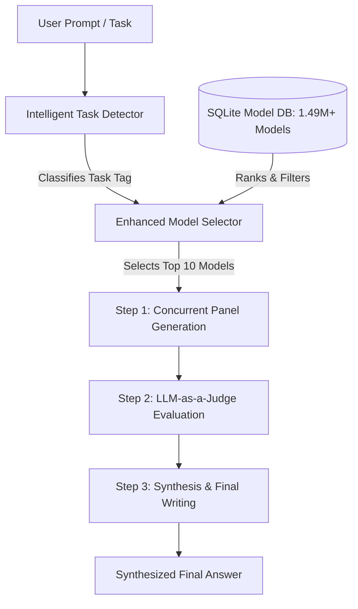

<p align="center">
  
</p>

<h1 align="center">ModelFusion</h1>

<p align="center">
  <strong>Open-Weight Compound Intelligence Through Retrieval-Augmented Consensus Deliberation</strong>
</p>

<p align="center">
  
  
  
  
  
</p>

---

ModelFusion is an open-weight compound intelligence system designed to achieve frontier-class reasoning and technical capability at a fraction of the cost of commercial proprietary APIs. By combining retrieval-augmented generation (RAG), dynamic task-based model selection, multi-model consensus deliberation, and structured synthesis, ModelFusion bridges the gap between local open-weights execution and closed frontier models.

---

## 🌀 System Architecture



### 1. The Hugging Face Model Database (1.49M+ Models)
ModelFusion leverages a local SQLite database (`hf_models.db`) indexing **over 1.49 million model entries** fetched directly from the Hugging Face Hub. 
*   For each model, it stores metadata including downloads, likes, model sizes, licensing, freshness, and capability metrics.
*   This allows local model routing to be fully grounded in actual Hugging Face ecosystem statistics rather than hardcoded heuristics.

### 2. Intelligent Routing & Classification
When a user submits a prompt, ModelFusion automatically routes it to the optimal models:
*   **Intelligent Task Detector**: Classifies the prompt's task type (e.g., `text-generation`, `question-answering`, `text-classification`, `summarization`, `translation`) by analyzing syntactic and semantic features.
*   **Enhanced Model Selector**: Performs a multi-objective optimization query over the 1.49M+ models database, normalizing downloads, popularity, model size, license openness, and performance metrics. It dynamically retrieves the **top 10 candidate models** matching the task classification to form the consensus panel.

### 3. Multi-Model Consensus Deliberation (`--fusion`)
When `--fusion` is active, the engine coordinates a three-step deliberation pipeline:
1.  **Concurrent Panel Execution**: Dispatches the prompt in parallel to the top 10 selected candidate models (served locally via Ollama or HF Serverless).
2.  **LLM-as-a-Judge Evaluation**: A high-capability reasoning model evaluates the 10 candidate responses, highlighting points of consensus, identifying factual contradictions, and extracting unique insights.
3.  **Synthesis & Writing**: A final writer model synthesizes the judge's analysis and the panel's consensus into a comprehensive, highly accurate response.

---

## 📁 Workspace Crate Structure

ModelFusion is built on a highly modular Rust and Python workspace:

*   [crates/analysis/](file:///D:/harfile/ModelFusion/crates/analysis) — PE header parser, high-entropy packed binary audits, and malware indicator scanning.
*   [crates/cli/](file:///D:/harfile/ModelFusion/crates/cli) — Main CLI package wrapper for orchestration execution.
*   [crates/core/](file:///D:/harfile/ModelFusion/crates/core) — Core system engine, asynchronous task execution, and orchestration pipelines.
*   [crates/db/](file:///D:/harfile/ModelFusion/crates/db) — Hugging Face SQLite DB indexing, query constraints, and self-healing db check loops.
*   [crates/model_selection/](file:///D:/harfile/ModelFusion/crates/model_selection) — Multi-objective model selection logic and score weight managers.
*   [crates/monitoring/](file:///D:/harfile/ModelFusion/crates/monitoring) — Decision metrics tracker and adaptive thresholds.
*   [crates/security/](file:///D:/harfile/ModelFusion/crates/security) — MITRE ATLAS threat detector scanning.
*   [crates/task_detection/](file:///D:/harfile/ModelFusion/crates/task_detection) — Syntax-based task routing and classifier keywords.
*   [crates/utils/](file:///D:/harfile/ModelFusion/crates/utils) — Rate limiters and directory managers.

---

## 📊 Scientific Publication & Results

Our research paper, *"Beyond Model Scale: Open-Weight Compound Intelligence Through Retrieval-Augmented Consensus Deliberation"*, evaluates ModelFusion using the rigorous **DRACO Evaluation Suite** (25 technical tasks across Software Engineering, Cryptography, Security, and Distributed Systems).

### Overall Benchmark Metrics (with 95% Confidence Intervals)

| Configuration | Mean Score | Std Dev ($\sigma$) | 95% Confidence Interval | API Operating Cost | Local Infra Cost | Profile |
|:---|:---:|:---:|:---:|:---:|:---:|:---|
| **Fusion panel only** | 26.47% | 32.55% | [14.0%, 39.6%] | \$0.00000 | \$0.10639 | Compound Open-Weights |
| **Gemma-4-E2B alone** | 38.73% | 29.91% | [27.4%, 49.3%] | \$0.00000 | \$0.00095 | Single Open-Weights |
| **Gemma-4-E2B + Context** | 47.20% | 37.70% | [32.8%, 62.0%] | \$0.00000 | \$0.00129 | Single Open-Weights |
| **Qwen2.5-7B alone** | 70.27% | 38.25% | [55.2%, 83.3%] | \$0.00000 | \$0.00299 | Single Open-Weights |
| **ModelFusion (Fusion + Context)** | **80.30%** | **28.80%** | **[69.1%, 90.8%]** | **\$0.00000** | **\$0.07760** | **Compound Open-Weights** |
| **gpt-4o alone** | 83.60% | 28.41% | [71.6%, 93.6%] | \$0.24908 | \$0.00000 | Commercial Cloud API |
| **gpt-5.5 alone** | 91.60% | 24.44% | [81.6%, 100.0%] | \$1.68826 | \$0.00000 | Commercial Cloud API |
| **gpt-5.5 + Context** | 98.40% | 8.00% | [95.2%, 100.0%] | \$1.41766 | \$0.00000 | Commercial Cloud API |

---

## 🔬 Key Scientific Discoveries

> [!IMPORTANT]
> **The Deliberation / Retrieval Synergy (Interaction Effect)**
> Consensus deliberation without grounding performs worse than a standalone base model (**26.47% vs. 38.73%**). Without source context, multi-model panels merely amplify assumptions. However, when grounded with RAG context, ModelFusion scores **80.30%** (a **+53.83%** absolute jump). This demonstrates a strong **nonlinear interaction effect** where retrieval and deliberation become highly synergistic.

> [!TIP]
> **Comparable Performance at 15x Lower Costs**
> ModelFusion (80.30%) achieves performance statistically comparable to GPT-4o (83.60%) with overlapping 95% confidence intervals, while running entirely on open-weights. Compared to GPT-5.5 + Context, ModelFusion achieves **81.6% of its accuracy at ~15x better cost efficiency** (1034.8 score-per-dollar vs 69.4 score-per-dollar).

---

## 🚀 Getting Started

### Prerequisites
*   Python 3.10+
*   [Ollama](https://ollama.com/) (installed and running locally)
*   Pull the models used by the evaluator and selector:
    ```powershell
    ollama pull qwen2.5:7b
    ollama pull gemma2:2b
    ```

### Running the CLI
To run ModelFusion's consensus deliberation panel directly on a query:
```powershell
cargo run --release --package cli -- --fusion --prompt "Design a high-concurrency connection pool in Rust."
```

### Running the Draco Benchmark
To execute the DRACO evaluation benchmark offline with strict verification (no simulated fallbacks) and compute confidence intervals across 1,000 bootstrap replicates:
```powershell
python canned_benchmark/draco_evaluator.py --no-fallback --bootstraps 1000
```

---

## 📄 References & Citation
For more information, please consult the complete research paper: 
*   Draft PDF: `Beyond Model Scale: Open-Weight Compound Intelligence Through Retrieval-Augmented Consensus Deliberation`
*   OpenRouter announcement: [Fusion Announcement](https://openrouter.ai/blog/announcements/fusion-beats-frontier/)
