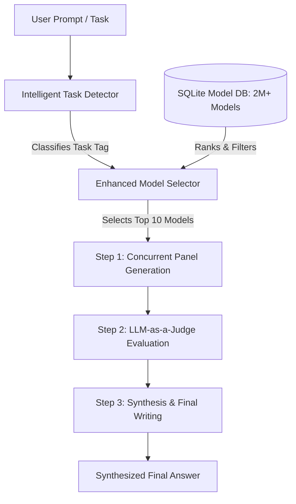

<p align="center">
  
</p>

<h1 align="center">ModelFusion</h1>

<p align="center">
  <strong>Open-Weight Compound Intelligence Through Retrieval-Augmented Consensus Deliberation</strong>
</p>

<p align="center">
  
  
  
  
  
</p>

---

ModelFusion is an open-weight compound intelligence system designed to achieve frontier-class reasoning and technical capability at a fraction of the cost of commercial proprietary APIs. By combining retrieval-augmented generation (RAG), dynamic task-based model selection, multi-model consensus deliberation, and structured synthesis, ModelFusion bridges the gap between local open-weights execution and closed frontier models.

### 📚 Documentation Links
*   [CLI Reference Manual](docs/CLI_REFERENCE.md) — Comprehensive guide for all 100+ commands, subcommands, and flags.
*   [HugOS IDE Integration Manual](docs/HUGOS_IDE_MANUAL.md) — Details local multimodal processing, intent classifier centroids, and IDE specific CLI/MCP configurations.

---

## 🌀 System Architecture


```mermaid
graph TD
    A[User Prompt / Task] --> B[Intelligent Task Detector]
    B -->|Classifies Task Tag| C[Enhanced Model Selector]
    D[(SQLite Model DB: 2M+ Models)] -->|Ranks & Filters| C
    C -->|Selects Top 10 Models| E[Step 1: Concurrent Panel Generation]
    E --> F[Step 2: LLM-as-a-Judge Evaluation]
    F --> G[Step 3: Synthesis & Final Writing]
    G --> H[Synthesized Final Answer]
```

### 1. The Hugging Face Model Database (2M+ Models)
ModelFusion leverages a local SQLite database (`hf_models.db`) indexing **over 2 million model entries** fetched directly from the Hugging Face Hub. 
*   For each model, it stores metadata including downloads, likes, model sizes, licensing, freshness, and capability metrics.
*   This allows local model routing to be fully grounded in actual Hugging Face ecosystem statistics rather than hardcoded heuristics.

### 2. Intelligent Routing & Classification
When a user submits a prompt, ModelFusion automatically routes it to the optimal models:
*   **Intelligent Task Detector**: Classifies the prompt's task type (e.g., `text-generation`, `question-answering`, `text-classification`, `summarization`, `translation`) by analyzing syntactic and semantic features.
*   **Enhanced Model Selector**: Performs a multi-objective optimization query over the 2M+ models database, normalizing downloads, popularity, model size, license openness, and performance metrics. It dynamically retrieves the **top 10 candidate models** matching the task classification to form the consensus panel.

### 3. Multi-Model Consensus Deliberation (`--fusion`)
When `--fusion` is active, the engine coordinates a three-step deliberation pipeline:
1.  **Concurrent Panel Execution**: Dispatches the prompt in parallel to the top 10 selected candidate models (served locally via Ollama or HF Serverless).
2.  **LLM-as-a-Judge Evaluation**: A high-capability reasoning model evaluates the 10 candidate responses, highlighting points of consensus, identifying factual contradictions, and extracting unique insights.
3.  **Synthesis & Writing**: A final writer model synthesizes the judge's analysis and the panel's consensus into a comprehensive, highly accurate response.

---

## 📁 Workspace Crate Structure

ModelFusion is built on a highly modular Rust and Python workspace:

*   [crates/analysis/](file:///D:/harfile/ModelFusion/crates/analysis) — PE header parser, high-entropy packed binary audits, and malware indicator scanning.
*   [crates/cli/](file:///D:/harfile/ModelFusion/crates/cli) — Main CLI package wrapper for orchestration execution.
*   [crates/core/](file:///D:/harfile/ModelFusion/crates/core) — Core system engine, asynchronous task execution, and orchestration pipelines.
*   [crates/db/](file:///D:/harfile/ModelFusion/crates/db) — Hugging Face SQLite DB indexing, query constraints, and self-healing db check loops.
*   [crates/model_selection/](file:///D:/harfile/ModelFusion/crates/model_selection) — Multi-objective model selection logic and score weight managers.
*   [crates/monitoring/](file:///D:/harfile/ModelFusion/crates/monitoring) — Decision metrics tracker and adaptive thresholds.
*   [crates/security/](file:///D:/harfile/ModelFusion/crates/security) — MITRE ATLAS threat detector scanning.
*   [crates/task_detection/](file:///D:/harfile/ModelFusion/crates/task_detection) — Syntax-based task routing and classifier keywords.
*   [crates/utils/](file:///D:/harfile/ModelFusion/crates/utils) — Rate limiters and directory managers.

---

## 📄 Scientific Publication: "Beyond Model Scale"

Our research paper, *"Beyond Model Scale: Open-Weight Compound Intelligence Through Retrieval-Augmented Consensus Deliberation"*, evaluates ModelFusion using the rigorous **DRACO Evaluation Suite** (25 technical tasks across Software Engineering, Cryptography, Security, and Distributed Systems).

### Related Work & OpenRouter Fusion
OpenRouter recently introduced "Fusion," a tool designed to synthesize outputs from a panel of multiple AI models to surpass individual frontier models on complex deep research tasks.
*   **Mechanism**: Submitted prompts are dispatched in parallel to participant models (equipped with web search/fetch) before a judge model compiles points of consensus and contradictions into a final response.
*   **Draco Benchmark Validation**: In evaluations, a fused combination of Fable 5 and GPT-5.5 scored **69.0%**, outperforming Fable 5's standalone score of 65.3%. A budget panel consisting of Gemini 3 Flash, Kimi K2.6, and DeepSeek V4 Pro scored **64.7%**, beating standalone models like GPT-5.5 and Claude Opus 4.8 at half the operational cost.

### Overall Benchmark Metrics (DRACO Suite with 95% Confidence Intervals)

| Configuration | Mean Score | Std Dev ($\sigma$) | 95% Confidence Interval | API Operating Cost | Local Infra Cost | Profile |
|:---|:---:|:---:|:---:|:---:|:---:|:---|
| **Fusion panel only** | 26.47% | 32.55% | [14.0%, 39.6%] | \$0.00000 | \$0.10639 | Compound Open-Weights |
| **Gemma-4-E2B alone** | 38.73% | 29.91% | [27.4%, 49.3%] | \$0.00000 | \$0.00095 | Single Open-Weights |
| **Gemma-4-E2B + Context** | 47.20% | 37.70% | [32.8%, 62.0%] | \$0.00000 | \$0.00129 | Single Open-Weights |
| **Qwen2.5-7B alone** | 70.27% | 38.25% | [55.2%, 83.3%] | \$0.00000 | \$0.00299 | Single Open-Weights |
| **ModelFusion (Fusion + Context)** | **80.30%** | **28.80%** | **[69.1%, 90.8%]** | **\$0.00000** | **\$0.07760** | **Compound Open-Weights** |
| **gpt-4o alone** | 83.60% | 28.41% | [71.6%, 93.6%] | \$0.24908 | \$0.00000 | Commercial Cloud API |
| **gpt-5.5 alone** | 91.60% | 24.44% | [81.6%, 100.0%] | \$1.68826 | \$0.00000 | Commercial Cloud API |
| **gpt-5.5 + Context** | 98.40% | 8.00% | [95.2%, 100.0%] | \$1.41766 | \$0.00000 | Commercial Cloud API |

---

## 🔬 Component Ablation Analysis

The ablation study shows that retrieval and consensus do not behave as simple independent add-ons.

```
Base model (Gemma-4-E2B)    [38.73%]
       |
       +--> Add Context Only  [47.20%] (Gains: +8.47 points)
       |
       +--> Add Fusion Only   [26.47%] (Loss: -12.26 points)
       |
       +--> ModelFusion (Full) [80.30%] (Synergy Gain: +41.57 points)
```

> [!IMPORTANT]
> **The Deliberation / Retrieval Synergy (Interaction Effect)**
> Consensus deliberation without grounding performs worse than a standalone base model (**26.47% vs. 38.73%**). Without source context, multi-model panels merely amplify assumptions. However, when grounded with RAG context, ModelFusion scores **80.30%** (a **+53.83%** absolute jump). This demonstrates a strong **nonlinear interaction effect** where retrieval and deliberation become highly synergistic.

---

## 💰 Operational Cost Analysis

ModelFusion trades commercial API charges for a predictable local infrastructure cost. 
*   **Infrastructure Efficiency**: ModelFusion costs **\$0.07760** and achieves **80.30%** accuracy, while GPT-4o costs **\$0.24908** and achieves **83.60%**.
*   **Resource Tradeoff**: ModelFusion reaches **96.1%** of GPT-4o's measured score while reducing run cost by **68.8%** relative to GPT-4o.
*   **Cost-per-Value Performance**: Compared to GPT-5.5 + Context, ModelFusion achieves **81.6%** of its accuracy at **~15x better cost efficiency** (1034.8 score-per-dollar vs 69.4 score-per-dollar).

---

## 📊 Sub-Domain and Task-Level Behavior

ModelFusion's average score evaluated across 20 technical sub-domains demonstrates strong technical capabilities:

| Sub-Domain / Task | Average Score (%) | Description |
|:---|:---:|:---|
| **Vector Databases** | 100.0% | Embedding search indexes & similarity scoring. |
| **System Architecture** | 100.0% | Distributed design and service modularization. |
| **Network Protocols** | 100.0% | Low-level transport layer handshake logic. |
| **AI Threat Detection** | 100.0% | Adversarial prompt and jailbreak scanning. |
| **Network Security** | 100.0% | TLS handshake parameters & threat analysis. |
| **Deep Learning** | 100.0% | Neural network layer parameter backpropagation. |
| **Language Runtimes** | 100.0% | Garbage collection mechanisms and JIT compilers. |
| **Computer Architecture**| 100.0% | CPU instruction caches and register states. |
| **Computer Security** | 100.0% | Vulnerability exploits and defense frameworks. |
| **Cryptography** | 100.0% | Encryption keys and secure key exchanges. |
| **Database Internals** | 100.0% | WAL logs, index queries, and transaction isolation. |
| **Software Engineering** | 75.0% | Object-oriented systems and concurrency bugs. |
| **Deep Learning Optimization**| 75.0% | Kernel optimizations and mixed precision. |
| **Web Security** | 66.7% | CORS, CSRF, and SQL Injection vector auditing. |
| **Distributed Systems** | 66.7% | Raft consensus logs and replica syncs. |
| **Blockchain Security** | 60.0% | Smart contract vulnerabilities. |
| **Concurrency** | 60.0% | Deadlock detection and locking mechanisms. |
| **Operating Systems** | 50.0% | Thread schedulers, page faults, and virtual memory. |
| **Cloud Infrastructure** | 37.5% | Kubernetes configurations and orchestration. |

### Limitations & Heatmap Insights
*   **Task 21 Miss**: The task-level heatmap exposes where the compound system succeeds and fails. While ModelFusion improves many weak cases, Task 21 (focusing on distributed storage sync) remains a complete miss, demonstrating that consensus still relies on high-quality retrieval and correct evidence use.

---

## 🚀 Getting Started

### Prerequisites
*   Rust 1.70+ and Cargo
*   Python 3.10+ with `transformers`, `torch`, and `accelerate` installed
*   **Ollama (Highly Recommended for GPU Speed):**
    1. Download and install Ollama from [ollama.com](https://ollama.com/).
    2. Once installed, start Ollama (ensure it is running in your taskbar).
    3. Pull the required models:
       ```powershell
       # The main text generation and coding model
       ollama pull qwen2.5:7b
       # The ultra-fast 0.5B model used for dynamic routing decisions
       ollama pull qwen2.5:0.5b
       ```
    4. Ollama will automatically detect and utilize your NVIDIA GPU (WDDM/CUDA) or AMD GPU (ROCm) for high-performance, low-latency local inference.


### Running the CLI

**Basic fusion query** (10 panel models by default, runs locally via `transformers`):
```powershell
cargo run --release --package cli -- --fusion --prompt "Design a high-concurrency connection pool in Rust."
```

**With auto-generated context** (uses DeepSeek-R1-Distill-Qwen-1.5B to generate background context):
```powershell
cargo run --release --package cli -- --fusion --context-auto --prompt "What is a deadlock and how can it be prevented?"
```

**With custom context guidance**:
```powershell
cargo run --release --package cli -- --fusion --context "Focus on Rust async patterns" --prompt "Compare tokio vs async-std"
```

**Custom panel size** (e.g., 3 models instead of the default 10):
```powershell
cargo run --release --package cli -- --fusion --fusion-models 3 --context-auto --prompt "Explain CAP theorem"
```

**Using Ollama** (runs models via local Ollama instead of Python transformers):
```powershell
cargo run --release --package cli -- --fusion --ollama --context-auto --prompt "What is a deadlock?"
```

### Fusion CLI Flags Reference

> [!TIP]
> This table lists the primary flags. For a complete manual detailing all 100+ command-line options, including ML-based routing, SINQ quantization, advanced agent workflows, LLM evaluations, and custom task routing flags, please see our dedicated [CLI Reference Manual](docs/CLI_REFERENCE.md).

| Flag | Default | Description |
|:---|:---:|:---|
| `--fusion` | off | Enable multi-model consensus deliberation pipeline |
| `--fusion-models <N>` | `10` | Number of models (or temperature samples) to run in the panel |
| `--fusion-mode <MODE>` | `multi-model` | Execution mode: `multi-model` (N different models) or `multi-sample` (1 model, N temperature samples — much faster locally) |
| `--ollama` | off | Use local Ollama for model execution (auto-starts `ollama serve` if not running) |
| `--openvino` | off | Use OpenVINO for optimized CPU inference (requires: `pip install -U openvino-genai`) |
| `--ov-model-dir <DIR>` | `ov_models` | Directory where pre-converted OpenVINO IR models are stored and loaded from |
| `--weight-format <FMT>` | `int8` | Weight format for OpenVINO export: `fp16`, `int8`, `int4` |
| `--prepare-all-models` | off | Download all pre-converted OV Hub models + locally convert small HF models (use with `--update`) |
| `--context-auto` | off | Auto-generate background context via DeepSeek-R1-Distill-Qwen-1.5B |
| `--context <STRING>` | none | Provide custom context guidance for context generation |
| `--report <PATH>` | none | Save the final fusion report to a file or directory |

### Execution Backends

ModelFusion supports three local execution backends. If no backend flag is specified, it defaults to Python `transformers`:

| Backend | Flag | Precision | 7B Model Memory | Best For |
|:---|:---:|:---:|:---:|:---|
| **Ollama** | `--ollama` | Q4_0 | ~5.0 GB | GPU inference via Vulkan/CUDA, fastest for repeated runs |
| **OpenVINO (cached)** | `--openvino` | INT4 | ~4.2 GB | Fastest CPU inference — loads pre-converted models in seconds |
| **OpenVINO (fresh)** | `--openvino` | INT4 | ~4.2 GB | Downloads pre-converted INT4 model from OpenVINO Hub on first run |
| **Transformers** | *(default)* | FP16 | ~16.8 GB | Direct HuggingFace model loading, widest compatibility |

### Fusion Execution Modes

| Mode | Flag | What It Does | Speed | Best For |
|:---|:---:|:---|:---:|:---|
| **Multi-Model** | `--fusion-mode multi-model` | Runs N different models, each providing a unique perspective | Slower (N model loads) | Maximum diversity and quality |
| **Multi-Sample** | `--fusion-mode multi-sample` | Loads 1 best model, samples N times with varied temperatures (T=0.3→1.1) | **5-10× faster** | Fast local execution with good diversity |

### Dynamic Resource Management

ModelFusion dynamically adapts to your hardware at runtime:

* **Memory Detection**: Scans available RAM (via PowerShell) and GPU VRAM (via `nvidia-smi`) on every run.
* **Model Filtering**: Only selects models that fit within 70% of available memory. If fewer than N models fit, the panel is **automatically reduced** with a clear warning.
* **GPU Routing**: Small models (≤ VRAM budget) run on 🎮 GPU; larger models fall back to 💻 CPU (RAM).
* **Sequential Execution**: Ollama and OpenVINO backends run models one at a time to avoid OOM crashes. Transformers can batch based on memory budget.
* **Runtime Fallback**: If a model fails during execution (OOM, timeout, API error), the system automatically substitutes the next-best model from a pre-built fallback pool and **logs the failure reason**.
* **Ollama Auto-Start**: If `--ollama` is specified but Ollama is not running, ModelFusion automatically starts `ollama serve` and waits up to 30 seconds for it to be ready.

> [!NOTE]
> ModelFusion's local SQLite database indexes **over 2 million open-weight models** across **56 task types** from the Hugging Face Hub. When `--fusion` is active, the system dynamically selects the best-fit models for your specific task from this entire catalog, filtered by your hardware's available memory and GPU capacity — giving every user access to a massive pool of open-weight intelligence regardless of their hardware.

### Usage Examples

**Fast local fusion** (1 model, 10 temperature samples via Ollama — recommended for most local setups):
```powershell
cli.exe --fusion --ollama --fusion-mode multi-sample --context-auto --prompt "Design a high-concurrency connection pool in Rust."
```

**Quality fusion** (10 different models via Ollama):
```powershell
cli.exe --fusion --ollama --context-auto --prompt "What is a deadlock and how can it be prevented?"
```

**OpenVINO optimized CPU** (cached INT4 models, no GPU needed):
```powershell
cli.exe --fusion --openvino --fusion-models 3 --fusion-mode multi-model --prompt "Explain CAP theorem"
```

**Custom panel size** (e.g., 5 models):
```powershell
cli.exe --fusion --ollama --fusion-models 5 --context-auto --prompt "Compare tokio vs async-std"
```

**Default transformers backend** (FP16, widest compatibility):
```powershell
cli.exe --fusion --context-auto --prompt "What are the tradeoffs of microservices?"
```

### Pre-installing Ollama Models
To pre-install the models commonly selected by the `--fusion --ollama` panel:
```powershell
ollama pull qwen2.5:7b
ollama pull qwen2.5:3b
ollama pull qwen2.5:1.5b
ollama pull llama3.1
ollama pull llama3.2:1b
ollama pull deepseek-r1:1.5b
```

---

### 🔷 OpenVINO Model Caching

The OpenVINO backend delivers the fastest local CPU inference by loading **pre-converted INT4 quantized models** directly from disk. The full setup workflow is:

#### Step 1 — Sync the database and cache all pre-converted models
```powershell
$env:PYTHONUTF8="1"
cli.exe --update --prepare-all-models --ov-model-dir ov_models
```

What this does:
- **`--update`**: Fetches 480,000+ models from the HuggingFace Hub into the local SQLite database, then syncs **149 pre-converted OpenVINO Hub models** (`library_name = openvino`, tagged `int4`/`int8`) into the DB with accurate size estimates and high efficiency scores.
- **`--prepare-all-models`**: Two-step caching process:
  1. **Step 1 (fast)** — Downloads all pre-converted `OpenVINO/` org models (INT4, ~0.5–4 GB each) using `huggingface_hub.snapshot_download`. No local GPU or conversion needed.
  2. **Step 2 (local)** — Locally converts small HuggingFace models (≤1.5B params) to OpenVINO IR format using `ov.convert_model()` for any model not available pre-converted.
- **`--ov-model-dir ov_models`**: All cached models are stored under `./ov_models/`.

> [!NOTE]
> `PYTHONUTF8=1` is required on Windows to avoid emoji encoding errors in the PowerShell console.

#### Step 2 — Run fusion with cached OpenVINO models
```powershell
cli.exe --fusion --openvino --fusion-models 3 --fusion-mode multi-model --ov-model-dir ov_models --prompt "Your prompt here"
```

The model selector automatically:
- **Detects cached models** in `ov_models/` and boosts their score by `+0.15`
- **Penalises uncached large models** (>3B params) by `−0.40` when `--openvino` is active
- **Loads from disk instantly** using `openvino_genai.LLMPipeline(local_path, "CPU")` — no download or conversion on inference

#### How model resolution works at inference time

```
Priority 1 → Local ov_models/ cache          ← instant, always checked first
Priority 2 → OpenVINO Hub download           ← ~30 sec, pre-converted INT4
Priority 3 → Manual torch → OV conversion    ← fallback, any model
```

#### OV Hub model registry

The following HuggingFace models have verified pre-converted versions on the [OpenVINO org](https://huggingface.co/OpenVINO):

| HuggingFace Model | OV Hub (INT4) | Size |
|:---|:---|:---:|
| `Qwen/Qwen2.5-1.5B-Instruct` | `OpenVINO/Qwen2.5-1.5B-Instruct-int4-ov` | ~750 MB |
| `Qwen/Qwen2.5-7B-Instruct` | `OpenVINO/Qwen2.5-7B-Instruct-int4-ov` | ~4.2 GB |
| `microsoft/Phi-3-mini-4k-instruct` | `OpenVINO/Phi-3-mini-4k-instruct-int4-ov` | ~2.2 GB |
| `TinyLlama/TinyLlama-1.1B-Chat-v1.0` | `OpenVINO/TinyLlama-1.1B-Chat-v1.0-int4-ov` | ~600 MB |
| `mistralai/Mistral-7B-Instruct-v0.2` | `OpenVINO/Mistral-7B-Instruct-v0.2-int4-ov` | ~4.1 GB |
| `google/gemma-2b-it` | `OpenVINO/gemma-2b-it-int4-ov` | ~1.3 GB |

> See [`src/scripts/run_model_openvino.py`](src/scripts/run_model_openvino.py) for the full registry and [`src/scripts/cache_ov_hub.py`](src/scripts/cache_ov_hub.py) for the standalone download script.

#### Running cache_ov_hub.py standalone
To download only OV Hub models without running `--update`:
```powershell
$env:PYTHONUTF8="1"
# Download all OV Hub models ≤ 5 GB:
python src/scripts/cache_ov_hub.py ov_models db/hf_models.db 5
```

#### Manually Downloading OpenVINO Models

If the automated download (`--prepare-all-models` or `cache_ov_hub.py`) freezes your system — for example when batch-downloading many large INT4 models at once — you can download models **one at a time** manually.

##### Where to find models

Browse pre-converted OpenVINO INT4 models on HuggingFace:
- **Official OpenVINO org**: [huggingface.co/OpenVINO](https://huggingface.co/OpenVINO)
- **Community converters**: Search HuggingFace for `openvino int4` — look for repos by `CelesteImperia`, `Morteza89`, `rpanchum`, `xpuenabler`, etc.

##### Method 1 — `huggingface-cli` (recommended)

Download one model at a time with resume support (won't re-download interrupted files):
```powershell
# Install the CLI if you haven't
pip install -U huggingface-hub

# Download a single model into ov_models/
huggingface-cli download OpenVINO/Qwen2.5-1.5B-Instruct-int4-ov --local-dir ov_models/OpenVINO--Qwen2.5-1.5B-Instruct-int4-ov

# Download a larger model
huggingface-cli download OpenVINO/Qwen2.5-7B-Instruct-int4-ov --local-dir ov_models/OpenVINO--Qwen2.5-7B-Instruct-int4-ov

# Download a community model
huggingface-cli download CelesteImperia/Phi-3.5-mini-instruct-OpenVINO-INT4 --local-dir ov_models/CelesteImperia--Phi-3.5-mini-instruct-OpenVINO-INT4
```

##### Method 2 — `git clone` (full repo)

```powershell
cd ov_models

# Clone with Git LFS (install git-lfs first: https://git-lfs.com)
git lfs install
git clone https://huggingface.co/OpenVINO/Qwen2.5-1.5B-Instruct-int4-ov OpenVINO--Qwen2.5-1.5B-Instruct-int4-ov
```

##### Method 3 — Browser download

1. Go to the model page, e.g. [OpenVINO/Qwen2.5-1.5B-Instruct-int4-ov](https://huggingface.co/OpenVINO/Qwen2.5-1.5B-Instruct-int4-ov)
2. Click the **Files and versions** tab
3. Download **all** files into a folder under `ov_models/`

##### Method 4 — `--getvino` (CLI built-in background downloader)

The CLI has a built-in `--getvino` flag that runs [`getvino.py`](src/scripts/getvino.py) as a **background thread**, downloading all matching OpenVINO org models while you work:

```powershell
# Downloads ALL OpenVINO org models into ov_models/ in the background (runs every 24h)
cli.exe --getvino --ov-model-dir ov_models --prompt "Your prompt here"
```

This runs silently alongside your normal inference — models appear in `ov_models/` as they finish downloading. Progress is logged to stderr.

You can also run `getvino.py` standalone with a **search filter** to download only specific architectures:

```powershell
# Download only Llama-based OpenVINO models
python src/scripts/getvino.py ov_models llama

# Download only Qwen-based OpenVINO models
python src/scripts/getvino.py ov_models qwen

# Download only Phi-based OpenVINO models
python src/scripts/getvino.py ov_models phi

# Download absolutely everything from the OpenVINO org
python src/scripts/getvino.py ov_models all
```

> [!TIP]
> Use a specific filter like `llama` or `qwen` instead of `all` to avoid downloading dozens of GB at once. The script automatically skips models that are already downloaded.

##### Required folder naming and file structure

The folder name **must** use `--` as the separator between org and model name (matching HuggingFace's `repo_id.replace("/", "--")` convention):

```
ov_models/
├── OpenVINO--Qwen2.5-1.5B-Instruct-int4-ov/
│   ├── openvino_model.xml          ← required (IR model definition)
│   ├── openvino_model.bin          ← required (IR model weights)
│   ├── openvino_tokenizer.xml      ← required for openvino_genai
│   ├── openvino_tokenizer.bin
│   ├── openvino_detokenizer.xml
│   ├── openvino_detokenizer.bin
│   ├── tokenizer.json
│   ├── tokenizer_config.json
│   ├── config.json
│   └── generation_config.json
├── CelesteImperia--Llama-3.2-1B-Instruct-OpenVINO-INT4/
│   └── ...
```

> [!IMPORTANT]
> The folder **must contain at least one `.xml` file** (e.g., `openvino_model.xml`). The CLI uses this to detect whether a model is cached and ready. Folders without `.xml` files are ignored.

##### Verifying manually downloaded models

After downloading, confirm the CLI detects your models:
```powershell
# List all cached models
cli.exe --cache-stats

# Run inference using a manually downloaded model
cli.exe --openvino --ov-model-dir ov_models --model OpenVINO/Qwen2.5-1.5B-Instruct-int4-ov --prompt "Hello world"
```

##### Tips to avoid system freezes

- **Download one model at a time** instead of using `--prepare-all-models` which tries to download all at once
- **Start with small models** (~600 MB–1.5 GB) before attempting 4+ GB models
- **Use `huggingface-cli`** — it supports resume, so you can interrupt and restart without losing progress
- **Set `max_size_gb`** when using `cache_ov_hub.py` to limit individual model size: `python src/scripts/cache_ov_hub.py ov_models db/hf_models.db 2` (only models ≤ 2 GB)
- **Close other applications** — large model downloads can consume significant RAM and disk I/O

---

### Running the Draco Benchmark
To execute the DRACO evaluation benchmark offline with strict verification (no simulated fallbacks) and compute confidence intervals across 1,000 bootstrap replicates:
```powershell
python canned_benchmark/draco_evaluator.py --no-fallback --bootstraps 1000
```

---

## 🖥️ HugOS IDE

HugOS IDE is a fully integrated development environment built on VS Code, with ModelFusion's multi-model orchestration engine embedded directly into the editor. It provides a local-first, privacy-respecting AI coding assistant that runs entirely on your machine.

<p align="center">
  
</p>

### 📥 Installation

1. **Download** the latest MSI from [GitHub Releases](https://github.com/oyesanyf/ModelFusion/releases)
2. **Run** `HugOS.msi` — installs to `C:\Program Files\HugOS IDE\`
3. **Install Ollama** from [ollama.com](https://ollama.com/) for local GPU inference
4. **Pull a model**:
   ```powershell
   ollama pull qwen2.5:1.5b    # Fast path (simple questions, ~2s)
   ollama pull qwen2.5:7b      # Quality path (complex coding, ~7s)
   ```
5. **Launch** HugOS IDE — the ModelFusion server starts automatically on port 5000

#### Command-Line Installation (msiexec)

```powershell
# Standard install (with UI)
msiexec /i "HugOS.msi"

# Silent install (no UI, no prompts)
msiexec /i "HugOS.msi" /qn

# Silent install with verbose log
msiexec /i "HugOS.msi" /qn /l*v "C:\hugos_install.log"

# Uninstall
msiexec /x "HugOS.msi" /qn
```

### ⚡ Adaptive Inference Pipeline

HugOS IDE uses an intelligent routing system that adapts to each question:

```
User Message → Complexity Gate → Route Decision
                    │
         ┌──────────┴──────────┐
         ▼                     ▼
    Simple Question       Complex Coding
    (< 200 chars,         (> 200 chars,
     no code keywords)     code keywords)
         │                     │
         ▼                     ▼
   ⚡ Fast Path           🧠 Heavy Pipeline
   qwen2.5:1.5b          Full Orchestrator
   ~3 seconds             ~7 seconds
   8 concurrent slots     2 concurrent slots
```

#### Dynamic System Prompts

The fast path automatically selects the best system prompt based on what you're asking:

| Domain | Trigger Keywords | Temperature |
|:-------|:----------------|:----------:|
| **Coding** | code, function, python, rust, javascript, sql, api, git... | 0.5 |
| **Math** | math, equation, integral, theorem, algebra, proof... | 0.3 |
| **Data Science** | dataset, ML, pytorch, sklearn, regression, neural net... | 0.5 |
| **Security** | hack, CVE, malware, PE header, reverse engineer, forensic... | 0.5 |
| **NLP** | sentiment, tokenize, translate, embedding, NER... | 0.5 |
| **DevOps** | kubernetes, terraform, AWS, CI/CD, pipeline, nginx... | 0.5 |
| **Databases** | postgres, redis, schema, query, migration, ORM... | 0.5 |
| **Networking** | TCP, DNS, firewall, SSL/TLS, protocol, socket... | 0.5 |
| **Writing** | essay, poem, email, resume, blog, article... | 0.8 |
| **Science** | physics, chemistry, biology, quantum, DNA, atom... | 0.3 |
| **Finance** | invest, stock, crypto, tax, revenue, accounting... | 0.3 |
| **Education** | explain, what is, how does, difference between... | 0.3 |
| **History/Geography** | capital, country, president, empire, population... | 0.3 |
| **Health** | symptom, vitamin, exercise, nutrition, disease... | 0.3 |
| **General** | *everything else* | 0.3 |

### 🔧 Slash Commands

Type `/` in the chat to see all available commands. These are powered by `.prompt.md` files in `.github/prompts/`.

#### Inference Backends
| Command | Description |
|:--------|:-----------|
| `/gpu` | Force GPU-accelerated inference |
| `/cpu` | Force CPU-only inference |
| `/ollama` | Use local Ollama models |
| `/openvino` | Use Intel OpenVINO optimized inference |
| `/onnx` | Use ONNX Runtime |
| `/vllm` | Use vLLM high-throughput inference (Linux) |

#### Orchestration & Analysis
| Command | Description |
|:--------|:-----------|
| `/fusion` | Enable multi-model fusion |
| `/model <id>` | Select a specific model |
| `/budget <N>` | Set execution budget (0-10) |
| `/evolve` | Evolve code using OpenEvolve optimization |
| `/security` | Run security analysis with MITRE ATT&CK |
| `/plan` | Generate execution plan before running |
| `/score` | Score response quality |
| `/judge` | LLM-as-judge evaluation |

#### Data Science & NLP
| Command | Description |
|:--------|:-----------|
| `/jupyter` | Launch Jupyter notebook mode |
| `/dataanalyst` | Data analyst mode for CSV/Excel |
| `/datascience` | ML training pipeline |
| `/sentiment` | Sentiment analysis |
| `/ner` | Named entity recognition |
| `/summary` | Text/code summarization |
| `/pe-header-extraction` | Windows PE binary analysis |

#### Configuration
| Command | Description |
|:--------|:-----------|
| `/context <text>` | Add custom context |
| `/context-auto` | Auto-detect workspace context |
| `/cot` | Enable chain-of-thought reasoning |
| `/verbose` | Show detailed logs |
| `/debug` | Full diagnostic output |
| `/stats` | Inference performance metrics |
| `/update` | Update model database |
| `/clearcache` | Clear inference cache |

### ⚙️ IDE Settings

Configure via **Settings** → search `hugos.modelfusion`:

| Setting | Default | Description |
|:--------|:--------|:-----------|
| `hugos.modelfusion.budget` | `1` | Inference budget (higher = more thorough) |
| `hugos.modelfusion.selectionStrategy` | `multi_objective` | Model selection algorithm |
| `hugos.modelfusion.device` | `auto` | Force `cpu` or `gpu` |
| `hugos.modelfusion.fusion` | `false` | Enable multi-model fusion by default |
| `hugos.modelfusion.fusionModels` | `3` | Number of models in fusion panel |
| `hugos.modelfusion.fusionMode` | `multi-model` | `multi-model` or `multi-sample` |
| `hugos.modelfusion.localBackend` | `openvino` | Default local backend |
| `hugos.modelfusion.ovModelDir` | `~/.hugos-ide/ov_models` | OpenVINO model cache directory |
| `hugos.modelfusion.getvino` | `false` | Background OpenVINO model downloads (24h cycle) |
| `hugos.modelfusion.dbPath` | `~/.hugos-ide/db/hf_models.db` | Model database path |

### 🏗️ Architecture

```
┌─────────────────────────────────────────────────┐
│                  HugOS IDE                       │
│  ┌────────────┐  ┌──────────────────────────┐   │
│  │  Chat UI   │  │  ModelFusion Extension    │   │
│  │  (Panel)   │──│  modelFusionProvider.ts   │   │
│  └────────────┘  └──────────┬───────────────┘   │
│                             │ HTTP :5000         │
│  ┌──────────────────────────▼───────────────┐   │
│  │          cli.exe (Rust Server)            │   │
│  │  ┌─────────────┐  ┌──────────────────┐   │   │
│  │  │ Fast Path   │  │ Heavy Pipeline   │   │   │
│  │  │ qwen2.5:1.5b│  │ Full Orchestrator│   │   │
│  │  │ 8 slots     │  │ 2 slots          │   │   │
│  │  └──────┬──────┘  └────────┬─────────┘   │   │
│  │         │                  │              │   │
│  │         ▼                  ▼              │   │
│  │  ┌────────────┐  ┌──────────────────┐    │   │
│  │  │   Ollama   │  │  HuggingFace API │    │   │
│  │  │  (Local)   │  │  / OpenVINO      │    │   │
│  │  └────────────┘  └──────────────────┘    │   │
│  └──────────────────────────────────────────┘   │
│                                                  │
│  ┌──────────────┐  ┌─────────────────────────┐  │
│  │  MCP Server  │  │  SQLite DB (2M+ models) │  │
│  │  (Tools)     │  │  hf_models.db           │  │
│  └──────────────┘  └─────────────────────────┘  │
└─────────────────────────────────────────────────┘
```

### 🔌 MCP Integration

HugOS IDE includes a built-in MCP (Model Context Protocol) server exposing tools:

| Tool | Description |
|:-----|:-----------|
| `quick_answer` | Fast Q&A via the 1.5b model |
| `run_modelfusion` | Full orchestration pipeline |
| `analyze_file` | File analysis with context |
| `search_models` | Search 2M+ model database |
| `system_info` | Hardware detection (RAM, GPU, disk) |

Access via `cli.exe --mcp` or through any MCP-compatible client.

---

## 📄 References & Citation
For more information, please consult the complete research paper: 
*   Draft PDF: `Beyond Model Scale: Open-Weight Compound Intelligence Through Retrieval-Augmented Consensus Deliberation`
*   OpenRouter announcement: [Fusion Announcement](https://openrouter.ai/blog/announcements/fusion-beats-frontier/)

