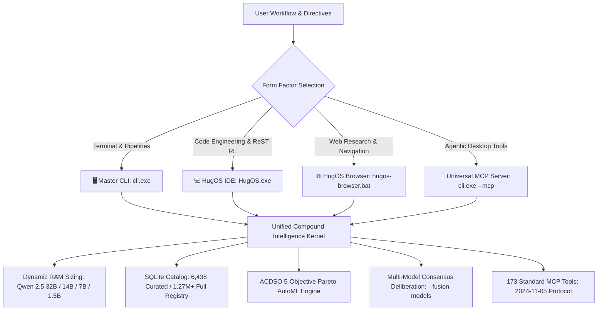
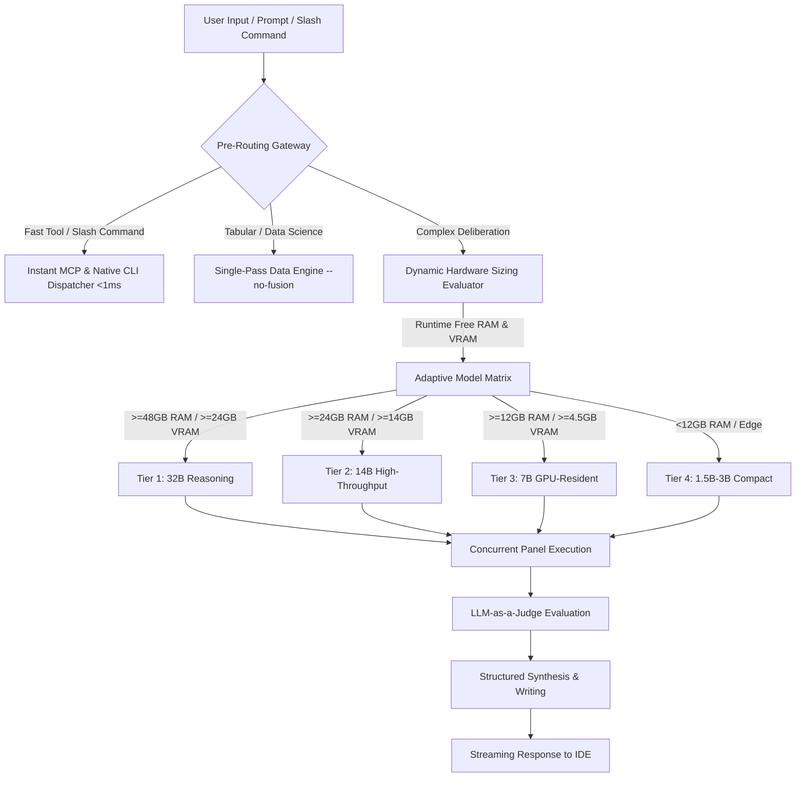
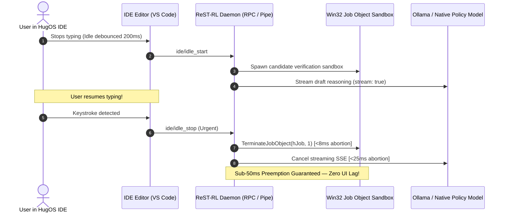
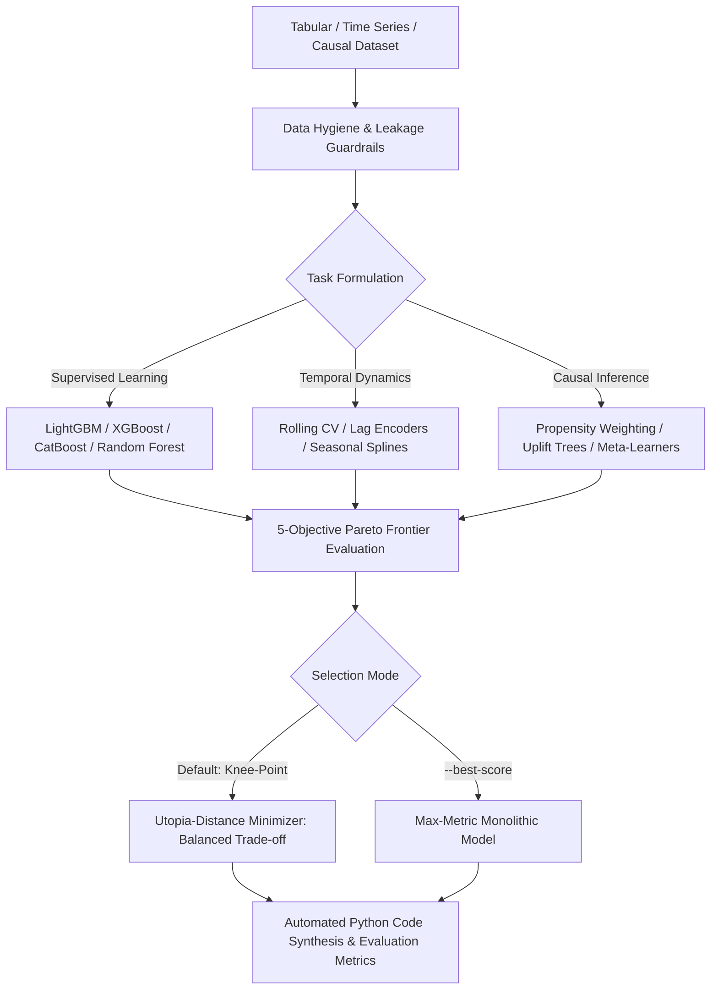
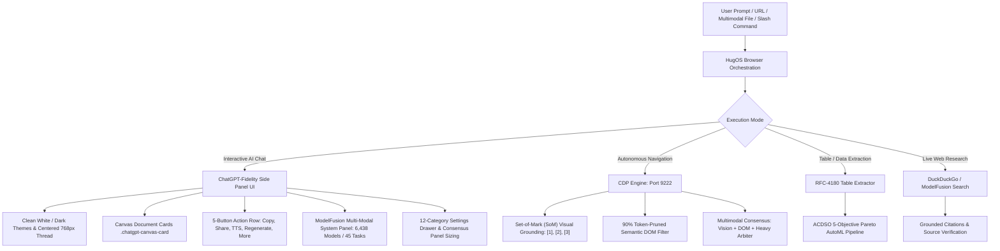

<p align="center">
  
</p>

<h1 align="center">ModelFusion CLI • HugOS IDE • HugOS Browser • Universal MCP Server</h1>

<p align="center">
  <strong>Universal Compound Intelligence Operating System • Autonomous ReST-RL Reasoning • Sub-50ms Kernel Preemption • 173-Tool MCP Catalog • AI-Native Chromium Browser</strong>
</p>

<p align="center">
  <a href="https://github.com/oyesanyf/ModelFusion/releases/tag/v1.0.0-beta.205"></a>
  
  
  
  
  
</p>

---

ModelFusion is an open-weight compound intelligence system and autonomous operating system runtime designed to achieve frontier-class reasoning and technical capability at a fraction of the cost of commercial proprietary APIs. By combining retrieval-augmented generation (RAG), dynamic task-based model selection across 2M+ models, multi-model consensus deliberation, sub-50ms preemption ReST-RL, and structured synthesis, ModelFusion bridges the gap between local open-weights execution and closed frontier models.

---

## 🏛️ The Four Pillars of ModelFusion: CLI • IDE • Browser • MCP Server

ModelFusion delivers a unified, zero-cloud compound intelligence ecosystem across four distinct, deeply integrated form factors. Every visitor to ModelFusion has instant access to the exact modality suited for their workflow:

| Pillar | Form Factor | Primary Entrypoint | Core Capabilities & Highlights |
| :--- | :--- | :--- | :--- |
| **1. Master CLI** | 🖥️ **Headless & Embedded Engine** | `cli.exe` (174 Flags) | Dynamic runtime RAM hardware sizing, 2M+ model catalog crawler (`--updatedb`), ACDSO 5-objective Pareto AutoML, local Ollama lifecycle manager, and headless automation. |
| **2. HugOS IDE** | 💻 **AI-Native Development Environment** | `HugOS.exe` (Code-OSS Fork) | Sub-8ms ReST-RL preemption with Windows Job Objects, virtual in-memory diffs (`restrl-diff://`), background auto-revival watchdog, and native chat panel with multi-modal intent classification. |
| **3. HugOS Browser** | 🌐 **AI-Native Web Operating System** | `hugos-browser.bat` / `--browser` | Chromium CDP integration (port 9222), Set-of-Mark (SoM) visual grounding, 90% token-pruned DOM filter, RFC-4180 table extraction into ACDSO, 12-category settings drawer, and ChatGPT canvas/ergonomic parity. |
| **4. Universal MCP Server** | 🔌 **Universal Agent Tool Protocol** | `cli.exe --mcp` / `mcp/` | Model Context Protocol JSON-RPC 2.0 stdio server exposing **173 specialized tools** (including all 161 core agent tools), ACDSO Pareto AutoML, 45+ multi-modal tasks, PE forensics, and dynamic Ollama models to Cursor, VS Code, Windsurf, Claude Desktop, Antigravity, and Zed. |


```mermaid
graph TD
    A[User Workflow & Directives] --> B{Form Factor Selection}
    
    B -->|Terminal & Pipelines| P1[🖥️ Master CLI: cli.exe]
    B -->|Code Engineering & ReST-RL| P2[💻 HugOS IDE: HugOS.exe]
    B -->|Web Research & Navigation| P3[🌐 HugOS Browser: hugos-browser.bat]
    B -->|Agentic Desktop Tools| P4[🔌 Universal MCP Server: cli.exe --mcp]
    
    P1 --> K[Unified Compound Intelligence Kernel]
    P2 --> K
    P3 --> K
    P4 --> K
    
    K --> M1[Dynamic RAM Sizing: Qwen 2.5 32B / 14B / 7B / 1.5B]
    K --> M2[SQLite Catalog: 6,438 Curated / 1.27M+ Full Registry]
    K --> M3[ACDSO 5-Objective Pareto AutoML Engine]
    K --> M4[Multi-Model Consensus Deliberation: --fusion-models]
    K --> M5[173 Standard MCP Tools: 2024-11-05 Protocol]
```

### 🚀 Parallel Quickstarts: Choose Your Modality

#### 🖥️ Pillar 1: ModelFusion Master CLI
For headless terminal automation, dataset pipelines, model selection, or MCP server integration:
```powershell
# Check hardware and dynamically provision optimal local Ollama model tier
cli.exe --sys-info

# Run fast curated update across all 45 tasks (~6,500 models)
cli.exe --update --db-path "IDE/db/hf_models.db"

# Execute 5-objective Pareto AutoML on a local dataset
cli.exe --acdso "dataset.csv" --target price

# Launch local background ModelFusion server (port 5000)
cli.exe --server
```
👉 *Read the full [CLI Reference Manual (All 174 Flags)](docs/CLI_REFERENCE.md).*

#### 💻 Pillar 2: HugOS IDE (AI-Native Code Editor)
For code engineering, sub-8ms ReST-RL preemption, inline diffs, and local chat:
```powershell
# Option A: Install via self-contained 1.44 GB signed MSI installer
Start-Process -FilePath "msiexec.exe" -ArgumentList "/i", "IDE\HugOS.msi" -Wait

# Option B: Direct download without Git
# Download HugOS.msi directly from GitHub Releases:
# https://github.com/oyesanyf/ModelFusion/releases/tag/v1.0.0-beta.153
```
👉 *Read the full [HugOS IDE Build & Feature Guide](docs/HUGOS_IDE_GUIDE.md).*

#### 🌐 Pillar 3: HugOS Browser (AI-Native Chromium Web Environment)
For autonomous web research, Set-of-Mark visual grounding, web table extraction, and ChatGPT canvas parity:
```powershell
# Execute autonomous goal-directed multi-step web agent (shopping, flights, form-filling)
cli.exe --browser-agent "Buy blue mechanical keyboard on Amazon ($79 budget)" --human-in-the-loop

# Launch interactive HugOS Browser with AI side panel
cli.exe --browser

# Or run the direct launcher batch script
.\browser\Chromium-win32-x64\hugos-browser.bat

# Execute autonomous goal-directed web research directive
cli.exe --browser-task "Extract recent research papers on multi-objective Pareto optimization"

# Semantically extract web tables directly into ACDSO AutoML
cli.exe --browser-extract "https://en.wikipedia.org/wiki/List_of_countries_by_GDP_(nominal)"
```
👉 *Read the full [HugOS Browser Technical Manual](browser/README.md), [Interactive Browser Agent Simulator](docs/screens/hugos_browser_agent_simulator.html), and [Browser Architecture Section](#-hugos-browser-dedicated-modelfusion-ai-web-environment).*

#### 🔌 Pillar 4: ModelFusion Universal MCP Server
The ModelFusion Model Context Protocol (MCP) Server bridges all frontier desktop AI assistants and modern IDEs to ModelFusion's local multi-modal engine, ACDSO 5-objective Pareto AutoML, and 2M+ model catalog across **173 specialized tools** (including all 161 core agent tools across 11 functional domains).

```powershell
# 1. Verify live stdio JSON-RPC handshake and all 173 MCP tools
python mcp\client\test_mcp_connection.py

# 2. Launch the MCP stdio server directly
.\mcp\scripts\run_mcp.bat
```

##### 🛠️ How to Install & Configure MCP in Any IDE:

* **Cursor IDE** (`.cursor/mcp.json` or Settings → Features → MCP):
  ```json
  {
    "mcpServers": {
      "modelfusion": {
        "command": "d:\\harfile\\ModelFusion\\target\\release\\cli.exe",
        "args": ["--mcp", "--db-path", "d:\\harfile\\ModelFusion\\IDE\\db\\hf_models.db"],
        "env": { "LOCAL_OLLAMA_ENDPOINT": "http://127.0.0.1:11434" }
      }
    }
  }
  ```

* **VS Code (with Continue.dev)** (`~/.continue/config.json`):
  ```json
  {
    "experimental": {
      "modelContextProtocolServers": [
        {
          "transport": {
            "type": "stdio",
            "command": "d:\\harfile\\ModelFusion\\target\\release\\cli.exe",
            "args": ["--mcp", "--db-path", "d:\\harfile\\ModelFusion\\IDE\\db\\hf_models.db"]
          }
        }
      ]
    }
  }
  ```

* **VS Code (with Roo Code / Cline)** (`cline_mcp_settings.json`):
  ```json
  {
    "mcpServers": {
      "modelfusion": {
        "command": "d:\\harfile\\ModelFusion\\target\\release\\cli.exe",
        "args": ["--mcp"],
        "disabled": false,
        "autoApprove": []
      }
    }
  }
  ```

* **Windsurf IDE (Codeium Cascade)** (`~/.codeium/windsurf/mcp_config.json`):
  ```json
  {
    "mcpServers": {
      "modelfusion": {
        "command": "d:\\harfile\\ModelFusion\\target\\release\\cli.exe",
        "args": ["--mcp", "--db-path", "d:\\harfile\\ModelFusion\\IDE\\db\\hf_models.db"]
      }
    }
  }
  ```

* **Claude Desktop** (`%APPDATA%\Claude\claude_desktop_config.json`):
  ```json
  {
    "mcpServers": {
      "modelfusion": {
        "command": "d:\\harfile\\ModelFusion\\mcp\\scripts\\run_mcp.bat",
        "args": []
      }
    }
  }
  ```

* **Zed Editor** (`~/.config/zed/settings.json`):
  ```json
  {
    "context_servers": {
      "modelfusion": {
        "command": {
          "path": "d:\\harfile\\ModelFusion\\target\\release\\cli.exe",
          "args": ["--mcp"]
        }
      }
    }
  }
  ```

* **Google Antigravity**:
  Add [`mcp/configs/antigravity_mcp.json`](mcp/configs/antigravity_mcp.json) into your active Antigravity workspace or MCP configuration.

* **HugOS IDE**:
  **Zero configuration required!** Built-in natively. The IDE background watcher connects to `cli.exe` and exposes all 173 tools via `@agent <tool_name>` in chat, terminal, and the Document Canvas.

👉 *Read the full [ModelFusion MCP Integration Guide](mcp/README.md), explore tools via [Interactive MCP Tools Explorer](docs/screens/mcp_tools_explorer.html), and browse the [Exhaustive 173-Tool Reference Manual](mcp/tools_reference.md).*

---

### 📚 Documentation, Interactive Screens & Architecture Reports
*   [**🔌 ModelFusion Universal MCP Server Guide**](mcp/README.md) — Connects 173 local AI tools (including all 161 core agent tools), ACDSO AutoML, and 45+ tasks into Cursor, VS Code, Windsurf, Claude Desktop, Antigravity, and Zed.
*   [**🔌 MCP Exhaustive 173-Tool Reference Manual**](mcp/tools_reference.md) — Comprehensive schemas, parameters, and examples for all 173 tools across 11 functional domains.
*   [**🔌 Interactive MCP Tools Explorer**](docs/screens/mcp_tools_explorer.html) — Searchable web interface with category filters, schema modal viewer, and one-click JSON-RPC call copy.
*   [**🌐 HugOS Browser AI Environment**](#-hugos-browser-dedicated-modelfusion-ai-web-environment) — Dedicated Chromium AI browsing environment with Set-of-Mark visual grounding, table extraction into ACDSO, 12-category settings drawer, and ChatGPT canvas fidelity.
*   [**HugOS Browser Technical Manual**](browser/README.md) — Architecture, CDP protocol, Set-of-Mark token pruning, consensus panel sizing, and extension configuration.
*   [**Interactive Screens & UI Catalog**](docs/screens/README.md) — Standalone ChatGPT-style simulators, aligned Generative UI widgets, 5-theme switchers, and browser interfaces.
*   [**Interactive Architecture & 174-Flag CLI Portal**](docs/screens/ModelFusion_Interactive_Docs.html) — Searchable database of all 174 Master CLI flags, hardware sizing simulator, and live telemetry.
*   [**Architecture Reports & Plans**](docs/reports/README.md) — Browser test reports, settings specifications, and walkthrough guides.
*   [**CLI Reference Manual (All 174 Flags)**](docs/CLI_REFERENCE.md) — Exhaustive master table, parameter options, and executable examples for all 174 CLI flags.
*   [**HugOS IDE Integration Manual**](docs/HUGOS_IDE_MANUAL.md) — Details local multimodal processing, intent classifier centroids, and IDE specific CLI/MCP configurations.
*   [**HugOS IDE Build & Feature Guide**](docs/HUGOS_IDE_GUIDE.md) — Architecture, installation, slash commands, and build pipeline.

---

## 🚀 Quickstart: Cloning & Installing HugOS IDE

HugOS IDE is a standalone, AI-powered IDE built on Code-OSS with local ModelFusion integration. The installer (`IDE/HugOS.msi`) is **100% self-contained**—embedding all 51,000+ files, including the IDE runtime (`HugOS.exe`), ModelFusion backend (`cli.exe` & `mcp-cli.exe`), Copilot extension with ModelFusion local models, and all 127 signed native dependencies.

### Option A: Clone the Full Repository (via Git LFS)
To clone the entire repository on any computer (including the 1.44 GB signed installer):

```powershell
# 1. Initialize Git LFS (required to pull the 1.44 GB MSI package)
git lfs install

# 2. Clone the repository
git clone https://github.com/oyesanyf/ModelFusion.git
cd ModelFusion

# 3. (Verification) Confirm HugOS.msi was fully downloaded (Build 153: ~1.44 GB)
(Get-Item IDE\HugOS.msi).Length
# Expected output: 1510301696 bytes
(Get-FileHash IDE\HugOS.msi -Algorithm SHA256).Hash
# Expected output: 4607C1F51A385F84077C8829E4799E626EF2B9D3DB34DCF71CD46A173ED830E0

# 4. Install HugOS IDE
Start-Process -FilePath "msiexec.exe" -ArgumentList "/i", "IDE\HugOS.msi" -Wait
```

> [!IMPORTANT]
> **Git LFS Requirement**: `IDE/HugOS.msi` is tracked via Git LFS. If `git lfs install` is not run before cloning, Git will download a 130-byte pointer file instead of the binary. If this occurs, simply run `git lfs pull` to fetch the complete installer.

### Option B: Direct Single-Click Download (No Git Required)
If you only want to install HugOS IDE without cloning the full repository:
1. Download **[HugOS.msi (Build 153)](https://github.com/oyesanyf/ModelFusion/releases/download/v1.0.0-beta.153/HugOS.msi)** directly from [GitHub Releases](https://github.com/oyesanyf/ModelFusion/releases).
2. Double-click `HugOS.msi` to run the setup wizard.

### Launching HugOS IDE
Once installed:
* **Start Menu**: Search for **HugOS IDE**
* **PowerShell**:
  ```powershell
  & "$env:LOCALAPPDATA\Programs\HugOS IDE\HugOS.exe"
  ```

---

## 🌀 System Architecture & Core Capabilities


```mermaid
graph TD
    A[User Input / Prompt / Slash Command] --> B{Pre-Routing Gateway}
    B -->|Fast Tool / Slash Command| C[Instant MCP & Native CLI Dispatcher <1ms]
    B -->|Tabular / Data Science| D[Single-Pass Data Engine --no-fusion]
    B -->|Complex Deliberation| E[Dynamic Hardware Sizing Evaluator]
    
    E -->|Runtime Free RAM & VRAM| F[Adaptive Model Matrix]
    F -->|>=48GB RAM / >=24GB VRAM| F1[Tier 1: 32B Reasoning]
    F -->|>=24GB RAM / >=14GB VRAM| F2[Tier 2: 14B High-Throughput]
    F -->|>=12GB RAM / >=4.5GB VRAM| F3[Tier 3: 7B GPU-Resident]
    F -->|<12GB RAM / Edge| F4[Tier 4: 1.5B-3B Compact]
    
    F1 & F2 & F3 & F4 --> G[Concurrent Panel Execution]
    G --> H[LLM-as-a-Judge Evaluation]
    H --> I[Structured Synthesis & Writing]
    I --> J[Streaming Response to IDE]
```

### 1. Dynamic Hardware Sizing: The Runtime Available Memory Law
A core tenet of ModelFusion is that **models are NEVER sized against total physical RAM**. Sizing against total RAM causes fatal OOM crashes when concurrent applications or system caches are active. ModelFusion continuously evaluates **live available free RAM** (`res.free_ram_gb`) and **free GPU VRAM** (`res.free_vram_mb`):

| Runtime Memory State | Model Tag Assigned | Execution Profile | Typical Latency |
|---|---|---|---|
| **Available RAM $\ge$ 48 GB** OR **Free VRAM $\ge$ 24 GB** | `qwen2.5:32b` | Frontier-Class Reasoning Tier | ~35-85 tok/s |
| **Available RAM $\ge$ 24 GB** OR **Free VRAM $\ge$ 14 GB** | `qwen2.5:14b` | Balanced High-Accuracy Tier | ~45-75 tok/s |
| **Available RAM $\ge$ 12 GB** OR **Free VRAM $\ge$ 4.5 GB** | `qwen2.5:7b` | Pure GPU Tensor Core Resident | ~60-90 tok/s |
| **Available RAM $\ge$ 6 GB** OR **Free VRAM $\ge$ 2 GB** | `qwen2.5:3b` | Low-Power Edge Tier | ~90-120 tok/s |
| **Available RAM < 6 GB** OR Low-Budget Flag | `qwen2.5:1.5b` | Minimal Memory Footprint | ~120+ tok/s |

---

### 2. Autonomous ReST-RL Daemon & Sub-50ms Kernel Preemption


```mermaid
sequenceDiagram
    autonumber
    actor User as User in HugOS IDE
    participant IDE as IDE Editor (VS Code)
    participant Daemon as ReST-RL Daemon (RPC / Pipe)
    participant Job as Win32 Job Object Sandbox
    participant LLM as Ollama / Native Policy Model

    User->>IDE: Stops typing (Idle debounced 200ms)
    IDE->>Daemon: ide/idle_start
    Daemon->>Job: Spawn candidate verification sandbox
    Daemon->>LLM: Stream draft reasoning (stream: true)
    
    Note over User,IDE: User resumes typing!
    User->>IDE: Keystroke detected
    IDE->>Daemon: ide/idle_stop (Urgent)
    Daemon->>Job: TerminateJobObject(hJob, 1) [<8ms abortion]
    Daemon->>LLM: Cancel streaming SSE [<25ms abortion]
    Note over Daemon,Job: Sub-50ms Preemption Guaranteed — Zero UI Lag!
```

* **Windows Job Object Termination**: Subprocesses launched during speculative code verification are bound to Win32 Job Objects (`CreateJobObjectW`) and terminated via `TerminateJobObject` in **<8ms**.
* **Zero VRAM Multi-Tier Verification**: 4-tier graduated verification signal (Syntax AST $\to$ Static Typing $\to$ Unit Tests $\to$ Mutation Testing) without allocating secondary 8B reward models into GPU memory.
* **Mutation Testing Gate**: $K=5$ AST mutants ($M_{\text{kill}} \ge 0.5$) act as an adversarial certification gate before candidate code patches are offered to the user.

#### Sound Multi-Objective Adaptive RL Controller (6 Fundamental Pillars)

ModelFusion integrates a computationally sound, sample-efficient reinforcement learning controller (`crates/core/src/rl/adaptive_controller.rs`) operating across the Master CLI, HugOS IDE ReST-RL daemon, and HugOS Browser:

1. **Algorithmic Soundness & Sabotage Elimination**:
   * **Counterfactual Margin Scoring**: Resolves the counterfactual zero-gain bug by evaluating candidates strictly against unsteered baseline rewards ($\Delta R = R_{\text{candidate}} - R_{\text{clean\_base}}$), preserving steering credit while penalizing unnecessary intervention.
   * **Strict Episode Boundaries ($\gamma = 0$)**: Enforces episodic reset ($\gamma = 0$) across independent prompts, distinct queries, and target file switches, preventing reward credit from bleeding backwards into prior trajectory steps.
   * **Time-Decayed Exploration Annealing**: Dynamically decays the exploration parameter via $c(t) = \frac{c_0}{1.0 + \alpha_{\text{decay}} \cdot t}$ (defaults: $c_0 = 1.0, \alpha_{\text{decay}} = 0.005$), ensuring broad early state-space discovery that transitions seamlessly into high-precision exploitation.
   * **Tikhonov-Regularized Cholesky Inversion**: Eliminates near-singular covariance matrix inversion instability by adding $\epsilon_{\text{tikh}} = 10^{-5} I$ before performing Cholesky decomposition ($L L^T = A_{\text{reg}}$), guaranteeing non-NaN, numerically stable parameter updates.

2. **Shared Generalization Across Models & Modalities (45D Joint Space)**:
   * Replaces siloed tabular heuristics with unified action-conditioned bilinear regression:
     $$\phi(s, a) = [1, s, a, s \otimes a] \in \mathbb{R}^{45}$$
   * **State Vector $s \in \mathbb{R}^8$**: Task complexity, runtime available RAM ($\text{GB} / 64$), free VRAM ($\text{MB} / 16384$), prompt character length ($\text{len} / 4000$), and modality indicators (`is_code`, `is_tabular`, `is_multimodal`, `is_web`).
   * **Action Vector $a \in \mathbb{R}^4$**: Model tier ($[1.5\text{B}, 7\text{B}, 14\text{B}, 32\text{B}]$), consensus panel size, verification depth, and search trigger mode.
   * **32 Bilinear Interaction Terms ($s \otimes a$)**: Enables rapid cross-task generalization, allowing the policy to accurately predict outcomes for rarely sampled actions based on shared feature affinities.

3. **Task-Aligned Multi-Signal Verifiable Reward**:
   * Multi-objective composite reward formulation:
     $$R(s, a) = w_{\text{acc}} \cdot R_{\text{verification}} + w_{\text{cost}} \cdot R_{\text{efficiency}} + w_{\text{lat}} \cdot R_{\text{latency}} + w_{\text{reg}} \cdot R_{\text{regret}}$$
   * Driven by verified compiler exit codes, Win32 Job Object test executions, AST mutation kills ($M_{\text{kill}} \ge 0.5 \implies R = 1.0$), and DOM element grounding accuracy over CDP (port 9222).

4. **Scientific Rigor & Zero Leakage (`frozen_test` Mode)**:
   * **`frozen_test` Mode**: Parameter updates are strictly locked during benchmark evaluation to prevent test-set contamination and guarantee valid out-of-distribution generalization metrics.
   * **Three Operational Regimes**: `Cold` (pure zero-shot baseline), `Prior` (warm-started with curated multi-modal heuristics), and `FrozenTest` (deterministic evaluation).
   * **Policy Checkpoint Serialization**: Persisted transparently to `IDE/db/adaptive_rl_policy.json`.

5. **Direct Advantage Attribution & Regret Tracking**:
   * **Direct Advantage Binning**: Categorizes every decision into `RL > Raw` (win), `RL == Raw` (neutral), and `RL < Raw` (loss) relative to the unsteered zero-shot baseline.
   * **Counterfactual Regret Tracking**: Quantifies instantaneous and cumulative regret ($\text{Regret}_t = R^* - R(a_t)$) to evaluate sample efficiency in real time.

6. **Temporal Dynamics & Behavioral Telemetry**:
   * **Live REST Endpoints**: Master CLI exposes `/api/rl/status`, `/api/rl/route`, and `/api/rl/eval-mode`.
   * **Browser Telemetry Card**: Dedicated **Sound RL Adaptive Controller** monitor in HugOS Browser Settings (`pane-tab-usage`) rendering live regime badges, decision counts, exploration rate $c(t)$, advantage win rates, and temporal gains ($R_{\text{late}} > R_{\text{early}}$).

---

### 3. Universal Multi-Modal Data Science & Tabular Engine
ModelFusion provides specialized, instant-response subcommands for data science, tabular modeling, and notebooks:
* `/data-science <path/to/data.csv>` — Instant tabular profiling, schema analysis, missing value detection, and correlation summaries. Automatically executes with `--no-fusion` for direct single-pass generation in seconds.
* `/jupyter <notebook.ipynb>` — Inspect and execute Jupyter cells, generate reproducible exploratory notebooks from raw datasets, and launch interactive analysis.
* `/dataanalyst <file>` — Formulate statistical hypotheses, generate clean matplotlib/seaborn visualization scripts, and identify anomalies.

---

## 📁 Workspace Crate Architecture

ModelFusion is structured into 11 specialized, high-performance Rust crates and a dedicated Python RL runtime:

| Crate Path | Role & Capabilities |
|---|---|
| [`crates/cli`](file:///D:/harfile/ModelFusion/crates/cli) | Authoritative Master CLI, HTTP server (`/orchestrate`), MCP server, and 159+ command flags. |
| [`crates/core`](file:///D:/harfile/ModelFusion/crates/core) | Providers abstraction (Ollama, OpenVINO, ONNX), autonomous deep web research, and pipeline orchestration. |
| [`crates/model_selection`](file:///D:/harfile/ModelFusion/crates/model_selection) | Multi-objective Pareto routing, contextual multi-armed bandit, and dynamic available RAM detection. |
| [`crates/code_graph`](file:///D:/harfile/ModelFusion/crates/code_graph) | Tree-sitter AST extraction (Rust, Python, TypeScript) and sub-1ms CTE call hierarchy queries. |
| [`crates/mesh`](file:///D:/harfile/ModelFusion/crates/mesh) | Zero-config peer discovery with ed25519 mTLS authentication and decentralized compute offloading. |
| [`crates/security`](file:///D:/harfile/ModelFusion/crates/security) | MITRE ATLAS adversarial AI threat detection (AML.T0049, AML.T0052, AML.T0054). |
| [`crates/db`](file:///D:/harfile/ModelFusion/crates/db) | SQLite database indexing 2,000,000+ Hugging Face models across all 45 tasks. |
| [`crates/analysis`](file:///D:/harfile/ModelFusion/crates/analysis) | Portable Executable (PE) binary header parsing, entropy analysis, and security auditing. |
| [`crates/monitoring`](file:///D:/harfile/ModelFusion/crates/monitoring) | Real-time decision metrics, latency tracking, and adaptive routing thresholds. |
| [`crates/task_detection`](file:///D:/harfile/ModelFusion/crates/task_detection) | Syntactic & semantic task classifier covering all 45+ Hugging Face modalities. |
| [`crates/utils`](file:///D:/harfile/ModelFusion/crates/utils) | Rate limiters, performance telemetry recorders, and directory managers. |

---

## 📄 Scientific Publication: "Beyond Model Scale"

Our research paper, *"Beyond Model Scale: Open-Weight Compound Intelligence Through Retrieval-Augmented Consensus Deliberation"*, evaluates ModelFusion using the rigorous **DRACO Evaluation Suite** (25 technical tasks across Software Engineering, Cryptography, Security, and Distributed Systems).

### Related Work & OpenRouter Fusion
OpenRouter recently introduced "Fusion," a tool designed to synthesize outputs from a panel of multiple AI models to surpass individual frontier models on complex deep research tasks.
*   **Mechanism**: Submitted prompts are dispatched in parallel to participant models (equipped with web search/fetch) before a judge model compiles points of consensus and contradictions into a final response.
*   **Draco Benchmark Validation**: In evaluations, a fused combination of Fable 5 and GPT-5.5 scored **69.0%**, outperforming Fable 5's standalone score of 65.3%. A budget panel consisting of Gemini 3 Flash, Kimi K2.6, and DeepSeek V4 Pro scored **64.7%**, beating standalone models like GPT-5.5 and Claude Opus 4.8 at half the operational cost.

### Overall Benchmark Metrics (DRACO Suite with 95% Confidence Intervals)

| Configuration | Mean Score | Std Dev ($\sigma$) | 95% Confidence Interval | API Operating Cost | Local Infra Cost | Profile |
|:---|:---:|:---:|:---:|:---:|:---:|:---|
| **Fusion panel only** | 26.47% | 32.55% | [14.0%, 39.6%] | \$0.00000 | \$0.10639 | Compound Open-Weights |
| **Gemma-4-E2B alone** | 38.73% | 29.91% | [27.4%, 49.3%] | \$0.00000 | \$0.00095 | Single Open-Weights |
| **Gemma-4-E2B + Context** | 47.20% | 37.70% | [32.8%, 62.0%] | \$0.00000 | \$0.00129 | Single Open-Weights |
| **Qwen2.5-7B alone** | 70.27% | 38.25% | [55.2%, 83.3%] | \$0.00000 | \$0.00299 | Single Open-Weights |
| **ModelFusion (Fusion + Context)** | **80.30%** | **28.80%** | **[69.1%, 90.8%]** | **\$0.00000** | **\$0.07760** | **Compound Open-Weights** |
| **gpt-4o alone** | 83.60% | 28.41% | [71.6%, 93.6%] | \$0.24908 | \$0.00000 | Commercial Cloud API |
| **gpt-5.5 alone** | 91.60% | 24.44% | [81.6%, 100.0%] | \$1.68826 | \$0.00000 | Commercial Cloud API |
| **gpt-5.5 + Context** | 98.40% | 8.00% | [95.2%, 100.0%] | \$1.41766 | \$0.00000 | Commercial Cloud API |

---

## 🔬 Component Ablation Analysis

The ablation study shows that retrieval and consensus do not behave as simple independent add-ons.

```
Base model (Gemma-4-E2B)    [38.73%]
       |
       +--> Add Context Only  [47.20%] (Gains: +8.47 points)
       |
       +--> Add Fusion Only   [26.47%] (Loss: -12.26 points)
       |
       +--> ModelFusion (Full) [80.30%] (Synergy Gain: +41.57 points)
```

> [!IMPORTANT]
> **The Deliberation / Retrieval Synergy (Interaction Effect)**
> Consensus deliberation without grounding performs worse than a standalone base model (**26.47% vs. 38.73%**). Without source context, multi-model panels merely amplify assumptions. However, when grounded with RAG context, ModelFusion scores **80.30%** (a **+53.83%** absolute jump). This demonstrates a strong **nonlinear interaction effect** where retrieval and deliberation become highly synergistic.

---

## 💰 Operational Cost Analysis

ModelFusion trades commercial API charges for a predictable local infrastructure cost. 
*   **Infrastructure Efficiency**: ModelFusion costs **\$0.07760** and achieves **80.30%** accuracy, while GPT-4o costs **\$0.24908** and achieves **83.60%**.
*   **Resource Tradeoff**: ModelFusion reaches **96.1%** of GPT-4o's measured score while reducing run cost by **68.8%** relative to GPT-4o.
*   **Cost-per-Value Performance**: Compared to GPT-5.5 + Context, ModelFusion achieves **81.6%** of its accuracy at **~15x better cost efficiency** (1034.8 score-per-dollar vs 69.4 score-per-dollar).

---

## 📊 Sub-Domain and Task-Level Behavior

ModelFusion's average score evaluated across 20 technical sub-domains demonstrates strong technical capabilities:

| Sub-Domain / Task | Average Score (%) | Description |
|:---|:---:|:---|
| **Vector Databases** | 100.0% | Embedding search indexes & similarity scoring. |
| **System Architecture** | 100.0% | Distributed design and service modularization. |
| **Network Protocols** | 100.0% | Low-level transport layer handshake logic. |
| **AI Threat Detection** | 100.0% | Adversarial prompt and jailbreak scanning. |
| **Network Security** | 100.0% | TLS handshake parameters & threat analysis. |
| **Deep Learning** | 100.0% | Neural network layer parameter backpropagation. |
| **Language Runtimes** | 100.0% | Garbage collection mechanisms and JIT compilers. |
| **Computer Architecture**| 100.0% | CPU instruction caches and register states. |
| **Computer Security** | 100.0% | Vulnerability exploits and defense frameworks. |
| **Cryptography** | 100.0% | Encryption keys and secure key exchanges. |
| **Database Internals** | 100.0% | WAL logs, index queries, and transaction isolation. |
| **Software Engineering** | 75.0% | Object-oriented systems and concurrency bugs. |
| **Deep Learning Optimization**| 75.0% | Kernel optimizations and mixed precision. |
| **Web Security** | 66.7% | CORS, CSRF, and SQL Injection vector auditing. |
| **Distributed Systems** | 66.7% | Raft consensus logs and replica syncs. |
| **Blockchain Security** | 60.0% | Smart contract vulnerabilities. |
| **Concurrency** | 60.0% | Deadlock detection and locking mechanisms. |
| **Operating Systems** | 50.0% | Thread schedulers, page faults, and virtual memory. |
| **Cloud Infrastructure** | 37.5% | Kubernetes configurations and orchestration. |

### Limitations & Heatmap Insights
*   **Task 21 Miss**: The task-level heatmap exposes where the compound system succeeds and fails. While ModelFusion improves many weak cases, Task 21 (focusing on distributed storage sync) remains a complete miss, demonstrating that consensus still relies on high-quality retrieval and correct evidence use.

---

## 🚀 Getting Started

### Prerequisites
*   Rust 1.70+ and Cargo
*   Python 3.10+ with `transformers`, `torch`, and `accelerate` installed
*   **Ollama (Highly Recommended for GPU Speed):**
    1. Download and install Ollama from [ollama.com](https://ollama.com/).
    2. Once installed, start Ollama (ensure it is running in your taskbar).
    3. Pull the required models:
       ```powershell
       # The main text generation and coding model
       ollama pull qwen2.5:7b
       # The ultra-fast 0.5B model used for dynamic routing decisions
       ollama pull qwen2.5:0.5b
       ```
    4. Ollama will automatically detect and utilize your NVIDIA GPU (WDDM/CUDA) or AMD GPU (ROCm) for high-performance, low-latency local inference.


### Running the CLI

**Basic fusion query** (10 panel models by default, runs locally via `transformers`):
```powershell
cargo run --release --package cli -- --fusion --prompt "Design a high-concurrency connection pool in Rust."
```

**With auto-generated context** (uses DeepSeek-R1-Distill-Qwen-1.5B to generate background context):
```powershell
cargo run --release --package cli -- --fusion --context-auto --prompt "What is a deadlock and how can it be prevented?"
```

**With custom context guidance**:
```powershell
cargo run --release --package cli -- --fusion --context "Focus on Rust async patterns" --prompt "Compare tokio vs async-std"
```

**Custom panel size** (e.g., 3 models instead of the default 10):
```powershell
cargo run --release --package cli -- --fusion --fusion-models 3 --context-auto --prompt "Explain CAP theorem"
```

**Using Ollama** (runs models via local Ollama instead of Python transformers):
```powershell
cargo run --release --package cli -- --fusion --ollama --context-auto --prompt "What is a deadlock?"
```

### Fusion CLI Flags Reference

> [!TIP]
> This table lists the primary flags. For a complete manual detailing all 100+ command-line options, including ML-based routing, SINQ quantization, advanced agent workflows, LLM evaluations, and custom task routing flags, please see our dedicated [CLI Reference Manual](docs/CLI_REFERENCE.md).

| Flag | Default | Description |
|:---|:---:|:---|
| `--fusion` | off | Enable multi-model consensus deliberation pipeline |
| `--fusion-models <N>` | `10` | Number of models (or temperature samples) to run in the panel |
| `--fusion-mode <MODE>` | `multi-model` | Execution mode: `multi-model` (N different models) or `multi-sample` (1 model, N temperature samples — much faster locally) |
| `--ollama` | off | Use local Ollama for model execution (auto-starts `ollama serve` if not running) |
| `--openvino` | off | Use OpenVINO for optimized CPU inference (requires: `pip install -U openvino-genai`) |
| `--ov-model-dir <DIR>` | `ov_models` | Directory where pre-converted OpenVINO IR models are stored and loaded from |
| `--weight-format <FMT>` | `int8` | Weight format for OpenVINO export: `fp16`, `int8`, `int4` |
| `--prepare-all-models` | off | Download all pre-converted OV Hub models + locally convert small HF models (use with `--update`) |
| `--context-auto` | off | Auto-generate background context via DeepSeek-R1-Distill-Qwen-1.5B |
| `--context <STRING>` | none | Provide custom context guidance for context generation |
| `--report <PATH>` | none | Save the final fusion report to a file or directory |

### Execution Backends

ModelFusion supports three local execution backends. If no backend flag is specified, it defaults to Python `transformers`:

| Backend | Flag | Precision | 7B Model Memory | Best For |
|:---|:---:|:---:|:---:|:---|
| **Ollama** | `--ollama` | Q4_0 | ~5.0 GB | GPU inference via Vulkan/CUDA, fastest for repeated runs |
| **OpenVINO (cached)** | `--openvino` | INT4 | ~4.2 GB | Fastest CPU inference — loads pre-converted models in seconds |
| **OpenVINO (fresh)** | `--openvino` | INT4 | ~4.2 GB | Downloads pre-converted INT4 model from OpenVINO Hub on first run |
| **Transformers** | *(default)* | FP16 | ~16.8 GB | Direct HuggingFace model loading, widest compatibility |

### Fusion Execution Modes

| Mode | Flag | What It Does | Speed | Best For |
|:---|:---:|:---|:---:|:---|
| **Multi-Model** | `--fusion-mode multi-model` | Runs N different models, each providing a unique perspective | Slower (N model loads) | Maximum diversity and quality |
| **Multi-Sample** | `--fusion-mode multi-sample` | Loads 1 best model, samples N times with varied temperatures (T=0.3→1.1) | **5-10× faster** | Fast local execution with good diversity |

### Dynamic Resource Management

ModelFusion dynamically adapts to your hardware at runtime:

* **Memory Detection**: Scans available RAM (via PowerShell) and GPU VRAM (via `nvidia-smi`) on every run.
* **Model Filtering**: Only selects models that fit within 70% of available memory. If fewer than N models fit, the panel is **automatically reduced** with a clear warning.
* **GPU Routing**: Small models (≤ VRAM budget) run on 🎮 GPU; larger models fall back to 💻 CPU (RAM).
* **Sequential Execution**: Ollama and OpenVINO backends run models one at a time to avoid OOM crashes. Transformers can batch based on memory budget.
* **Runtime Fallback**: If a model fails during execution (OOM, timeout, API error), the system automatically substitutes the next-best model from a pre-built fallback pool and **logs the failure reason**.
* **Ollama Auto-Start**: If `--ollama` is specified but Ollama is not running, ModelFusion automatically starts `ollama serve` and waits up to 30 seconds for it to be ready.

> [!NOTE]
> ModelFusion's local SQLite database indexes **over 2 million open-weight models** across **56 task types** from the Hugging Face Hub. When `--fusion` is active, the system dynamically selects the best-fit models for your specific task from this entire catalog, filtered by your hardware's available memory and GPU capacity — giving every user access to a massive pool of open-weight intelligence regardless of their hardware.

### Usage Examples

**Fast local fusion** (1 model, 10 temperature samples via Ollama — recommended for most local setups):
```powershell
cli.exe --fusion --ollama --fusion-mode multi-sample --context-auto --prompt "Design a high-concurrency connection pool in Rust."
```

**Quality fusion** (10 different models via Ollama):
```powershell
cli.exe --fusion --ollama --context-auto --prompt "What is a deadlock and how can it be prevented?"
```

**OpenVINO optimized CPU** (cached INT4 models, no GPU needed):
```powershell
cli.exe --fusion --openvino --fusion-models 3 --fusion-mode multi-model --prompt "Explain CAP theorem"
```

**Custom panel size** (e.g., 5 models):
```powershell
cli.exe --fusion --ollama --fusion-models 5 --context-auto --prompt "Compare tokio vs async-std"
```

**Default transformers backend** (FP16, widest compatibility):
```powershell
cli.exe --fusion --context-auto --prompt "What are the tradeoffs of microservices?"
```

### Database & Model Update Commands

ModelFusion provides two distinct, non-aliased updating commands for its local SQLite catalog (`hf_models.db`) and local AI runtime:

| Command / Flag | Default | Description |
|:---|:---:|:---|
| `--update` | off | **Fast curated update**: indexes top ~6,500 production workhorse models across all 45 tasks and provisions optimal local Ollama hardware model |
| `--updatedb` | off | **Full registry crawler**: continuously ingests ALL 2M+ models from Hugging Face Hub (cursor-paginated in 1,000-model batches, whether junk or not) |
| `--max-models <N>` | unlimited | Maximum number of models to ingest during `--updatedb` |
| `--db-path <PATH>` | `db/hf_models.db` | Custom SQLite database path for ModelFusion (e.g. `IDE/db/hf_models.db`) |

#### Update Examples

**Fast curated update + Ollama model setup** (daily usage & IDE background watcher):
```powershell
cli.exe --update --db-path "IDE/db/hf_models.db"
```

**Full registry crawler** (ingest all 2M+ models from Hugging Face Hub):
```powershell
cli.exe --updatedb --db-path "IDE/db/hf_models.db"
```

**Capped registry crawl** (ingest up to 50,000 models):
```powershell
cli.exe --updatedb --max-models 50000 --db-path "IDE/db/hf_models.db"
```

### Pre-installing Ollama Models
To pre-install the models commonly selected by the `--fusion --ollama` panel:
```powershell
ollama pull qwen2.5:7b
ollama pull qwen2.5:3b
ollama pull qwen2.5:1.5b
ollama pull llama3.1
ollama pull llama3.2:1b
ollama pull deepseek-r1:1.5b
```

---

### 🔷 OpenVINO Model Caching

The OpenVINO backend delivers the fastest local CPU inference by loading **pre-converted INT4 quantized models** directly from disk. The full setup workflow is:

#### Step 1 — Sync the database and cache all pre-converted models
```powershell
$env:PYTHONUTF8="1"
cli.exe --update --prepare-all-models --ov-model-dir ov_models
```

What this does:
- **`--update`**: Fetches 480,000+ models from the HuggingFace Hub into the local SQLite database, then syncs **149 pre-converted OpenVINO Hub models** (`library_name = openvino`, tagged `int4`/`int8`) into the DB with accurate size estimates and high efficiency scores.
- **`--prepare-all-models`**: Two-step caching process:
  1. **Step 1 (fast)** — Downloads all pre-converted `OpenVINO/` org models (INT4, ~0.5–4 GB each) using `huggingface_hub.snapshot_download`. No local GPU or conversion needed.
  2. **Step 2 (local)** — Locally converts small HuggingFace models (≤1.5B params) to OpenVINO IR format using `ov.convert_model()` for any model not available pre-converted.
- **`--ov-model-dir ov_models`**: All cached models are stored under `./ov_models/`.

> [!NOTE]
> `PYTHONUTF8=1` is required on Windows to avoid emoji encoding errors in the PowerShell console.

#### Step 2 — Run fusion with cached OpenVINO models
```powershell
cli.exe --fusion --openvino --fusion-models 3 --fusion-mode multi-model --ov-model-dir ov_models --prompt "Your prompt here"
```

The model selector automatically:
- **Detects cached models** in `ov_models/` and boosts their score by `+0.15`
- **Penalises uncached large models** (>3B params) by `−0.40` when `--openvino` is active
- **Loads from disk instantly** using `openvino_genai.LLMPipeline(local_path, "CPU")` — no download or conversion on inference

#### How model resolution works at inference time

```
Priority 1 → Local ov_models/ cache          ← instant, always checked first
Priority 2 → OpenVINO Hub download           ← ~30 sec, pre-converted INT4
Priority 3 → Manual torch → OV conversion    ← fallback, any model
```

#### OV Hub model registry

The following HuggingFace models have verified pre-converted versions on the [OpenVINO org](https://huggingface.co/OpenVINO):

| HuggingFace Model | OV Hub (INT4) | Size |
|:---|:---|:---:|
| `Qwen/Qwen2.5-1.5B-Instruct` | `OpenVINO/Qwen2.5-1.5B-Instruct-int4-ov` | ~750 MB |
| `Qwen/Qwen2.5-7B-Instruct` | `OpenVINO/Qwen2.5-7B-Instruct-int4-ov` | ~4.2 GB |
| `microsoft/Phi-3-mini-4k-instruct` | `OpenVINO/Phi-3-mini-4k-instruct-int4-ov` | ~2.2 GB |
| `TinyLlama/TinyLlama-1.1B-Chat-v1.0` | `OpenVINO/TinyLlama-1.1B-Chat-v1.0-int4-ov` | ~600 MB |
| `mistralai/Mistral-7B-Instruct-v0.2` | `OpenVINO/Mistral-7B-Instruct-v0.2-int4-ov` | ~4.1 GB |
| `google/gemma-2b-it` | `OpenVINO/gemma-2b-it-int4-ov` | ~1.3 GB |

> See [`src/scripts/run_model_openvino.py`](src/scripts/run_model_openvino.py) for the full registry and [`src/scripts/cache_ov_hub.py`](src/scripts/cache_ov_hub.py) for the standalone download script.

#### Running cache_ov_hub.py standalone
To download only OV Hub models without running `--update`:
```powershell
$env:PYTHONUTF8="1"
# Download all OV Hub models ≤ 5 GB:
python src/scripts/cache_ov_hub.py ov_models db/hf_models.db 5
```

#### Manually Downloading OpenVINO Models

If the automated download (`--prepare-all-models` or `cache_ov_hub.py`) freezes your system — for example when batch-downloading many large INT4 models at once — you can download models **one at a time** manually.

##### Where to find models

Browse pre-converted OpenVINO INT4 models on HuggingFace:
- **Official OpenVINO org**: [huggingface.co/OpenVINO](https://huggingface.co/OpenVINO)
- **Community converters**: Search HuggingFace for `openvino int4` — look for repos by `CelesteImperia`, `Morteza89`, `rpanchum`, `xpuenabler`, etc.

##### Method 1 — `huggingface-cli` (recommended)

Download one model at a time with resume support (won't re-download interrupted files):
```powershell
# Install the CLI if you haven't
pip install -U huggingface-hub

# Download a single model into ov_models/
huggingface-cli download OpenVINO/Qwen2.5-1.5B-Instruct-int4-ov --local-dir ov_models/OpenVINO--Qwen2.5-1.5B-Instruct-int4-ov

# Download a larger model
huggingface-cli download OpenVINO/Qwen2.5-7B-Instruct-int4-ov --local-dir ov_models/OpenVINO--Qwen2.5-7B-Instruct-int4-ov

# Download a community model
huggingface-cli download CelesteImperia/Phi-3.5-mini-instruct-OpenVINO-INT4 --local-dir ov_models/CelesteImperia--Phi-3.5-mini-instruct-OpenVINO-INT4
```

##### Method 2 — `git clone` (full repo)

```powershell
cd ov_models

# Clone with Git LFS (install git-lfs first: https://git-lfs.com)
git lfs install
git clone https://huggingface.co/OpenVINO/Qwen2.5-1.5B-Instruct-int4-ov OpenVINO--Qwen2.5-1.5B-Instruct-int4-ov
```

##### Method 3 — Browser download

1. Go to the model page, e.g. [OpenVINO/Qwen2.5-1.5B-Instruct-int4-ov](https://huggingface.co/OpenVINO/Qwen2.5-1.5B-Instruct-int4-ov)
2. Click the **Files and versions** tab
3. Download **all** files into a folder under `ov_models/`

##### Method 4 — `--getvino` (CLI built-in background downloader)

The CLI has a built-in `--getvino` flag that runs [`getvino.py`](src/scripts/getvino.py) as a **background thread**, downloading all matching OpenVINO org models while you work:

```powershell
# Downloads ALL OpenVINO org models into ov_models/ in the background (runs every 24h)
cli.exe --getvino --ov-model-dir ov_models --prompt "Your prompt here"
```

This runs silently alongside your normal inference — models appear in `ov_models/` as they finish downloading. Progress is logged to stderr.

You can also run `getvino.py` standalone with a **search filter** to download only specific architectures:

```powershell
# Download only Llama-based OpenVINO models
python src/scripts/getvino.py ov_models llama

# Download only Qwen-based OpenVINO models
python src/scripts/getvino.py ov_models qwen

# Download only Phi-based OpenVINO models
python src/scripts/getvino.py ov_models phi

# Download absolutely everything from the OpenVINO org
python src/scripts/getvino.py ov_models all
```

> [!TIP]
> Use a specific filter like `llama` or `qwen` instead of `all` to avoid downloading dozens of GB at once. The script automatically skips models that are already downloaded.

##### Required folder naming and file structure

The folder name **must** use `--` as the separator between org and model name (matching HuggingFace's `repo_id.replace("/", "--")` convention):

```
ov_models/
├── OpenVINO--Qwen2.5-1.5B-Instruct-int4-ov/
│   ├── openvino_model.xml          ← required (IR model definition)
│   ├── openvino_model.bin          ← required (IR model weights)
│   ├── openvino_tokenizer.xml      ← required for openvino_genai
│   ├── openvino_tokenizer.bin
│   ├── openvino_detokenizer.xml
│   ├── openvino_detokenizer.bin
│   ├── tokenizer.json
│   ├── tokenizer_config.json
│   ├── config.json
│   └── generation_config.json
├── CelesteImperia--Llama-3.2-1B-Instruct-OpenVINO-INT4/
│   └── ...
```

> [!IMPORTANT]
> The folder **must contain at least one `.xml` file** (e.g., `openvino_model.xml`). The CLI uses this to detect whether a model is cached and ready. Folders without `.xml` files are ignored.

##### Verifying manually downloaded models

After downloading, confirm the CLI detects your models:
```powershell
# List all cached models
cli.exe --cache-stats

# Run inference using a manually downloaded model
cli.exe --openvino --ov-model-dir ov_models --model OpenVINO/Qwen2.5-1.5B-Instruct-int4-ov --prompt "Hello world"
```

##### Tips to avoid system freezes

- **Download one model at a time** instead of using `--prepare-all-models` which tries to download all at once
- **Start with small models** (~600 MB–1.5 GB) before attempting 4+ GB models
- **Use `huggingface-cli`** — it supports resume, so you can interrupt and restart without losing progress
- **Set `max_size_gb`** when using `cache_ov_hub.py` to limit individual model size: `python src/scripts/cache_ov_hub.py ov_models db/hf_models.db 2` (only models ≤ 2 GB)
- **Close other applications** — large model downloads can consume significant RAM and disk I/O

---

### Running the Draco Benchmark
To execute the DRACO evaluation benchmark offline with strict verification (no simulated fallbacks) and compute confidence intervals across 1,000 bootstrap replicates:
```powershell
python canned_benchmark/draco_evaluator.py --no-fallback --bootstraps 1000
```

---

## 🧠 ACDSO: Adaptive Contextual Data Science Optimization (Risk-Aware AutoML)

ModelFusion integrates **ACDSO (Adaptive Contextual Data Science Optimization)**, an open-weights, risk-aware AutoML and causal decision intelligence engine designed to autonomously build, validate, and optimize end-to-end data science pipelines directly on local hardware without cloud data egress.

While legacy AutoML frameworks optimize solely for a single benchmark metric (e.g. cross-entropy or $R^2$), ACDSO formulates model search as a **5-Objective Constrained Optimization Problem**, enforcing rigorous guardrails against target leakage, data contamination, and latency bloat.


```mermaid
graph TD
    A[Tabular / Time Series / Causal Dataset] --> B[Data Hygiene & Leakage Guardrails]
    B --> C{Task Formulation}
    C -->|Supervised Learning| D1[LightGBM / XGBoost / CatBoost / Random Forest]
    C -->|Temporal Dynamics| D2[Rolling CV / Lag Encoders / Seasonal Splines]
    C -->|Causal Inference| D3[Propensity Weighting / Uplift Trees / Meta-Learners]
    
    D1 & D2 & D3 --> E[5-Objective Pareto Frontier Evaluation]
    E --> F{Selection Mode}
    F -->|Default: Knee-Point| G[Utopia-Distance Minimizer: Balanced Trade-off]
    F -->|--best-score| H[Max-Metric Monolithic Model]
    
    G & H --> I[Automated Python Code Synthesis & Evaluation Metrics]
```

### 1. 5-Objective Pareto Optimization Matrix

ACDSO evaluates every candidate model architecture, feature subset, and hyperparameter configuration across 5 simultaneous conflicting dimensions:

| Objective Dimension | Optimization Direction | Mathematical Formulation / Target Metric | Operational Impact |
|:---|:---:|:---|:---|
| **1. Predictive Accuracy** | **Maximize** | $\text{ROC-AUC}$, $\text{PR-AUC}$, $F_1\text{-score}$, $R^2$, or $\text{1 - Normalized RMSE}$ | Prevents underfitting and maximizes real-world discrimination capability. |
| **2. Training Cost & Time** | **Minimize** | Wall-clock execution seconds $\tau_{\text{train}}$ and CPU/GPU iteration epochs | Guarantees rapid turnaround for iterative ad-hoc analysis in the IDE. |
| **3. Peak Memory Footprint** | **Minimize** | Peak runtime memory $M_{\text{peak}}$ during training and state serialization | Eliminates Out-Of-Memory (OOM) fatal aborts on laptops and resource-constrained workstations. |
| **4. Inference Latency** | **Minimize** | P99 single-row scoring latency $L_{\text{inf}}$ in milliseconds | Complies with strict sub-millisecond production microservice SLAs. |
| **5. Risk & Robustness Drop** | **Minimize** | Covariate shift variance $\sigma_{\text{CV}}^2$ + collinearity penalty $P_{\text{leak}}$ | Eliminates fragile, over-parameterized models prone to silent failure upon distribution drift. |

### 2. Utopia-Guided Knee-Point Selection vs. `--best-score`

In enterprise machine learning, selecting a model based purely on a scalar leaderboard score (`--best-score`) frequently selects bloated 100-estimator ensembles that achieve an incremental $+0.003$ AUC at the expense of $10\times$ inference latency and $5\times$ memory footprint.

ACDSO's default engine computes the non-dominated Pareto frontier and selects the **Knee Point** by minimizing the weighted normalized Euclidean distance to the theoretical **Utopia Point** $\mathbf{u}^* = (1, 0, 0, 0, 0)$:

$$\text{dist}(m, \mathbf{u}^*) = \sqrt{w_1 (1 - \text{Acc}_m)^2 + w_2 (\bar{\tau}_m)^2 + w_3 (\bar{M}_m)^2 + w_4 (\bar{L}_m)^2 + w_5 (\bar{R}_m)^2}$$

- **Knee-Point Solution (Default)**: Yields a production-ready model capturing $98\text{--}99\%$ of peak predictive power while slashing memory and inference latency by up to $80\%$.
- **`--best-score` Flag**: Explicitly overrides multi-objective Pareto trade-offs to force selection of the single candidate with the absolute highest cross-validation score, regardless of compute or latency overhead.

### 3. Automated Risk & Leakage Guardrails

Before fitting model pipelines, ACDSO applies automated data hygiene inspections:

- **Target Leakage Detection**: Detects and prunes predictor columns exhibiting suspicious mutual information ($I(X; Y) > 0.98$) or deterministic forward-looking correlations that indicate the feature is a downstream artifact of the target itself.
- **Feature Collinearity Pruning**: Identifies severe multicollinearity clusters using Variance Inflation Factor ($\text{VIF} > 10$) or high correlation thresholds ($|r| > 0.95$), retaining only the highest-signal orthogonal features.
- **Train-Test Contamination Checks**: Scans for exact row duplicates, near-duplicate hashes, and overlapping entity keys across training and validation partitions to ensure unbiased out-of-sample error estimates.
- **Risk Penalty Scoring**: Penalizes models with extreme parameter-to-sample ratios or high test-score variance across $k$-fold cross-validation folds.

### 4. Automated Time Series Forecasting (`--timeseries`)

When temporal ordering is detected or the `--timeseries` flag is specified, ACDSO pivots from standard cross-validation to walk-forward temporal cross-validation, preventing future information leakage:

- **Temporal Split Validation**: Eliminates random k-fold shuffling; uses expanding or rolling temporal windows.
- **Automated Feature Engineering**: Automatically extracts cyclical trigonometric features (sine/cosine of hour, day, week, month), lag features ($t-1, t-2, \dots, t-k$), and rolling summary statistics (rolling mean, rolling standard deviation, exponential moving averages) across configurable window horizons.
- **Horizon & Timestamp Directives**: Configured directly via `--datetime-col <COL>` and `--horizon <N>` (e.g. `--horizon 14`).

### 5. Causal Decision Intelligence & Uplift Modeling (`--decision`)

Supervised learning predicts *what will happen*, but business decision-making requires knowing *what would happen under intervention*. ACDSO's Decision Intelligence mode (`--decision`) bridges predictive modeling and causal reasoning:

- **Heterogeneous Treatment Effect (HTE) Estimation**: Quantifies Individual Treatment Effects (ITE) and Conditional Average Treatment Effects (CATE) across sub-populations.
- **Propensity Score Weighting**: Uses Inverse Probability Weighting (IPW) and doubly robust estimators to correct for observational selection bias and confounding variables.
- **Uplift Curves & Net Lift Optimization**: Evaluates Cumulative Qini and Uplift curves to identify true "Persuadables" while isolating "Sleeping Dogs" (users who respond negatively to treatment) and "Sure Things" (users who convert regardless of treatment).
- **Treatment Column Directive**: Designated via `--treatment <COL>`.

### 6. Zero Paid Models Guarantee & 100% Local Privacy

ACDSO is strictly committed to open-weight, zero-cost execution:
- **100% Local Execution**: All computations, feature engineering, statistical tests, and machine learning models run entirely on your local machine using Rust, local Python kernels, and Ollama (`qwen2.5:32b`, `qwen2.5:14b`, `qwen2.5:7b`) or OpenVINO.
- **Zero API Subscriptions or Cloud Egress**: Sensitive proprietary datasets, medical records, and financial transactions never leave your machine or traverse cloud endpoints.
- **Reproducible Python Script Generation**: ACDSO outputs complete, clean, self-contained Python scripts (`scikit-learn`, `lightgbm`, `xgboost`, `pandas`) that can be exported, version-controlled, or run in standalone CI/CD pipelines.

### 7. Chat Interface Directives & CLI Execution Examples

ACDSO is accessible via standalone CLI commands or conversational directives in the HugOS IDE chat panel:

#### Conversational Directives in HugOS IDE
```text
@agent acdso "data/customer_churn.csv" --target churn --predict churn
/acdso "data/retail_demand.csv" --timeseries --datetime-col date --horizon 30
@automl "data/clinical_trial.csv" --decision --target recovery --treatment drug_group
```

#### Standalone Master CLI Commands

```powershell
# 1. Supervised AutoML with Knee-Point Pareto Selection (Default)
cli.exe --acdso --file "data/credit_risk.csv" --target default --no-fusion

# 2. Force Max-Metric Benchmark Model (--best-score)
cli.exe --acdso --file "data/credit_risk.csv" --target default --best-score

# 3. Automated Time Series Forecasting (14-day Horizon)
cli.exe --acdso --file "data/store_sales.csv" --timeseries --datetime-col "date" --horizon 14

# 4. Causal Decision Intelligence & Uplift Modeling
cli.exe --acdso --file "data/marketing_campaign.csv" --decision --target conversion --treatment incentive_code
```

---

## 🌐 HugOS Browser: Dedicated ModelFusion AI Web Environment

HugOS Browser is a dedicated, autonomous Chromium-based AI operating environment engineered specifically for ModelFusion. Powered by the authoritative ModelFusion Master CLI (`cli.exe`), Chrome DevTools Protocol (CDP port 9222), and high-throughput semantic DOM pruning, HugOS Browser unifies interactive web navigation, Set-of-Mark visual grounding, automated dataset extraction into ACDSO, and pixel-perfect ChatGPT functional fidelity into a single zero-paid-models desktop runtime.


```mermaid
graph TD
    A[User Prompt / URL / Multimodal File / Slash Command] --> B[HugOS Browser Orchestration]
    B --> C{Execution Mode}
    
    C -->|Interactive AI Chat| D[ChatGPT-Fidelity Side Panel UI]
    C -->|Autonomous Navigation| E[CDP Engine: Port 9222]
    C -->|Table / Data Extraction| F[RFC-4180 Table Extractor]
    C -->|Live Web Research| G[DuckDuckGo / ModelFusion Search]
    
    D --> D1[Clean White / Dark Themes & Centered 768px Thread]
    D --> D2[Canvas Document Cards .chatgpt-canvas-card]
    D --> D3[5-Button Action Row: Copy, Share, TTS, Regenerate, More]
    D --> D4[ModelFusion Multi-Modal System Panel: 6,438 Models / 45 Tasks]
    D --> D5[12-Category Settings Drawer & Consensus Panel Sizing]
    
    E --> E1["Set-of-Mark (SoM) Visual Grounding: [1], [2], [3]"]
    E --> E2[90% Token-Pruned Semantic DOM Filter]
    E --> E3[Multimodal Consensus: Vision + DOM + Heavy Arbiter]
    
    F --> H[ACDSO 5-Objective Pareto AutoML Pipeline]
    G --> I[Grounded Citations & Source Verification]
```

### 1. Autonomous Chromium AI Web Environment & CDP Architecture
HugOS Browser is built directly around an isolated Chromium distribution (`browser/Chromium-win32-x64/`) and coordinates with the ModelFusion Master CLI over Chrome DevTools Protocol (CDP port 9222):
- **Direct Async RFC-6455 WebSockets**: Provides sub-millisecond command dispatch for page navigation, element inspection, screenshot capturing, mouse events, and keystrokes.
- **Bi-Directional AI Communication**: The dedicated Manifest V3 companion extension (`browser/extension/`) bridges browser runtime events with the ModelFusion HTTP API server on port 5000.
- **Fail-Safe Non-Blocking Timeouts**: All CDP operations enforce strict 10-second safety timeouts with automatic reconnection, preventing process deadlocks during heavy multi-tab browsing.

### 2. Set-of-Mark (SoM) Visual Grounding & Token-Pruned DOM
Modern web pages frequently span megabytes of minified JavaScript, bloated SVG paths, CSS styles, and tracking beacons that exhaust LLM context windows and slow response times. HugOS Browser eliminates this overhead through two synergistic mechanisms:
- **90% Token Reduction Semantic Pruner**: Strips scripts, styles, SVGs, noscripts, iframes, and comments, slashing typical token consumption by **85% to 95%** while preserving complete interactive fidelity.
- **Set-of-Mark (SoM) Visual Grounding**: Actionable interactive targets (`<a>`, `<button>`, `<input>`, `<select>`, `<textarea>`, and click handlers) are tagged with discrete numeric badges (`[1]`, `[2]`, `[3]`). Vision models (`qwen2.5-vl`) and text models (`qwen2.5:32b/7b`) reference elements by number for error-free autonomous clicking and typing.

### 3. Structured Table & Dataset Extraction directly into ACDSO
HugOS Browser transforms the web into an instant data ingestion engine for machine learning:
- **Zero-Loss Table Parsing**: Automatically extracts HTML `<table>` elements and modern dynamic grids (`role="grid"`, `role="table"`), converting them to RFC-4180 compliant CSV and structured JSON.
- **Direct ACDSO Pipeline**: Triggered via `/acdso <URL>` or `--browser-extract <URL>`, tables are streamed directly into the 5-Objective Pareto AutoML engine to train predictive, time-series, or causal models on real-time web data without manual CSV export.

### 4. ChatGPT Visual & Functional Fidelity
HugOS Browser's AI side panel (`browser/ui/`) provides high-fidelity ergonomics modeled on frontier AI interfaces:
- **Default Clean White Theme & Dark Variants**: Implements the signature ChatGPT aesthetic with clean `#FCFCFC` / `#FFFFFF` backgrounds, subtle `#E5E5E5` borders, and high-contrast typography, alongside dark theme options (Dark+, Obsidian, Midnight, Warm).
- **Centered 768px Chat Thread**: Optimal reading width centered in the viewport with responsive auto-reflow.
- **Full Markdown Rendering**: Clean typographic hierarchy for headings (`#`, `##`, `###`), bold emphasis, lists, tables, and fenced code blocks equipped with one-click copy buttons.
- **Canvas Document Card (`.chatgpt-canvas-card`)**: Long-form outputs, essays, reports, and code blocks automatically wrap into elegant, rounded canvas containers displaying the document title in the top-left corner alongside `📋 Copy` and `⤢ Expand` buttons.
- **5-Button Assistant Action Row**: Every assistant message provides a streamlined toolbar:
  - 📋 **Copy**: Copies message contents or Markdown directly to the clipboard.
  - ⬆️ **Share**: Exports or shares message exchanges.
  - 🔊 **Read Aloud**: Native text-to-speech audio synthesis utilizing the Web Speech API.
  - 🔄 **Regenerate**: Re-prompts the ModelFusion engine for alternative consensus drafts.
  - ⋯ **More options**: Quick access to model details, token telemetry, and raw outputs.
- **Sidebar Chat History**: Persistent multi-session history with instant switching, thread renaming, deletion, and "New chat" creation.
- **Auto-Hiding Sleek 6px Scrollbars**: Completely eliminates thick operating system scrollbars and page-level double scrollbar bugs, providing a smooth, distraction-free view.

### 5. Multi-Model Consensus Deliberation & Dynamic Panel Sizing (`--fusion-models`)
HugOS Browser supports compound multi-model deliberation, fusing multiple models or temperature variations to achieve super-human consensus:
- **Consensus Panel Size Setting**: Configured under **Settings ➔ AI Models & Endpoints**:
  - `0 (Auto-RAM)` *(Default)*: Dynamically allocates the number of models based strictly on **runtime available / free memory** (`res.free_ram_gb`, `res.free_vram_mb`) to completely eliminate Out-Of-Memory (OOM) risks.
  - `2 Models`: Fast Dual Consensus (Primary workhorse + Secondary validation verifier).
  - `3 Models`: Tri-Specialist panel (Fast DOM Specialist + Vision Specialist + Heavy Reasoning Arbiter).
  - `5 Models`: Deep Consensus Panel (Broad sampling across multiple model architectures).
  - `10 Models`: Exhaustive Frontier Deliberation (Full multi-model Pareto consensus).
- **Consensus Arbitration Gates**:
  - **Dominant Winner Gate**: Selects the candidate with the highest PRM verification score ($R = 1.0$).
  - **Unanimous Agreement Gate**: Fast bypass when all models agree on the proposed action.
  - **Reasoning Synthesis Gate**: Blends token-level logprobs across reasoning specialists.

### 6. Model Catalog Architecture: 6,438 Curated Workhorses vs. 1.27M+ Full Registry
ModelFusion maintains an SQLite catalog database (`hf_models.db`) to enable offline discovery and instant model switching across all 45 Hugging Face tasks:
- **`--update` (Fast Curated Ingestion)**: Ingests the **top ~6,500 production workhorse models** across all 45 tasks. Designed for daily use, `@agent update`, and background refreshers. When initialized via `--update`, the database contains ~6,438 models. Available directly in the Settings Drawer and Models tab via `⚡ Run Curated Update (--update)`.
- **`--updatedb` (Full Registry Crawler - All 2M+ Models)**: Traverses the entire Hugging Face Hub via cursor pagination (`limit=1000`, HTTP `Link: rel="next"`), indexing **over 2 million models** ("whether junk or not") in 1,000-model transactions (~1,000 models/sec). Available via one-click `🚀 Crawl Full Registry (--updatedb)` in the Settings Drawer with quick caps (10k, 50k, 250k, or all 2M+).
- **Offline / IPC Disconnected Fallback**: If the Master CLI server (`http://127.0.0.1:5000`) is offline or unreachable, the browser UI fails safe to the verified baseline constant of **6,438 Models**, rather than failing or displaying an empty screen.
- **Task-Specific Filtering**: Unclassified community repositories lacking a valid `pipeline_tag` exist in the raw 1.27M database, but are pruned from task-specific consensus candidate pools to guarantee execution reliability.

### 7. Comprehensive 12-Category Settings Drawer (Matching HugOS IDE)
HugOS Browser includes a full-featured Settings Modal (`Ctrl+,`) with real-time search filtering across 12 distinct functional categories:
1. ⚙️ **General**: Default browser homepage, token streaming toggles, auto-scroll behavior, and system diagnostics.
2. 🔆 **Appearance**: 5 custom themes (ChatGPT Clean White, Sleek Dark, Obsidian Black, Midnight Navy, Warm Sepia) and font size scaling.
3. 🌐 **Web Search & Routing**: Autonomous query routing toggles, search engine provider, maximum search results, and citation formatting.
4. 🧠 **AI Models & Endpoints**: Ollama REST API URL, ModelFusion Master CLI IPC URL, Chrome CDP Port, Primary Workhorse Model, Consensus Panel Size (`--fusion-models`), Vision Specialist Model (`qwen2.5-vl`), and Audio Specialist Model (`whisper-base`). Includes quick-action update buttons (`⚡ Update Curated (~6.5k)` and `🚀 Crawl All 2M+ Models`).
5. 📁 **Storage**: Navigation history cache clearing, attached file staging management, database statistics, and interactive **Catalog Update & Crawler Operations Card** (`⚡ Run Curated Update` and `🚀 Crawl Full Registry`).
6. ⌨️ **Keyboard**: Master table of keyboard shortcuts (`Ctrl+,`, `Ctrl+N`, `Ctrl+[`, `Ctrl+Enter`, `Alt+S`, `Esc`).
7. 📈 **Usage**: Live host telemetry (Runtime Available RAM, GPU VRAM, active model, and query counter).
8. 🔔 **Notifications**: In-app toast alerts, model provisioning notifications, and task completion chimes.
9. 👤 **Account**: 100% local profile, zero cloud registration, and `%LOCALAPPDATA%\HugOS Browser` path.
10. 🔑 **Security & Sandboxing**: Windows Job Object process isolation (<8ms termination) and CORS defense-in-depth.
11. 🎙️ **Voice**: Speech synthesis voice selection, pitch, and playback rate for Read Aloud.
12. 🐾 **Pets**: Interactive desktop productivity companion and status indicators.

### 8. Live Internet Search & Grounded Citations
HugOS Browser combines local offline intelligence with real-time web awareness:
- **Intelligent Query Routing (`/api/search`)**: Automatically analyzes query intent; time-sensitive facts, news, and current events are routed to live web search without manual toggling.
- **Local Synthesis & Grounding**: Web search snippets are synthesized through local open-weights models (`qwen2.5:32b/7b`), generating factual Markdown responses with clickable footnote citations (`[1]`, `[2]`).

### 9. Multimodal File Attachments & Direct Pipelines
Attach any file via the `📎` button or drag-and-drop:
- **Images** (`.png`, `.jpg`, `.webp`): Thumbnail previews with Set-of-Mark visual grounding.
- **Audio** (`.wav`, `.mp3`): Transcribed via local Whisper specialists.
- **Tabular Datasets** (`.csv`, `.tsv`, `.parquet`): Instant `[⚡ Run ACDSO]` action chip to train 5-objective Pareto AutoML models directly.
- **Code & Documents** (`.rs`, `.py`, `.json`, `.pdf`, `.md`): Automatically injected into prompt context.

### 10. Architectural Comparison: Standard Browser vs. HugOS Browser

| Capability | Standard Browsers (Chrome / Edge) | HugOS Browser (ModelFusion AI) |
| :--- | :--- | :--- |
| **Local AI Engine** | None (Cloud-dependent extensions) | **100% Offline Local AI (Ollama / OpenVINO)** |
| **Cloud Token Cost** | Paid API keys / monthly subscriptions | **$0.00 / Zero Paid Models Guaranteed** |
| **Data Privacy** | Cloud telemetry and external logging | **100% Private (No data leaves local host)** |
| **DOM Optimization** | Raw HTML (Megabytes of minified code) | **90% Token-Pruned Semantic DOM Filter** |
| **Interactive Grounding** | CSS selectors / XPath (Fragile) | **Set-of-Mark (SoM) Discrete Visual Badges (`[1]`, `[2]`)** |
| **AutoML Data Extraction** | Manual download & external scripts | **Zero-Loss Table Extractor directly into ACDSO** |
| **Model Deliberation** | Single model or commercial vendor lock | **Multi-Model Consensus Deliberation (`--fusion-models`)** |
| **Catalog Offline Index** | None | **1,271,167 Models across 45 Hugging Face Tasks** |
| **Ergonomics & Visuals** | Standard browser UI | **ChatGPT Visual Parity, Clean White, Canvas Cards** |

### 11. Concrete Executable Command Examples

#### Standalone Master CLI Commands
```powershell
# Launch interactive HugOS Browser with AI side panel
cli.exe --browser

# Execute autonomous goal-directed web research directive
cli.exe --browser-task "Extract recent research papers on multi-objective Pareto optimization"

# Semantic dataset extraction from target URL directly into ACDSO
cli.exe --browser-extract "https://en.wikipedia.org/wiki/List_of_countries_by_GDP_(nominal)"

# Launch with custom Chromium remote debugging port
cli.exe --browser --browser-port 9225

# Launch with custom multi-model consensus panel size (e.g. 5 models)
cli.exe --browser --fusion-models 5

# Direct launcher batch script
.\browser\Chromium-win32-x64\hugos-browser.bat
```

#### Conversational Slash Commands in HugOS Chat
```text
/browser https://en.wikipedia.org/wiki/Comparison_of_deep_learning_software
@agent browser extract tables from https://en.wikipedia.org/wiki/List_of_countries_by_GDP_(nominal)
/acdso https://example.com/dataset.csv --target price --predict price
@agent browser find the highest rated local speech recognition models on Hugging Face
```

---

## 💻 CLI Reference & Capabilities (All 174 Flags)

ModelFusion's Master CLI (`cli.exe`) is the single authoritative execution engine powering both standalone terminal workflows and the embedded HugOS IDE runtime. In accordance with ModelFusion's command architecture, **all 170 CLI flags function as direct executable capability directives** rather than passive configuration options.

> [!TIP]
> **Complete Authoritative Documentation**: For the full numbered master table (#1 to #170), detailed parameter specifications, and concrete executable examples for every single flag, see the dedicated [**docs/CLI_REFERENCE.md**](docs/CLI_REFERENCE.md).

### Functional Category Matrix (All 170 Production Flags)

| # | Category | Flag Range | Total | Core Capabilities & Key Directives | Concrete Execution Example |
|:---:|:---|:---:|:---:|:---|:---|
| **1** | **Global Execution & Resource Flags** | `#1 – #19` | 19 | Hardware targeting (`--gpu`, `--cpu`), prompt inputs (`--file`, `--prompt`), budget limits (`--budget`), execution trace | `cli.exe --prompt "Design lock-free queue" --gpu` |
| **2** | **Machine Learning Model Selection** | `#20 – #26` | 7 | Adaptive Pareto routing, online RL feedback (`--ml-learning`), meta-ensembles, confidence thresholds | `cli.exe --enable-ml-selection --ml-analytics` |
| **3** | **SINQ Quantization Engine** | `#27 – #31` | 5 | Sub-4-bit integer non-linear weight quantization, bit-width (`--sinq-nbits`), grouping, tiling modes | `cli.exe --sinq --sinq-nbits 4 --prompt "..."` |
| **4** | **Innovation & Cognitive Systems** | `#32 – #37` | 6 | Workflow optimization, semantic AST tracking, predictive reasoning, cognitive innovation levels | `cli.exe --enable-innovations --innovation-level 2` |
| **5** | **HyDE Search & Web Retrieval** | `#38 – #46` | 9 | Hypothetical document embeddings, live web search agent (`--search`), autonomous deep research (`--research`) | `cli.exe --research "Latest GRPO RL advances"` |
| **6** | **System & Orchestration Commands** | `#47 – #87` | 41 | Model Fusion deliberation (`--fusion`), Ollama/OpenVINO/ONNX/vLLM backends, `--update` vs `--updatedb`, ReST-RL, HugOS Browser (`--browser`, `--browser-task`) | `cli.exe --browser --browser-task "Research GRPO"` |
| **7** | **Data Science & Tabular Workflows** | `#88 – #90` | 3 | Automated tabular profiling (`--dataanalyst`), full ML pipeline (`--datascience`), formatted PDF report export | `cli.exe --datascience --file "data.csv" --export-pdf` |
| **8** | **Response Evaluation & Planning** | `#91 – #93` | 3 | Multi-metric response scoring (`--score`), LLM-as-a-Judge certification (`--judge`), strategic blueprints (`--plan`) | `cli.exe --judge --score --prompt "..."` |
| **9** | **Binary & PE Executable Analysis** | `#94` | 1 | Windows PE executable header inspection, import/export symbol tables, digital Authenticode signatures | `cli.exe --pe-header-extraction --file "cli.exe"` |
| **10** | **Multi-Modal Task Routing Flags** | `#95 – #156` | 62 | All 45+ Hugging Face tasks spanning Vision, Audio, NLP, Code, Document QA, Tabular, and Domain pipelines | `cli.exe --text-generation --prompt "..."` |
| **11** | **Server & Database Commands** | `#157 – #161` | 5 | Custom SQLite database path (`--db-path`), HTTP REST server (`--server`, `--port`), MCP stdio protocol (`--mcp`) | `cli.exe --server --port 5000 --db-path "IDE/db/hf_models.db"` |
| **12** | **ACDSO Risk-Aware AutoML** | `#162 – #170` | 9 | Multi-objective knee-point AutoML (`--acdso`), supervised modeling (`--target`, `--predict`, `--best-score`), auto time-series forecasting (`--timeseries`, `--datetime-col`, `--horizon`), causal decision intelligence (`--decision`, `--treatment`) | `cli.exe --acdso --file "data.csv" --target score` |

---

### Core Execution Invariants

1. **Dual Database Ingestion Pipelines**:
   - **`--update` (Fast Curated Engine)**: Ingests top ~6,500 production workhorse models across all 45 tasks and provisions matching Ollama model.
   - **`--updatedb` (Full Registry Crawler)**: Traverses all 2,000,000+ models on Hugging Face Hub using cursor pagination (1,000 models/commit).
2. **Dynamic Runtime Available Memory Law**:
   - Never size or allocate models based on total physical RAM. Always evaluate runtime free/available RAM (`res.free_ram_gb`) and free VRAM (`res.free_vram_mb`) to prevent OOM termination.
3. **4-Way Cryptographic Parity**:
   - `cli.exe` is kept byte-identical across `target/release/cli.exe`, `IDE/bin/cli.exe`, `IDE/VSCode-win32-x64/bin/cli.exe`, and `%LOCALAPPDATA%\HugOS IDE\bin\cli.exe`.

For complete documentation of all flags, see [**docs/CLI_REFERENCE.md**](docs/CLI_REFERENCE.md).

---

## 🖥️ HugOS IDE

HugOS IDE is a fully integrated development environment built on VS Code, with ModelFusion's multi-model orchestration engine embedded directly into the editor. It provides a local-first, privacy-respecting AI coding assistant that runs entirely on your machine.

<p align="center">
  
</p>

### 📥 Installation

1. **Download** the latest MSI from [GitHub Releases](https://github.com/oyesanyf/ModelFusion/releases)
2. **Run** `HugOS.msi` — installs to `C:\Program Files\HugOS IDE\`
3. **Install Ollama** from [ollama.com](https://ollama.com/) for local GPU inference
4. **Pull a model**:
   ```powershell
   ollama pull qwen2.5:1.5b    # Fast path (simple questions, ~2s)
   ollama pull qwen2.5:7b      # Quality path (complex coding, ~7s)
   ```
5. **Launch** HugOS IDE — the ModelFusion server starts automatically on port 5000

#### Command-Line Installation (msiexec)

```powershell
# Standard install (with UI)
msiexec /i "HugOS.msi"

# Silent install (no UI, no prompts)
msiexec /i "HugOS.msi" /qn

# Silent install with verbose log
msiexec /i "HugOS.msi" /qn /l*v "C:\hugos_install.log"

# Uninstall
msiexec /x "HugOS.msi" /qn
```

### ⚡ Adaptive Inference Pipeline

HugOS IDE uses an intelligent routing system that adapts to each question:

```
User Message → Complexity Gate → Route Decision
                    │
         ┌──────────┴──────────┐
         ▼                     ▼
    Simple Question       Complex Coding
    (< 200 chars,         (> 200 chars,
     no code keywords)     code keywords)
         │                     │
         ▼                     ▼
   ⚡ Fast Path           🧠 Heavy Pipeline
   qwen2.5:1.5b          Full Orchestrator
   ~3 seconds             ~7 seconds
   8 concurrent slots     2 concurrent slots
```

#### Dynamic System Prompts

The fast path automatically selects the best system prompt based on what you're asking:

| Domain | Trigger Keywords | Temperature |
|:-------|:----------------|:----------:|
| **Coding** | code, function, python, rust, javascript, sql, api, git... | 0.5 |
| **Math** | math, equation, integral, theorem, algebra, proof... | 0.3 |
| **Data Science** | dataset, ML, pytorch, sklearn, regression, neural net... | 0.5 |
| **Security** | hack, CVE, malware, PE header, reverse engineer, forensic... | 0.5 |
| **NLP** | sentiment, tokenize, translate, embedding, NER... | 0.5 |
| **DevOps** | kubernetes, terraform, AWS, CI/CD, pipeline, nginx... | 0.5 |
| **Databases** | postgres, redis, schema, query, migration, ORM... | 0.5 |
| **Networking** | TCP, DNS, firewall, SSL/TLS, protocol, socket... | 0.5 |
| **Writing** | essay, poem, email, resume, blog, article... | 0.8 |
| **Science** | physics, chemistry, biology, quantum, DNA, atom... | 0.3 |
| **Finance** | invest, stock, crypto, tax, revenue, accounting... | 0.3 |
| **Education** | explain, what is, how does, difference between... | 0.3 |
| **History/Geography** | capital, country, president, empire, population... | 0.3 |
| **Health** | symptom, vitamin, exercise, nutrition, disease... | 0.3 |
| **General** | *everything else* | 0.3 |

### 🔧 Slash Commands & @agent Directives

Type `/` or `@agent ` in the HugOS Chat input to see interactive autocomplete suggestions. All 71+ commands are processed natively by the ModelFusion Master CLI (`cli.exe`) with complete **1:1 command parity** between `/command` and `@agent command`.

#### 1. Code Optimization & Evolution
| Command | Aliases | Options | Description |
|:---|:---|:---|:---|
| `/evolve` | `/evolution`, `/avo` | `-n <N>`, `--iterations <N>`, `--strategy <auto\|builtin>` | Iterative code evolution cycling through bug fixes, performance, error handling, refactoring, and security. Auto-applies inline diff (`Ctrl+Shift+Y` / `Ctrl+Shift+N`). |
| `/refactor` | — | `[instructions]` | Refactors code for modularity, clean architecture, and SOLID adherence. |
| `/optimize` | `/workflow-optimization` | `--focus <cpu\|memory\|io>` | Analyzes hot paths and reduces algorithmic time/memory complexity ($O(N)$). |
| `/fix` | — | `[error context]` | Automatically fixes syntax errors, type errors, and compiler diagnostics in active file. |
| `/review` | `/audit` | `--severity <low\|med\|high>` | Conducts deep code review identifying architectural anti-patterns and flaws. |
| `/tests` | — | `--framework <pytest\|jest\|cargo>` | Generates unit test suites, regression fixtures, and edge-case mocks. |
| `/explain` | — | `--level <beginner\|expert>` | Step-by-step walkthrough explaining complex algorithms and data structures. |

*Examples:*
```text
/evolve -n 5 Optimize this Rust buffer for zero allocations on the hot path
/refactor Convert this monolithic function to an event-driven strategy handler
/tests --framework cargo Generate tests for concurrent RwLock acquisition
```

#### 2. Code Quality, Security & Auditing
| Command | Aliases | Options | Description |
|:---|:---|:---|:---|
| `/security` | `/code-vulnerability-detection` | `--deep`, `--framework <owasp\|cve>` | Runs ATLAS static security analysis scanning for OWASP Top 10, CWEs, and secret leaks. |
| `/comment` | `/comments`, `/doc`, `/docs` | `--style <jsdoc\|rustdoc>` | Generates comprehensive docstrings, parameter types, and inline comments. |
| `/pii-detection` | — | `--sanitize` | Scans files and prompts for credentials, IP addresses, and private user data. |
| `/code-clone-detection` | — | `--threshold <0.1-1.0>` | Detects duplicate code fragments and semantic clones across the workspace. |

*Examples:*
```text
/security --deep Audit this auth router for SQL injection, timing attacks, and JWT flaws
/comment --style rustdoc Document all public structs, traits, errors, and safety invariants
```

#### 3. Multi-Model Consensus & Deliberation
| Command | Aliases | Options | Description |
|:---|:---|:---|:---|
| `/fusion` | — | `on` / `off` | Toggles ModelFusion multi-model deliberation panel with consensus synthesis. |
| `/fusion-models` | — | `<N>` (e.g. `0`, `3`, `5`) | Configures consensus panel size. **`0` = Auto Dynamic Sizing** (based on live available RAM/VRAM). |
| `/fusion-mode` | — | `multi-model` \| `multi-sample` | `multi-model` (queries N distinct models) or `multi-sample` (N temperature seeds on top model). |
| `/judge` | — | `on` / `off` | Activates LLM-as-a-Judge cross-evaluation and output quality grading. |
| `/score` | — | `on` / `off` | Scores response accuracy, relevance, and formatting quality. |
| `/plan` | — | `[goal]` | Directs the model to generate a structured sequential execution plan before modifying code. |
| `/cot` | — | `on` / `off` | Enables Chain-of-Thought scratchpad reasoning before emitting answers. |
| `/full` | — | — | Activates compound mode (CoT + Planning + Multi-Model Fusion + Judge). |

*Examples:*
```text
/fusion Compare Kafka Event Sourcing vs Debezium CDC for high-throughput financial audits
/fusion-models 0 Auto-size consensus panel based on live free RAM and deliberate on architecture
/plan Plan migration from CommonJS to ESM across our entire TypeScript monorepo
```

#### 4. Hardware Acceleration & Engine Control
| Command | Options | Description |
|:---|:---|:---|
| `/gpu` / `/cpu` | — | Forces inference to GPU (CUDA/Arc/ROCm) or CPU (AVX-512/AMX). |
| `/ollama` | — | Routes inference to local Ollama daemon (`http://127.0.0.1:11434`). |
| `/openvino` | — | Routes inference to Intel OpenVINO INT4/INT8 accelerated runtime. |
| `/onnx` / `/vllm` | — | Routes inference to ONNX Runtime or vLLM engine (Linux). |
| `/model <name>` | `<id>` (e.g. `qwen2.5:14b`) | Explicitly overrides the active model. |
| `/budget <N>` | `<N>` (e.g. `1.5`, `7`, `14`) | Sets maximum model size cap in billions of parameters ($P \le N	ext{B}$). |

*Examples:*
```text
/ollama /model qwen2.5:14b
/budget 7 Run best local model fitting strictly within a 7B parameter footprint
/openvino /gpu Run local inference on Intel Arc GPU
```

#### 5. Data Science, Notebooks & Binary Analysis
| Command | Aliases | Description |
|:---|:---|:---|
| `/jupyter` | — | Activates interactive Jupyter Notebook mode with dataframe inspection. |
| `/dataanalyst` | — | Data Analyst mode: parses CSV/Excel, calculates descriptive stats, detects anomalies. |
| `/datascience` | `/data-science` | End-to-end data science pipeline with feature engineering and ML training. |
| `/acdso` | `/automl`, `/risk-automl`, `/riskautoml` | Adaptive Contextual Data Science Optimization: Risk-aware AutoML, multi-objective knee-point model selection, and time series. |
| `/pe-header-extraction` | `/peheaderextraction` | Deep static analysis of Windows PE binaries (DOS/NT headers, sections, imports, entropy). |

*Examples:*
```text
/dataanalyst Analyze sales_q3.csv, identify churn correlation, and plot distributions
/acdso "credit_risk.csv" --target default --no-fusion
/pe-header-extraction target/release/cli.exe
```

#### 6. Live Web Research & Model Hub Sync
| Command | Aliases | Description |
|:---|:---|:---|
| `/research <topic>` | `/reseach` | Live internet research: scrapes web docs, summarizes findings, provides source URLs. |
| `/search <query>` | — | Fast real-time web search for current library versions and API signatures. |
| `/update` | — | **Fast Curated Engine**: Syncs top ~6,500 models across 45 tasks + auto-provisions Ollama model. |
| `/updatedb` | `/update-db` | **Full Registry Crawler**: Traverses all 2M+ Hugging Face models via cursor pagination into SQLite. |

*Examples:*
```text
/research Best practices for React Server Actions with optimistic UI updates in Next.js 15
/update
/updatedb --max-models 25000
```

#### 7. NLP & Modality Directives
| Command | Description |
|:---|:---|
| `/sentiment` / `/financial-sentiment-analysis` | Sentiment classification with polarity and financial market indicators (bullish/bearish). |
| `/ner` / `/financial-ner` / `/legal-ner` | Named entity extraction for general, financial (tickers/equities), and legal (statutes/cases) entities. |
| `/summary` / `/scientific-abstract-summarization` | Multi-document summarization and scientific paper extraction. |
| `/question` | Context-grounded extractive question answering against open documents. |
| `/contract-clause-classification` | Audits agreements for indemnity, liability, and governing law terms. |
| `/automatic-speech-recognition` / `/text-to-speech` | Speech-to-text (Whisper) transcription and speech audio synthesis. |
| `/image-classification` / `/visual-question-answering` | Computer vision classification and multimodal Q&A on uploaded images. |

#### 8. System Introspection & Diagnostics
| Command | Aliases | Description |
|:---|:---|:---|
| `/sysinfo` | `/sys-info` | Real-time hardware discovery: CPU cores, available RAM, free VRAM, dynamic budget. |
| `/active-model` | `/current-model`, `/ide-model` | Displays currently loaded model, backend engine, and device target. |
| `/stats` / `/performance-stats` | Inference latency percentiles (p50/p95/p99), token throughput, and cache metrics. |
| `/decision-stats` / `/cache-stats` | Model selection decision history logs and local disk cache breakdown. |
| `/keys` | `/api-keys` | Displays status of configured API keys (`[LOADED]` or `[DISABLED]`). |
| `/clearcache` | — | Flushes temporary model weights, cache artifacts, and scratch embeddings. |
| `/export-pdf` | `/exportpdf` | Compiles active chat session, code diffs, and benchmark charts into a PDF report. |
| `/commands` | `/command`, `/help` | Displays interactive quick-reference of all available commands. |

#### 🔄 @agent Directives Parity
Every slash command can be invoked interchangeably as an `@agent` directive:
```text
@agent update                          # Runs Fast Curated Engine sync and model provisioning
@agent evolve -n 5                     # Runs 5 iterative evolution passes with inline diff
@agent fusion                          # Activates multi-model consensus deliberation
@agent sysinfo                         # Displays live CPU, RAM, and GPU hardware metrics
@agent security                        # Performs static vulnerability audit on active code
@agent budget 14                       # Caps model selection budget at 14B parameters
@agent research Rust axum WebSockets   # Conducts live web research
```

---

### ⚙️ IDE Settings

HugOS IDE provides **83 granular configuration settings** accessible via **Settings** (`Ctrl+,` → search `hugos.modelfusion` or browse **HugOS ModelFusion**). 

#### Core Production Defaults

| Setting ID | Production Default | Description |
|:---|:---:|:---|
| `hugos.modelfusion.fusion` | **`true`** | **Multi-Model Fusion**: Enabled by default to deliver compound consensus deliberation. |
| `hugos.modelfusion.fusionModels` | **`0`** | **Dynamic Memory Scaling**: `0` = Auto (dynamically scales panel size based on runtime available RAM/VRAM). |
| `hugos.modelfusion.fusionMode` | `"multi-model"` | Deliberation execution mode: `multi-model` (diverse models) or `multi-sample`. |
| `hugos.modelfusion.selectionStrategy` | `"multi_objective"` | Model ranking algorithm balancing speed, parameter size, and task accuracy. |
| `hugos.modelfusion.localBackend` | **`"ollama"`** | **Default Local Backend**: Runs local Ollama engine with dynamic model tier provisioning (`qwen2.5:7b`/`14b`). |
| `hugos.modelfusion.device` | `"auto"` | Hardware compute device: auto-detects GPU (CUDA/Arc) with CPU fallback. |
| `hugos.modelfusion.budget` | `1` | Parameter budget cap in billions of parameters (auto-sized at launch). |
| `hugos.modelfusion.openevolve.enabled` | **`true`** | Enables `/evolve` iterative code evolution in chat. |
| `hugos.modelfusion.openevolve.autoApply` | **`true`** | Automatically opens inline diff with Accept (`Ctrl+Shift+Y`) / Reject (`Ctrl+Shift+N`). |
| `hugos.modelfusion.openevolve.iterations` | `5` | Default number of evolution passes per `/evolve` run. |
| `hugos.modelfusion.watcher.enabled` | **`true`** | Background catalog watcher keeping `hf_models.db` synchronized. |
| `hugos.modelfusion.watcher.interval` | `86400` | Background update frequency in seconds (24 hours). |
| `hugos.modelfusion.dbPath` | `""` | SQLite database path (defaults to `IDE/db/hf_models.db`). |
| `hugos.modelfusion.ovModelDir` | `""` | OpenVINO IR model cache directory (defaults to `IDE/ov_models`). |
| `hugos.modelfusion.getvino` | `false` | Background 24h OpenVINO pre-converted model download cycle. |

#### Optional Hybrid Cloud API Keys (100% Private by Default)
HugOS runs completely private and offline out-of-the-box. If desired, configure cloud provider API keys in Settings GUI (`Ctrl+,`) for hybrid cloud model routing:
- `hugos.modelfusion.openaiApiKey`: OpenAI API Key (GPT-4o hybrid routing; `[DISABLED]` when empty).
- `hugos.modelfusion.anthropicApiKey`: Anthropic API Key (Claude 3.5 Sonnet hybrid routing; `[DISABLED]` when empty).
- `hugos.modelfusion.geminiApiKey`: Google Gemini API Key (Gemini 1.5/2.0 Flash and Pro; `[DISABLED]` when empty).
- `hugos.modelfusion.huggingfaceApiKey`: Hugging Face User Access Token (`HF_TOKEN` for gated model downloads).

*For the complete 83-setting reference across all 8 categories (Fusion, Engines, Cloud Keys, Evolution, SINQ Quantization, ML Intelligence, Advanced Reasoning & RAG, Diagnostics & Watcher), see the [HugOS IDE Guide](docs/HUGOS_IDE_GUIDE.md#complete-83-setting-ide-reference).*

---

### 🏗️ Architecture

```
┌─────────────────────────────────────────────────┐
│                  HugOS IDE                       │
│  ┌────────────┐  ┌──────────────────────────┐   │
│  │  Chat UI   │  │  ModelFusion Extension    │   │
│  │  (Panel)   │──│  modelFusionProvider.ts   │   │
│  └────────────┘  └──────────┬───────────────┘   │
│                             │ HTTP :5000         │
│  ┌──────────────────────────▼───────────────┐   │
│  │          cli.exe (Rust Server)            │   │
│  │  ┌─────────────┐  ┌──────────────────┐   │   │
│  │  │ Fast Path   │  │ Heavy Pipeline   │   │   │
│  │  │ qwen2.5:1.5b│  │ Full Orchestrator│   │   │
│  │  │ 8 slots     │  │ 2 slots          │   │   │
│  │  └──────┬──────┘  └────────┬─────────┘   │   │
│  │         │                  │              │   │
│  │         ▼                  ▼              │   │
│  │  ┌────────────┐  ┌──────────────────┐    │   │
│  │  │   Ollama   │  │  HuggingFace API │    │   │
│  │  │  (Local)   │  │  / OpenVINO      │    │   │
│  │  └────────────┘  └──────────────────┘    │   │
│  └──────────────────────────────────────────┘   │
│                                                  │
│  ┌──────────────┐  ┌─────────────────────────┐  │
│  │  MCP Server  │  │  SQLite DB (2M+ models) │  │
│  │  (Tools)     │  │  hf_models.db           │  │
│  └──────────────┘  └─────────────────────────┘  │
└─────────────────────────────────────────────────┘
```

### 🔌 Universal MCP Integration (173 Tools Across 11 Domains)

The ModelFusion MCP Server exposes **173 specialized tools** (including all 161 core agent tools) over standard JSON-RPC 2.0 stdio:

| Category | Tool Count | Core Capabilities | Representative Tools |
|:---|:---:|:---|:---|
| **Core Orchestration** | 3 | Dynamic task routing, multi-model consensus, fast direct inference | `execute`, `quick_answer`, `orchestrate` |
| **Code Intelligence** | 21 | AST parsing, type inference, generation, reviews, refactors, tests | `analyze_file`, `code_gen`, `refactor`, `test_gen`, `ast_parse` |
| **Autonomous Browser** | 11 | Live Chromium navigation, Set-of-Mark visual grounding, research | `browser`, `markers`, `som`, `summarize`, `search` |
| **Reasoning & Agents** | 15 | Multi-turn loops, planning, adversarial stress-testing, reflection | `goal`, `plan`, `grill_me`, `boost`, `agentic_loop` |
| **NLP & Linguistics** | 30 | Classification, extraction, translation, sentiment, semantic search | `nlp`, `text_generation`, `translation`, `ner` |
| **Computer Vision** | 25 | Object detection, visual QA, OCR, segmentation, image-to-text | `vision`, `object_detection`, `vqa`, `ocr` |
| **Audio & Speech** | 15 | Whisper ASR, TTS, speaker diarization, voice activity detection | `asr`, `tts`, `vad`, `speaker_diarization` |
| **Domain Sciences** | 16 | Legal judgment, biomedical NER, financial sentiment, robotics | `medical`, `legal`, `finance`, `robotics` |
| **AutoML & Tabular** | 15 | 5-objective Pareto AutoML, time-series forecasting, anomaly scans | `acdso`, `datascience`, `timeseries`, `predict` |
| **CyberSecurity** | 16 | PE header forensics, malware analysis, YARA, secrets audit | `security`, `pe`, `vuln_scan`, `malware_analysis` |
| **System Lifecycle** | 6 | ReST-RL daemon management, database crawler, hardware telemetry | `rest_rl`, `update`, `updatedb`, `sys_info` |

Access via `cli.exe --mcp` or through any MCP-compatible client (**Cursor**, **VS Code**, **Windsurf**, **Claude Desktop**, **Zed**, **Google Antigravity**).

---

## 📄 References & Citation
For more information, please consult the complete research paper: 
*   Draft PDF: `Beyond Model Scale: Open-Weight Compound Intelligence Through Retrieval-Augmented Consensus Deliberation`
*   OpenRouter announcement: [Fusion Announcement](https://openrouter.ai/blog/announcements/fusion-beats-frontier/)

