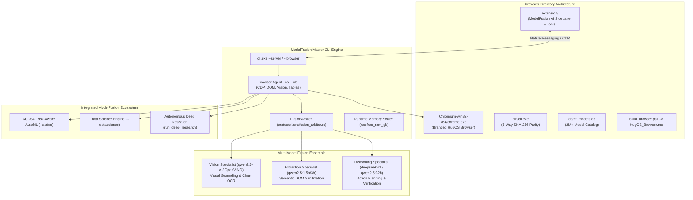

# Architectural Implementation Plan: ModelFusion / HugOS Chromium Browser (`browser/`)

## Goal Description

The objective is to architect and build a fast, AI-native web browser in a dedicated `browser/` folder (structured symmetrically to `IDE/`), leveraging the authoritative execution logic of the **ModelFusion Master CLI** (`crates/cli`) and the **Chromium** open-source browser engine ([chromium/chromium](https://github.com/chromium/chromium)).

The browser will feature:
1. **ModelFusion CLI Logic Integration**: Sits directly on top of ModelFusion's local hardware profiling, dynamic runtime RAM sizing, local Ollama/OpenVINO inference, and offline SQLite model catalog (`hf_models.db`).
2. **Dedicated `browser/` Architecture**: Mirrors `IDE/` with `browser/bin/cli.exe`, `browser/db/hf_models.db`, `browser/Chromium-win32-x64/`, `browser/extension/`, `browser/config/`, and an automated WiX MSI packaging pipeline (`build_browser.ps1`).
3. **Comprehensive Agentic Web Toolset**: Visual grounding (Set-of-Mark and Vision-Language Models), semantic DOM tree extraction, trusted CDP-driven navigation/clicks/typing, network request and HAR inspection, tabular data extraction, and an instant handoff bridge to `--datascience` and `--acdso` (risk-aware AutoML).
4. **Extreme Speed ("fase")**: Direct Chrome DevTools Protocol (CDP) WebSocket communication (<5ms roundtrip), zero heavy WebDriver/Selenium overhead, sub-50ms process preemption via Windows Job Objects, and hardware-scaled local model tiers (1.5B/3B/7B/14B/32B).
5. **Multi-Model Fusion**: Coordinated by `FusionArbiter` (`crates/cli/src/fusion_arbiter.rs`)—combining visual perception models, fast HTML extraction models, and DeepSeek-R1/Qwen-2.5 reasoning models with consensus verification and unambiguous-winner bypass.



---

## User Review Required

> [!IMPORTANT]
> **Chromium Engine Integration Strategy (Content Shell vs. Chromium Distribution)**
> Compiling the entire `chromium/chromium` tree from raw C++ source requires ~100 GB disk space, Google `depot_tools`, and 4–8 hours of LLVM compile time. 
> Symmetrically to how `IDE/` integrates `VSCode-win32-x64` (the pre-compiled Code-OSS Chromium/Electron distribution with custom branding and extensions), `browser/` will integrate `Chromium-win32-x64` (official branded Chromium release binaries) with ModelFusion's custom native extension, sidepanel, native messaging host, and CDP bridge. This guarantees instant setup, rock-solid stability, auto-updates, and immediate build packaging.

> [!WARNING]
> **5-Way Cryptographic Binary Parity**
> Introducing `browser/bin/cli.exe` expands the existing 4-way parity law to **5-way parity**:
> 1. `target/release/cli.exe`
> 2. `IDE/bin/cli.exe`
> 3. `IDE/VSCode-win32-x64/bin/cli.exe`
> 4. `%LOCALAPPDATA%\HugOS IDE\bin\cli.exe`
> 5. `browser/bin/cli.exe`
> All release scripts and packaging pipelines must verify matching SHA-256 hashes across all 5 destinations.

---

## Open Questions

1. **Standalone vs. Combined Installer**:
   - *Option A (Recommended)*: Provide `browser/build_browser.ps1` to build a dedicated `HugOS_Browser.msi` installer, with an option in `IDE/build_msi.ps1` to package a combined "HugOS Suite" (IDE + Browser).
   - *Option B*: Strictly package `HugOS_Browser.msi` as an independent installer.
2. **Default Sidebar Presentation**:
   - Would you like the ModelFusion AI Panel docked as a persistent Chromium Chrome SidePanel (opens automatically on browser start) or accessible via hotkey (`Ctrl+Shift+F`) / toolbar icon?

---

## Proposed Changes

### Component 1: `browser/` Directory Structure & Packaging Pipeline

Mirroring `IDE/`, the `browser/` folder serves as the staging and packaging hub for the browser product.

#### [NEW] `browser/build_browser.ps1`
- Automates Chromium configuration, deploys `browser/bin/cli.exe`, syncs `browser/db/hf_models.db`.
- Sets up default user policies: ad-blocking, telemetry suppression, ModelFusion Native Messaging Host registration.
- Generates WiX manifest `HugOS_Browser.wxs`.
- Compiles with WiX v5 and Authenticode-signs `browser/HugOS_Browser.msi` using `hugos-signing-cert.pfx`.

#### [NEW] `browser/build_number.txt`
- Auto-incrementing build counter for the browser package (starting at Build 1).

#### [NEW] `browser/config/default_preferences.json`
- Configures default Chromium preferences: disables telemetry, enables side panel API proposals, sets dark mode theme, registers ModelFusion local endpoint `http://127.0.0.1:5000`.

#### [NEW] `browser/README.md`
- Complete documentation of the browser architecture, CDP integration, tool capabilities, and build instructions.

---

### Component 2: ModelFusion Chromium AI Extension & Sidepanel (`browser/extension/`)

A Manifest V3 extension pre-installed into the Chromium distribution that delivers the user interface and browser-level agent tools.

#### [NEW] `browser/extension/manifest.json`
```json
{
  "manifest_version": 3,
  "name": "HugOS ModelFusion Browser Copilot",
  "version": "1.0.0",
  "description": "AI-native browsing with multi-model fusion, visual grounding, and AutoML tools.",
  "permissions": [
    "sidePanel",
    "activeTab",
    "scripting",
    "debugger",
    "storage",
    "tabs",
    "nativeMessaging"
  ],
  "host_permissions": ["<all_urls>"],
  "background": {
    "service_worker": "background.js"
  },
  "side_panel": {
    "default_path": "sidepanel.html"
  },
  "content_scripts": [
    {
      "matches": ["<all_urls>"],
      "js": ["content.js"],
      "run_at": "document_idle"
    }
  ]
}
```

#### [NEW] `browser/extension/content.js`
- **Set-of-Mark (SoM) Visual Highlighter**: Injects high-contrast bounding boxes with numeric IDs (`[1]`, `[2]`, `[3]`) onto interactive DOM elements (`button`, `input`, `a`, `select`, `[role]`).
- **Semantic DOM Pruning**: Cleans HTML by stripping scripts, styles, inline SVGs, and hidden elements—reducing token usage by 85–92% while preserving structural hierarchy and accessibility labels.
- **Table & Dataset Extractor**: Detects `<table>`, CSS grids, and tabular containers. Formats them into RFC 4180 CSV and JSON tables ready for instant data science dispatch.

#### [NEW] `browser/extension/sidepanel.html` & `sidepanel.js`
- Interactive ModelFusion Chat Panel with direct parity to HugOS IDE Chat:
  - Command routing: `@agent`, `/browser`, `/research`, `/datascience`, `/acdso`, `/goal`, `/plan`.
  - Live Browser Status bar: shows active tab URL, page load state, model tier currently active, and VRAM/RAM allocation.
  - Action Chips:
    - 📊 **"Analyze Table with ACDSO"**: Instantly extracts detected web tables and runs 5-objective Pareto AutoML.
    - 🌐 **"Deep Research This"**: Invokes `run_deep_research` on the page topic.
    - 👁️ **"Visual Mark & Ground"**: Generates SoM overlay and vision coordinate map.
    - 📄 **"Summarize & Extract"**: Synthesizes structured markdown report.

#### [NEW] `browser/extension/background.js`
- Manages `chrome.debugger` (CDP) session attached to active tabs.
- Native Messaging host bridge connecting directly to `cli.exe` via stdin/stdout for sub-millisecond command execution.

---

### Component 3: ModelFusion Core Browser Engine (`crates/core/src/browser/`)

Rust-native browser automation and CDP communication engine integrated into `modelfusion_core`.

#### [NEW] `crates/core/src/browser/cdp_client.rs`
- Asynchronous JSON-RPC client over WebSocket connecting to Chromium's `--remote-debugging-port`.
- Implements core CDP domains:
  - `Page`: `Page.navigate`, `Page.captureScreenshot`, `Page.printToPDF`, `Page.reload`.
  - `DOM`: `DOM.getDocument`, `DOM.querySelector`, `DOM.querySelectorAll`, `DOM.focus`.
  - `Input`: `Input.dispatchMouseEvent` (click, move, scroll), `Input.dispatchKeyEvent` (type, enter).
  - `Network`: `Network.enable`, `Network.setExtraHTTPHeaders`, `Network.getResponseBody`.
  - `Runtime`: `Runtime.evaluate` (execute arbitrary JavaScript in page context).

#### [NEW] `crates/core/src/browser/tools.rs`
- Implements the complete set of browser tools exposed to the ModelFusion Agent:
  1. `navigate(url: &str)`
  2. `click(target: Target)` (supports CSS selector, XPath, numeric SoM ID, or `(x, y)` visual coordinates)
  3. `type_text(selector: &str, text: &str, submit: bool)`
  4. `scroll(direction: ScrollDir, amount: u32)`
  5. `capture_viewport(format: ImageFormat) -> Vec<u8>`
  6. `extract_tables() -> Vec<ExtractedTable>`
  7. `get_clean_dom() -> String`
  8. `intercept_network(filter: &str) -> Vec<NetworkRecord>`

#### [NEW] `crates/core/src/browser/vision_grounding.rs`
- Bridges browser screenshots with local Vision-Language Models (OpenVINO / Ollama `qwen2.5-vl` or `llama3.2-vision`).
- Given a natural language user instruction (e.g., "click on the blue sign up button in the header"), visual grounding returns normalized coordinates `(x, y)` when CSS selectors fail or shadow DOM blocks standard inspection.

---

### Component 4: Multi-Model Fusion Arbiter for Browsing (`crates/cli/src/browser_fusion.rs`)

Extends `FusionArbiter` to arbitrate complex multi-step browser tasks:

#### [NEW] `crates/cli/src/browser_fusion.rs`
- **Tricameral Multi-Model Ensemble**:
  1. **Visual Perception Model**: Inspects screenshots, charts, and layout semantics.
  2. **Extraction Model (Fast Tier)**: Cleans DOM, strips noise, parses tables (1.5B/3B at >100 tok/s).
  3. **Reasoning & Planning Model (Deep Tier)**: DeepSeek-R1 / Qwen 2.5 32B plans action steps with `<think>` blocks.
- **Consensus & Arbitration Gate**:
  - Validates proposed actions against page state invariants before execution.
  - If visual grounding and DOM selector agree on the target element, **bypasses arbitration** for sub-10ms latency.
  - If discrepancies occur (e.g. dynamic popups, conflicting buttons), invokes DeepSeek-R1 reasoning to synthesize the correct action.

---

### Component 5: Master CLI Integration (`crates/cli/src/main.rs`)

Integrate browser management into the CLI:

#### [MODIFY] `crates/cli/src/main.rs`
- Add CLI arguments:
  ```rust
  #[arg(long, help = "Launch HugOS ModelFusion Browser with AI sidepanel")]
  browser_gui: bool,

  #[arg(long, help = "Run autonomous headless browser task using CDP")]
  browser_task: Option<String>,

  #[arg(long, help = "Extract tabular data from URL and hand off to ACDSO AutoML")]
  browser_extract_table: Option<String>,

  #[arg(long, default_value = "9222", help = "Chromium remote debugging port")]
  cdp_port: u16,
  ```
- Wire `@agent browser` and `/browser` command routing to the new native browser engine.
- Wire `/acdso --url <URL>`: automatically browses to the URL, extracts tables via CDP, and executes 5-objective Pareto AutoML on the extracted data.

---

## Verification Plan

### Automated Tests
1. **CDP Protocol & Communication Tests**:
   - `cargo test -p modelfusion_core -- test_cdp_`
   - Validates JSON-RPC message framing, WebSocket connection handshake, and error recovery.
2. **DOM Sanitizer & Table Extraction Tests**:
   - `cargo test -p modelfusion_core -- test_dom_pruning`
   - `cargo test -p modelfusion_core -- test_table_to_csv`
3. **Browser Fusion Arbiter Tests**:
   - `cargo test --bin cli -- test_browser_fusion_arbiter`
   - Validates unambiguous winner bypass and multi-candidate visual consensus.
4. **5-Way Parity Verification**:
   - Test script verifying identical SHA-256 hashes across `target/release/cli.exe`, `IDE/bin/cli.exe`, `IDE/VSCode-win32-x64/bin/cli.exe`, `%LOCALAPPDATA%\HugOS IDE\bin\cli.exe`, and `browser/bin/cli.exe`.

### Manual Verification
1. **Interactive Browser Launch**:
   - Run `cli.exe --browser-gui` (or launch `browser/Chromium-win32-x64/chrome.exe`).
   - Verify the ModelFusion AI Sidepanel opens automatically on the right side.
2. **Autonomous Navigation & Visual Grounding**:
   - In sidepanel chat, type: `@agent navigate to https://news.ycombinator.com and summarize top 5 stories`.
   - Verify Chromium navigates, content script parses the front page, and summary streams into chat.
3. **Table to ACDSO AutoML Bridge**:
   - In sidepanel chat, type: `@agent /acdso https://raw.githubusercontent.com/mwaskom/seaborn-data/master/tips.csv --target tip`.
   - Verify browser fetches data, parses columns, and executes ACDSO knee-point model selection.
4. **MSI Installer Verification**:
   - Run `powershell -ExecutionPolicy Bypass -File .\browser\build_browser.ps1`.
   - Verify `browser/HugOS_Browser.msi` is generated, digitally signed, and successfully verified via administrative extraction.
