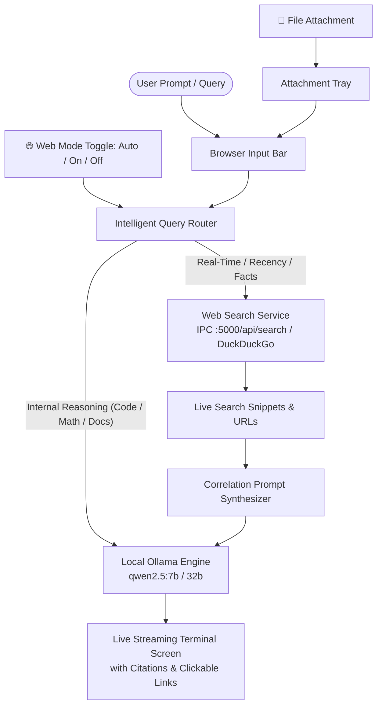
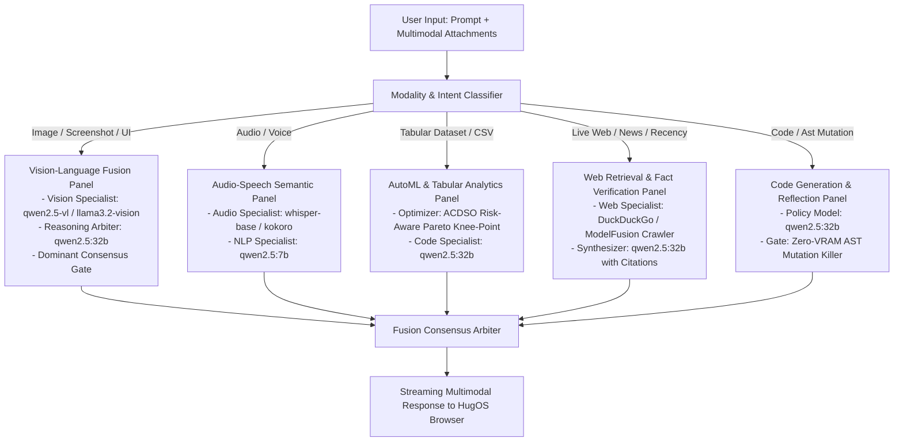

# HugOS Browser Architecture Plan: Settings Drawer, Live Web Search Routing & File Attachments

## Executive Summary
This document specifies the architecture, routing algorithms, and UI integration for the HugOS Intelligent Browser environment (`browser/ui/`).
It fulfills all four pillars requested by the user:
1. **IDE-Style Settings Drawer** strictly aligned with the user-provided screenshot (`media_1790440436024.png`): a left sidebar with a search bar, categorized sections with icons (General, Appearance, Web Search & Routing, AI Models, Storage, Keyboard, Usage, Notifications, Profile, Security, Voice, Pets), and an interactive card configuration pane on the right.
2. **ChatGPT-Style Live Internet Search**: autonomous retrieval of live web information without paid API keys (via ModelFusion IPC `:5000/api/search` and DuckDuckGo engine), with structured citations `[1]`, `[2]`, and clickable markdown links.
3. **Intelligent Query Router & Result Correlator**: automatically classifies incoming queries into internal local LLM reasoning vs real-time live web search, synthesizing retrieved web snippets into local Ollama models (`qwen2.5:7b`/`32b`).
4. **File Attachment System**: drag-and-drop and file picker support for text, code, JSON, and tabular datasets (`.csv`, `.tsv`, `.parquet`), enabling seamless context forwarding and one-click Pareto ACDSO AutoML analysis.

---

## 1. System Architecture



---

## 2. Component Specifications

### A. Settings Drawer (`browser/ui/index.html` & `styles.css`)
- **Visual Parity**: Modeled after `media_1790440436024.png`:
  - **Header & Search**: Top search bar `<input id="settings-search" placeholder="Search">` with real-time filtering across tab titles and setting labels.
  - **Sidebar Menu**: Category header `Personal` followed by rounded pill items:
    - ⚙️ **General**: Default homepage, token streaming, auto-scroll, system diagnostics.
    - 🔆 **Appearance**: Themes (`dark-plus`, `obsidian`, `midnight`), font size (`12px` to `16px`).
    - 🌐 **Web Search & Routing**: Enable web search toggle, mode (Auto/Always/Off), engine provider, max snippets (1-10), local LLM correlation toggle, citation links.
    - 🧠 **AI Models & Endpoints**: Ollama URL (`11434`), IPC URL (`5000`), model selector (`qwen2.5:7b`/`32b`), CDP port (`9222`), vision model (`qwen2.5-vl`), dynamic memory sizing rule.
    - 📁 **Storage**: Navigation history cache, attached file cache, SQLite catalog metrics.
    - ⌨️ **Keyboard**: Shortcut directory (`Ctrl+,`, `Ctrl+Enter`, `Ctrl+O`, `Esc`, `Alt+S`).
    - 📈 **Usage**: Live hardware telemetry (free RAM, VRAM, GPU status, query counters).
    - 🔔 **Notifications**, 👤 **Account**, 🔑 **Security**, 🎙️ **Voice**, 🐾 **Pets**.

### B. Live Web Search & Correlation (`crates/cli` & `browser/ui/app.js`)
- **IPC Endpoint (`/api/search` & `/websearch`)**:
  - Exposes `modelfusion_core::live_web_search(query, max_results)` over HTTP with full CORS headers (`Access-Control-Allow-Origin: *`).
  - Supports both GET query strings (`?q=...`) and POST JSON bodies.
- **Intelligent Router (`shouldRouteToWeb(query, mode)`)**:
  - **Auto-Detection Rules**:
    - Recency / temporal markers: "latest", "recent", "today", "current", "news", "release date", "price", "2024", "2025", "2026", "weather".
    - Factual lookup: "who won", "what is the current status of", "documentation for", "who is".
    - Explicit commands: `/search`, `/research`, `@agent search`.
  - **Exclusions (LLM Direct)**:
    - Code creation / refactoring ("write a function", "implement binary search", "fix this error").
    - Pure mathematical logic.
    - Local CLI commands (`--sys-info`, `/som`, `/acdso`).
- **Correlation Synthesis**:
  - Injects retrieved snippets into local LLM prompt as ground-truth facts.
  - Generates structured citations `[1]`, `[2]` with hyperlinked markdown sources.

### C. File Attachment Support (`browser/ui/app.js`)
- **Drag-and-Drop & File Picker**:
  - Supports `.txt`, `.csv`, `.tsv`, `.parquet`, `.json`, `.py`, `.rs`, `.js`, `.md`, `.log`.
  - Renders visual chips in `#attachment-tray`:
    - File icon, file name, formatted size (`14.2 KB`), remove button (`✕`).
    - Green badge `📊 Dataset` for tabular files.
  - Automatically forwards file content into LLM prompt context:
    ```text
    [ATTACHED FILES]:
    --- BEGIN FILE: filename.ext ---
    <file content>
    --- END FILE: filename.ext ---
    ```
  - For tabular datasets: offers instant one-click execution with ACDSO AutoML (`/acdso`).

---

## 4. Multimodal Processing & Adaptive Model Fusion Architecture



### A. Multimodal Asset Processing & Previews
1. **Images (`.png`, `.jpg`, `.jpeg`, `.webp`, `.gif`, `.bmp`, `.svg`)**:
   - Parsed with `FileReader.readAsDataURL()`.
   - Rendered in `#attachment-tray` with an inline visual thumbnail (`.chip-thumb`), file size, and `🖼️ Image` badge.
   - Base64 extracted and passed in `"images": [base64]` to vision-capable local models (`qwen2.5-vl`, `llama3.2-vision`).
2. **Audio (`.wav`, `.mp3`, `.ogg`, `.m4a`, `.flac`)**:
   - Parsed and rendered with a `🎙️ Audio` badge.
   - Forwarded to local audio pipeline (`whisper-base` / `kokoro`).
3. **Tabular Datasets (`.csv`, `.tsv`, `.parquet`)**:
   - Rendered with `📊 Tabular Dataset` badge and quick action `[⚡ Run ACDSO AutoML]`.
4. **Documents & Code (`.pdf`, `.json`, `.py`, `.rs`, `.md`, `.txt`)**:
   - Text extracted and injected into prompt context.

### B. Dynamic Model Fusion Panels
The router inspects the combined modality vector and constructs a specialist panel:
- **Vision-Language Reasoning Fusion**:
  - `Vision Specialist`: `qwen2.5-vl` / `llama3.2-vision` (spatial layout, Set-of-Mark coordinates, OCR)
  - `Reasoning Specialist`: `qwen2.5:32b` (analytical context, planning, multi-step problem solving)
  - `Consensus Gate`: Dominant (2/3 majority) or Arbiter-synthesized.
- **Audio-Speech Semantic Fusion**:
  - `Audio Specialist`: `whisper-base` (transcription) + `qwen2.5:7b` (conversational action)
- **AutoML & Tabular Analytics Fusion**:
  - `AutoML Specialist`: `ACDSO` (5-objective Pareto knee-point optimization: Accuracy, Cost, Memory, Latency, Risk)
  - `Code Specialist`: `qwen2.5:32b` (production training pipeline synthesis)
- **Live Web Retrieval & Fact Synthesis Fusion**:
  - `Web Specialist`: DuckDuckGo / ModelFusion IPC `:5000/api/search`
  - `Reasoning Specialist`: `qwen2.5:32b` (fact verification, citation links `[1]`, `[2]`)

### C. Live Terminal Visualization
Each directive displays an active fusion banner before/during execution:
```text
[ROUTER] 🎭 Multimodal Model Fusion Active:
  ├─ Modality Detected: Vision 🖼️ + Analytical Reasoning 🧠
  ├─ Specialist 1: qwen2.5-vl (Visual Feature Grounding & OCR)
  ├─ Specialist 2: qwen2.5:32b (Deep Analytical Reasoning)
  └─ Arbiter Strategy: Multi-Objective Consensus (Dominant Gate)
```
