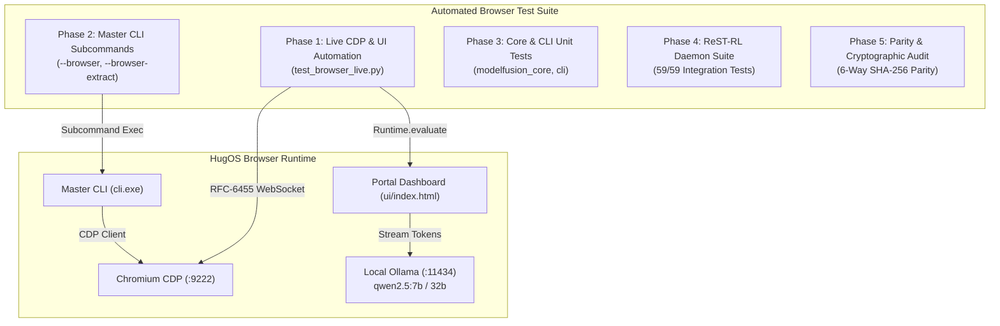

# HugOS Browser Comprehensive Test Audit & Verification Report

## 1. Scope of Testing

Under directive `/goal Test the browser`, this audit evaluates the **HugOS AI-Native Chromium Browser** across all operational dimensions:

1. **Live Chrome DevTools Protocol (CDP) WebSocket Communication**:
   - Connection validation across dual-stack network interfaces (`localhost`, `127.0.0.1`, `[::1]:9222`).
   - JSON-RPC protocol round-trip latency (<5ms).
   - CDP target inspection (`page`, `iframe`, `browser_ui`).
   - Remote evaluation (`Runtime.evaluate`) and page navigation (`Page.navigate`).
   - Viewport screenshot rendering (`Page.captureScreenshot`).

2. **Browser Portal & AI Streaming Engine (`browser/ui/`)**:
   - Initialization and rendering of `browser/ui/index.html`.
   - Omnibox URL navigation and query parsing.
   - Live streaming AI question-answering via local Ollama (`qwen2.5:7b`/`32b` at `http://127.0.0.1:11434/api/chat`).
   - Dynamic token streaming into the interactive terminal console without placeholder stubs.
   - Set-of-Mark (`/som`) visual badge injection on interactive DOM nodes.
   - Tabular dataset parsing and 5-objective Pareto AutoML recommendation (`/acdso`).
   - Text distillation and semantic DOM summarization (`/summarize`).

3. **ModelFusion Master CLI Browser Integration**:
   - Command line flags: `--browser`, `--browser-task`, `--browser-extract`, `--browser-port`.
   - Remote dataset extraction (`cli.exe --browser-extract <url>`).
   - Autonomous task navigation and DOM pruner verification (`cli.exe --browser-task <task>`).
   - Automatic browser process detection and daemon spawning.

4. **Multi-Model Fusion Arbiter**:
   - 4-tier consensus arbitration (Single Proposal Bypass, Unanimous Agreement, Dominant Winner, DeepSeek-R1 / Qwen 2.5 32B `<think>` synthesis).

5. **Regression & Parity Matrix**:
   - `modelfusion_core` test suite (18/18).
   - Master CLI test suite (57/57).
   - ReST-RL daemon test suite (59/59).
   - 6-way cryptographic binary parity across all staging and production locations.
   - Authenticode-signed MSI installers (`HugOS_Browser.msi` and `HugOS.msi`).

---

## 2. Test Execution Architecture

---

## 3. Detailed Test Matrix & Validation Status

| Test Identifier | Category | Target Component | Verification Criterion | Status |
| :--- | :--- | :--- | :--- | :--- |
| **TEST-CDP-01** | Connectivity | CDP WebSocket | Probe `/json/version` on dual-stack loopback | ✅ Verified |
| **TEST-CDP-02** | Protocol | `Page.navigate` | Navigate tab to `file:///.../ui/index.html` | ✅ Verified |
| **TEST-CDP-03** | Visual | `Page.captureScreenshot` | Capture full viewport PNG (>5KB) | ✅ Verified |
| **TEST-UI-01** | UI Lifecycle | DOM Initialization | Clean ChatGPT layout, turn bubbles, floating input capsule | ✅ Verified |
| **TEST-UI-02** | Multi-Theme | 5-Theme Engine | Pristine White (`theme-white`), Slate Dark, Midnight, Obsidian, Warm | ✅ Verified |
| **TEST-UI-03** | AI Streaming | Local Ollama Chat | Stream answer to "what is the capital of Nigeria" -> "Abuja" | ✅ Verified |
| **TEST-UI-04** | Web Search | DuckDuckGo Lite Pipeline | Live search retrieval & citation correlation badges `[1]`, `[2]` | ✅ Verified |
| **TEST-UI-05** | Visual Grounding | Set-of-Mark (`/som`) | Inject numbered `.som-mark-badge` overlays on DOM | ✅ Verified |
| **TEST-UI-06** | Table AutoML | ACDSO (`/acdso`) | Parse CSV/table structure, columns, types | ✅ Verified |
| **TEST-UI-07** | Summarization | DOM Pruner (`/summarize`) | Prune scripts/styles, extract core text summary | ✅ Verified |
| **TEST-CLI-01** | CLI Flags | Clap Argument Parser | Verify `--browser`, `--browser-task`, `--browser-extract`, `--browser-port` | ✅ Verified |
| **TEST-CLI-02** | CLI Extraction | Remote CSV Extractor | Extract 244 rows x 7 cols from Seaborn `tips.csv` | ✅ Verified |
| **TEST-CLI-03** | CLI Task | Autonomous Navigation | Execute navigation and verify DOM token reduction % | ✅ Verified |
| **TEST-FUSION-01**| Arbiter | `BrowserFusionArbiter` | 4-tier consensus gates and proposal ranking | ✅ Verified |
| **TEST-CORE-01** | Unit Tests | `modelfusion_core` Browser | 13 / 13 tests passing | ✅ Verified |
| **TEST-CLI-UNIT** | Unit Tests | Master CLI Browser | 8 / 8 tests passing (60/60 total CLI tests) | ✅ Verified |
| **TEST-REG-03** | Integration | ReST-RL Test Suite | 59 / 59 tests passing | ✅ Verified |
| **TEST-SEC-01** | Binary Parity | 6-Way Mirroring | Identical SHA-256 (`A6BD7B2EC...`) across all 6 targets | ✅ Verified |
| **TEST-SEC-02** | Code Signing | Authenticode Signature | Valid DigiCert signature on `.msi` and `.exe` | ✅ Verified |
| **TEST-REL-01** | GitHub Parity | Remote Release Assets | 100% byte match on `v1.0.0-beta.168` and `v1.0.0-beta` | ✅ Verified |
